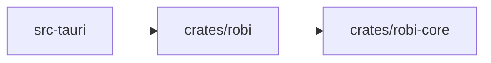

# Project Instructions

Robi is a desktop coding assistant: a Rust core that runs an agent loop against a
local workspace, and a React front end that renders the conversation.

Start with [docs/roadmap.md](docs/roadmap.md) for what ships and in what order.
The design for the current milestone is
[docs/design/agent-loop.md](docs/design/agent-loop.md).

## Layout

Three crates, one of which Tauri requires. Everything else is a module **shaped
like a crate**: its own name, one responsibility, and the same one-way dependency
direction. Promote it to a real crate later only when there is a reason — see
[When to split](#when-to-split).

| Path | Kind | Role |
|------|------|------|
| `crates/robi-core` | crate | The agent loop: transcript, tool trait and registry, approval state, events. No I/O |
| `crates/robi` | crate | The implementations that do I/O. Depends on `robi-core` |
| `src-tauri` | crate | The Tauri app: commands, IPC, wiring. Depends on `robi` |
| `src` | — | React + TypeScript front end |
| `docs` | — | The roadmap and the design docs |

Arrows point at the dependency, and the direction never reverses:



### Modules inside `crates/robi`

Add the directory when its milestone starts, not before.

| Module | Milestone | Role |
|--------|-----------|------|
| `providers/` | M1 | Model clients, streaming, retries |
| `store/` | M2 | Session persistence and settings |
| `tools/` | M3 | Built-in tools |
| `workspace/` | M3 | Root resolution, path confinement, policy |
| `review/` | M6 | Diff engine and review objects |
| `lsp/` | M7 | Language server client |
| `index/` | M7 | AST chunking, embeddings, vector search |

`crates/robi-index` and `crates/robi-lsp` are the likely first splits, because
their dependencies — an embedding runtime, tree-sitter grammars, a JSON-RPC
client — are large and optional. `crates/robi-cli` for headless mode (M8) is the
next, and it is the evidence this layout works: a new binary with no code moved.

## The crate boundary is the contract

`crates/robi-core` holds the loop and the four traits it depends on. Nothing
else. Cargo enforces that boundary, which is the only reason it holds.

A Cargo dependency belongs to a **crate**, not a module, and a module can name any
dependency its crate has. While the loop shares a crate with an HTTP client,
`agent.rs` can reach the network, and no review convention or lint stops it. Keep
the loop in its own crate and the manifest does the work:

```sh
cargo test -p robi-core      # builds no Tauri, opens no socket, touches no file
cargo tree -p robi-core      # the dependency audit, in one line
```

`robi-core`'s dependency list stays short: `serde`, `serde_json`, `tokio` for
sync primitives, `tokio-util` for the cancellation token, `async-trait`,
`thiserror`, and an id crate.

The rules that follow:

- **Never add a workspace crate or an I/O dependency to `robi-core`.** No
  `reqwest`, no `tauri`, no `std::fs`, no `std::net`.
- **`robi-core` declares the traits; `crates/robi` implements them.** `Model`,
  `Tool`, `MessageStore`, and `EventSink` are declared in the loop and
  implemented outside it. The loop never names a provider or a concrete store.
  Signatures are in [docs/design/agent-loop.md](docs/design/agent-loop.md).
- **Run the dependency check in CI.** `cargo tree -p robi-core` is the audit.
- **Use clippy for `std::fs` and `std::net`.** They ship with `std`, so no crate
  boundary excludes them. Disallow them with `disallowed-methods` and
  `disallowed-types` in `clippy.toml`. That is a lint rather than a guarantee, so
  treat a new entry as a decision, not a detail.
- **Default to `pub(crate)` in `robi-core`.** Mark the intended public surface
  deliberately. This is the one property that gets harder to recover as the crate
  grows, and it is what keeps a later extraction clean.

## When to split

Promote a module to a crate for one of these reasons, and not to make the tree
look organized:

1. **Dependency isolation.** Something must not be reachable from other code.
2. **A heavy or optional dependency** to isolate or feature-gate.
3. **Measured build time.** Measure it first.
4. **A public API** that outside code compiles against and that needs its own
   semver.

The anti-signal: adding `pub` to an item only so another crate can reach it, when
that item is not part of a real API. That is a split that happened too early.
Because these modules are already shaped like crates, a promotion is a move plus a
manifest, so deferring costs little.

## Working rules

- **Add a module, not a crate.** A new subsystem starts as a directory under
  `crates/robi`.
- **Keep I/O out of the loop.** When the loop needs a file or a socket, it needs
  a trait instead.
- **Keep dependencies one-way.** `robi-core` never depends on `crates/robi`, and
  nothing depends on `src-tauri`.
- **Documentation is part of the change.** A change to behavior, a default, a
  limit, or an interface updates the matching page under `docs/` in the same
  change. The table in the roadmap lists which page each feature needs.
- **Write what the code does.** When a page and the code disagree, fix the page,
  or make the code match the intent and state which.
- **Test the loop with fakes.** `cargo test -p robi-core` runs against a stub
  model and an in-memory store, and touches no network and no file.
- **Format and lint before finishing:** `cargo fmt`, then
  `cargo clippy --workspace`.
