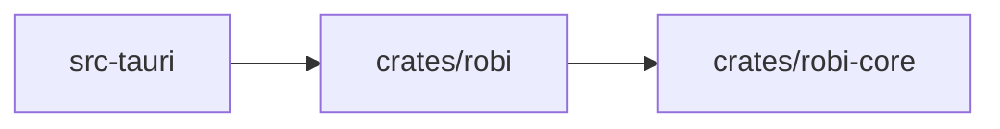

# Project Instructions

Robi is a desktop coding assistant: a Rust core that runs an agent loop against a
local workspace, and a React front end that renders the conversation.

Start with [docs/src/roadmap.md](docs/src/roadmap.md) for what ships and in what order.
The design for the current milestone is
[docs/src/design/providers/providers-streaming.md](docs/src/design/providers/providers-streaming.md); the loop
it drives — the transcript types, the four traits, and the turn state machine — is
[docs/src/design/core/agent-loop.md](docs/src/design/core/agent-loop.md).

## Layout

Three crates, one of which Tauri requires. Everything else is a module **shaped
like a crate**: its own name, one responsibility, and the same one-way dependency
direction. Promote it to a real crate later only when there is a reason — see
[When to split](#when-to-split).

| Path | Kind | Role |
|------|------|------|
| `crates/robi-core` | crate | The agent loop: transcript, tool trait and registry, approval state, events. No I/O |
| `crates/robi` | crate | The implementations that do I/O. Depends on `robi-core` |
| `src-tauri` | crate | The Tauri app: commands, IPC, wiring. Depends on `robi` |
| `src` | — | React + TypeScript front end |
| `docs` | — | The mdBook: guides, concepts, reference, and the internal design docs |

Arrows point at the dependency, and the direction never reverses:



### Modules inside `crates/robi`

Add the directory when its milestone starts, not before.

The crate root is `agent/`, `domain/`, `adapters/`, and `web_api/`. Turn I/O lives under `agent/`.

| Module | Milestone | Role |
|--------|-----------|------|
| `agent/providers/` | M1 | Model clients, streaming, retries |
| `domain/` | M2 | Chat session models, repository traits, and services. No I/O |
| `adapters/` | M2 | SQLite behind those traits, and the settings files. A keychain can replace the secret backend later |
| `bootstrap/` | M2 | Shared app state, bind, and router for `robi-api` and the Tauri process |
| `web_api/` | M2 | Local Axum routes, DTOs, and OpenAPI |
| `agent/tools/` | M3 | Built-in tools |
| `agent/workspace/` | M3 | Root resolution, path confinement, policy |
| `agent/review/` | M4 | Line diff and session hunks. The review object and UI stay M6 |
| `agent/lsp/` | M7 | Language server client |
| `agent/index/` | M7 | AST chunking, embeddings, vector search |
| `agent/skills/` | M8 | Skill scan, catalog, and `@id` loads. See [docs/src/design/reach/skills.md](docs/src/design/reach/skills.md) |
| `agent/mcp/` | M8 | MCP host: server config, connections, and remote tools. See [docs/src/design/reach/mcp.md](docs/src/design/reach/mcp.md) |
| `agent/compress/` | M9 | Tool-output compression and the original store |

Inside `crates/robi`, `web_api` and `adapters` depend on `domain`, and `domain`
depends on neither. `bootstrap` is the composition root both processes call. Schema,
routes, and the chat session lifecycle are in
[docs/src/design/persistence/persistence.md](docs/src/design/persistence/persistence.md).

`crates/robi-index` and `crates/robi-lsp` are the likely first splits, because
their dependencies — an embedding runtime, tree-sitter grammars, a JSON-RPC
client — are large and optional. `crates/robi-cli` for headless mode (M8) is the
next, and it is the evidence this layout works: a new binary with no code moved.

## The crate boundary is the contract

`crates/robi-core` holds the loop and the four traits it depends on. Nothing
else. Cargo enforces that boundary, which is the only reason it holds.

A Cargo dependency belongs to a **crate**, not a module, and a module can name any
dependency its crate has. While the loop shares a crate with an HTTP client,
`agent.rs` can reach the network, and no review convention or lint stops it. Keep
the loop in its own crate and the manifest does the work:

```sh
cargo test -p robi-core      # builds no Tauri, opens no socket, touches no file
cargo tree -p robi-core      # the dependency audit, in one line
```

`robi-core`'s dependency list stays short: `serde`, `serde_json`, `tokio` for
sync primitives, `tokio-util` for the cancellation token, `async-trait`,
`thiserror`, and an id crate.

The rules that follow:

- **Never add a workspace crate or an I/O dependency to `robi-core`.** No
  `reqwest`, no `tauri`, no `std::fs`, no `std::net`.
- **`robi-core` declares the traits; `crates/robi` implements them.** `Model`,
  `Tool`, `MessageStore`, and `EventSink` are declared in the loop and
  implemented outside it. The loop never names a provider or a concrete store.
  Signatures are in [docs/src/design/core/agent-loop.md](docs/src/design/core/agent-loop.md).
- **Run the dependency check in CI.** `cargo tree -p robi-core` is the audit.
- **Use clippy for `std::fs` and `std::net`.** They ship with `std`, so no crate
  boundary excludes them. Disallow them with `disallowed-methods` and
  `disallowed-types` in `clippy.toml`. That is a lint rather than a guarantee, so
  treat a new entry as a decision, not a detail.
- **Default to `pub(crate)` in `robi-core`.** Mark the intended public surface
  deliberately. This is the one property that gets harder to recover as the crate
  grows, and it is what keeps a later extraction clean.

## When to split

Promote a module to a crate for one of these reasons, and not to make the tree
look organized:

1. **Dependency isolation.** Something must not be reachable from other code.
2. **A heavy or optional dependency** to isolate or feature-gate.
3. **Measured build time.** Measure it first.
4. **A public API** that outside code compiles against and that needs its own
   semver.

The anti-signal: adding `pub` to an item only so another crate can reach it, when
that item is not part of a real API. That is a split that happened too early.
Because these modules are already shaped like crates, a promotion is a move plus a
manifest, so deferring costs little.

## Frontend

The desktop shell is a React app in `src/` inside the Tauri crate at `src-tauri/`.
The package manager is pnpm. The Vite dev server listens on port **1430**, strict,
so it does not share a port with other local Tauri apps.

Visual language (dark tokens, shell layout, chat chrome):
[docs/src/design/shell/visual-style.md](docs/src/design/shell/visual-style.md). Use those CSS
variables; do not invent one-off hex or import another product's theme.
Menus and dialogs use Radix primitives, styled with those tokens.

| Task | Command |
|------|---------|
| Web-only Vite dev | `pnpm dev` (port **1430**, strict; proxies `/api` → `127.0.0.1:1431`) |
| Local API | `cargo run -p robi --bin robi-api` (default `127.0.0.1:1431`) |
| Desktop app | `pnpm tauri dev` |
| Production web build | `pnpm build` |
| Lint (ESLint + Prettier) | `pnpm run lint` |
| Format | `pnpm run format` |
| Typecheck | `pnpm run typecheck` |
| Generate API client types | `pnpm run generate:api` (from `openapi/openapi.json`) |

`pnpm dev` serves the web UI alone. `pnpm tauri dev` opens the desktop window
against that same server. Chat-session HTTP goes through the Vite `/api` proxy
to `robi-api`; run the API alongside the web UI. The shell opens one
`EventSource` on `/api/v1/events/stream` through that proxy — see
[docs/src/design/shell/events-sse.md](docs/src/design/shell/events-sse.md). Never hand-edit
`src/api/schema.d.ts` — regenerate it after `make openapi-spec` when routes
change.

Workspace commands live in the root `Makefile`. `make api` runs the local API.
`make dev-api` restarts it when the Rust crates change. `make lint` checks
formatting and lints for Rust and the frontend, and runs the doc link check.
`make fix` writes formatting and lint fixes. `make test` runs
`cargo test --workspace`. `make openapi-spec` writes `openapi/openapi.json`.
`make docs` builds the mdBook at `docs/`; `make docs-serve` serves it locally
with live reload.

Pull requests run `.github/workflows/ci.yml`, which mirrors those commands in
three jobs. `frontend` runs ESLint + Prettier, `tsc`, and vitest. `rust` runs
rustfmt, clippy with `-D warnings`, and `cargo test --workspace` on macOS —
macOS because the workspace tests execute the OS sandbox, and it is the shipping
target. That job builds the front end first, because `src-tauri`'s
`generate_context!` needs `dist/` to compile. `docs` runs the doc-link check and
builds the mdBook, the same steps as the Pages workflow. Keep the jobs and the
`Makefile` in step: when a make target changes, change the job too.

## Working rules

- **Add a module, not a crate.** A new subsystem starts as a directory under
  `crates/robi`.
- **Keep I/O out of the loop.** When the loop needs a file or a socket, it needs
  a trait instead.
- **Keep dependencies one-way.** `robi-core` never depends on `crates/robi`, and
  nothing depends on `src-tauri`.
- **Documentation is part of the change.** A change to behavior, a default, a
  limit, or an interface updates the matching page under `docs/src/` in the same
  change. The table in the roadmap lists which page each feature needs.
- **Every page is listed in `docs/src/SUMMARY.md`.** A page that is not in the
  summary does not render in the book.
- **A design doc names its category.** Design docs live under
  `docs/src/design/<category>/`, one category per module in the layout table
  (`core`, `providers`, `shell`, `persistence`, `tools`, `workspace`, `review`,
  `intelligence`, `reach`, `compression`). The `design/` root receives no files.
  Internal design pages and discovery notes are the `# Project internals` part of
  the book; user-facing pages go under `guides/`, `concepts/`, or `reference/`.
- **Write what the code does.** When a page and the code disagree, fix the page,
  or make the code match the intent and state which.
- **Test the loop with fakes.** `cargo test -p robi-core` runs against a stub
  model and an in-memory store, and touches no network and no file.
- **Format and lint before finishing:** `make fix`, then `make lint`.
