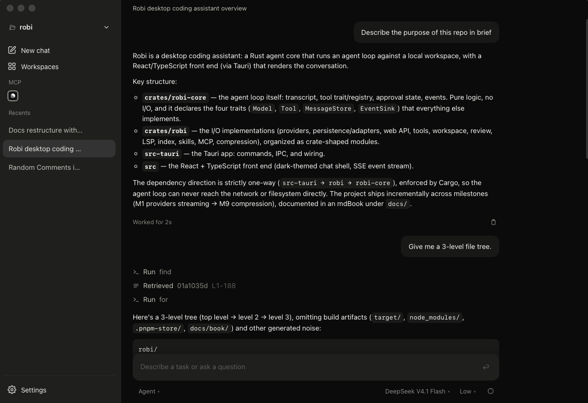

# Robi

A desktop coding assistant: a Rust agent loop against a local workspace, in a
Tauri window.

[](https://cgund98.github.io/robi/)



Robi reads and edits a workspace, runs commands in a sandbox, and delegates work
to subagents. A Rust core runs the agent loop with no I/O; everything that
touches a file or a socket is implemented behind a trait in a separate crate. It
keeps credentials in `~/.robi`, and pauses for approval before it edits a
protected path or widens the sandbox. If the sandbox cannot be applied, the
command does not run.

## Quickstart

Robi needs a Rust toolchain, Node.js with [pnpm](https://pnpm.io/), and a
provider credential.

```bash
make api          # the local API on 127.0.0.1:1431
pnpm tauri dev    # the desktop app
```

Put the provider key in `~/.robi/secrets.toml`:

```toml
opencode_go_api_key = "sk-..."
```

`pnpm dev` serves the web UI alone in a browser; run the API alongside it either
way. See the [Quickstart](https://cgund98.github.io/robi/guides/quickstart.html)
for the full walkthrough.

## Highlights

- **Sandboxed shell** — commands run under Seatbelt on macOS and bubblewrap on
  Linux. If the sandbox cannot be applied, the command is refused.
- **Approval per call** — a protected path, an `unsandboxed` command, or a fetch
  to a new host pauses for one approval. The bar shows the exact arguments, not a
  summary.
- **Secrets stay in `~/.robi`** — credentials are read by the host process and
  never reach the model, a tool argument, or a log line.
- **Review every edit** — each edit is a checkpoint you can revert, independent
  of git. Review the session as a diff and approve or reject a file or a hunk.
- **Subagents** — `delegate` hands a bounded task to a child and returns only its
  answer, so the parent's context stays clean.
- **Extensible** — tools from any [MCP](https://cgund98.github.io/robi/concepts/mcp.html)
  server become tools the assistant can call, and skills packaged as markdown
  load on demand.

## Documentation

The full documentation is at **[cgund98.github.io/robi](https://cgund98.github.io/robi/)**.

- **Guides** — task-focused pages, starting with the
  [Quickstart](https://cgund98.github.io/robi/guides/quickstart.html).
- **Concepts** — why Robi behaves the way it does, such as
  [How Robi works](https://cgund98.github.io/robi/concepts/how-robi-works.html)
  and [Approvals](https://cgund98.github.io/robi/concepts/approvals.html).
- **Reference** — the [configuration](https://cgund98.github.io/robi/reference/configuration.html),
  [tools](https://cgund98.github.io/robi/reference/tools.html),
  [file locations](https://cgund98.github.io/robi/reference/file-locations.html),
  and [HTTP API](https://cgund98.github.io/robi/reference/http-api.html).

The pages are markdown under [`docs/src/`](docs/src/index.md). Run `make docs-serve`
to read them locally, or `make docs` to build the site.

## Development

Run Robi from a clone:

```bash
git clone https://github.com/cgund98/robi
cd robi
make api
pnpm tauri dev
```

Run `make test` for the Rust workspace test suite and `make lint` to check
formatting, lints, and the documentation links. The crate layout and the
conventions are in [`AGENTS.md`](AGENTS.md).

## License

MIT License. See [LICENSE](LICENSE).
