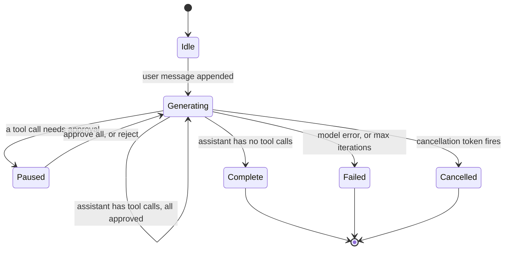
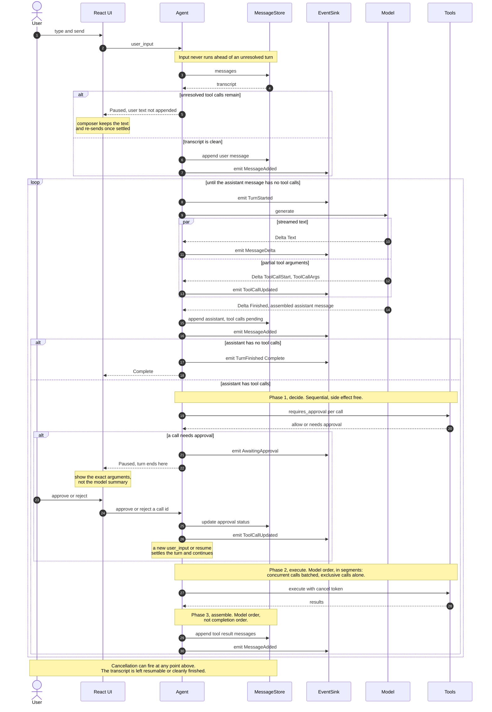

# Core agent loop

The core agent loop is the component that turns a user message into a settled
transcript: it streams a model turn, executes the tools the model asked for,
pauses for approval when a tool needs it, and stops.

This page defines that loop: its state machine, its traits, its stop conditions,
and its failure modes. It is the design doc for **M0** in the
[roadmap](../roadmap.md). Read it before writing code in `robi-core`.

## What this doc does not cover

| Topic | Where it belongs |
|---|---|
| Provider wire formats, SSE parsing, retries, the delta enum's full definition | `docs/design/providers-streaming.md` (M1) |
| Which paths need approval, grants, the policy floor | `docs/design/permissions.md` (M3) |
| Store schema, migrations, how a session is listed and resumed | `docs/design/persistence.md` (M2) |
| Who may call `user_input`, and how a newer instruction interrupts a running one | [chat-runtime.md](chat-runtime.md) (M2) |
| UI event stream: CloudEvents envelope, fan-out, SSE | [events-sse.md](events-sse.md) (M2) |
| Process model and command IPC | `docs/design/architecture.md` (M2) |

This page defines the *shape* of the delta and the seams that persistence and the
UI plug into. Their contents live in their own docs.

## Problem

The loop looks trivial and is not. A provider will accept one shape of transcript
and no other; a tool call that is neither approved nor rejected deadlocks the
conversation; a tool that fails must not take the run with it; and a user who
types while the loop is blocked on a decision will produce a transcript no
provider accepts. Each of those is a state the loop must handle explicitly.

`gogent` already encodes these decisions and has the tests to show it. This design
ports its state machine and deviates in exactly three places, each marked
**Deviation** below.

## The turn state machine

A turn runs from a user message to the last assistant message of that exchange.
Everything below is derived from the stored transcript; none of it is kept
separately.



`Paused` is the only non-terminal state the process can be restarted from, which
is why it must be derivable from the transcript alone. `Cancelled` and `Failed`
must leave a transcript that is either resumable or cleanly finished; a
half-written assistant message with dangling tool calls is neither.

## Turn lifecycle

One turn, end to end: the user's message, the model turn, the approval round
trip, tool execution, and the loop back to the model. The state diagram above is
the state contract; this is the interaction contract.



The diagram commits the implementation to six orderings. Each is testable, and
each has a test in [Testing](#testing).

1. **Settle before append.** `user_input` settles unresolved calls before it
   appends the user's text. That is the invariant in
   [Approval and the paused turn](#approval-and-the-paused-turn).
2. **Persist before emit.** Every event follows its store write, so a consumer
   that reloads from disk after an event sees at least what the event announced.
3. **Append before branch.** The assistant message is persisted while its tool
   calls are still `pending`. A crash between the model turn and the tool round
   therefore leaves a resumable transcript rather than a lost message.
4. **Decide the whole turn before executing any of it.** Execution is segmented by
   concurrency; the decision is not. No half-decided turn, where some calls ran
   and others are still waiting on the user.
5. **Assemble in model order.** Tool results commit in the order the model asked
   for them, never in completion order.
6. **Pausing returns; resuming is a new call.** The loop holds no waiter while
   paused, which is what lets a paused turn survive a restart.

Note what is absent: nothing in the diagram blocks on the user. The approval round
trip is two calls with a process boundary between them, and the transcript alone
records where it stopped.

## Interfaces

`robi-core` defines four traits and one type that owns the loop. Every later
milestone supplies an implementation; none of them changes a signature here.

### Model

```rust
#[async_trait]
pub trait Model: Send + Sync {
    /// One model turn. Deltas stream as they arrive; the final item is
    /// `Delta::Finished`, carrying the fully assembled assistant message.
    ///
    /// `session` identifies the conversation. The loop already holds it, and an
    /// adapter needs it: OpenCode Go takes a per-conversation routing header, and
    /// per-session model selection reads it too.
    async fn generate(
        &self,
        session: SessionId,
        transcript: &[Message],
        cancel: CancellationToken,
    ) -> Result<ModelStream, ModelError>;
}
```

The loop consumes a stream in M0 even though M0 has no UI and ships only a stub.
Making the call blocking and changing it at M1 would touch every call site;
draining a one-item stream costs nothing. See **Rejected alternative 1**.

`Delta` in M0 carries what the loop needs to act on. This is the vocabulary from
M0 onward: M1 adds emitters, not variants.

```rust
pub enum Delta {
    Text(String),
    Reasoning(String),
    ToolCallStart { index: usize, id: ToolCallId, name: String },
    ToolCallArgs  { index: usize, fragment: String },
    ToolCallEnd   { index: usize },
    Usage(Usage),
    Finished(Message),          // assembled by the provider adapter
    Failed(ModelError),
}
```

`Reasoning` is part of the M0 vocabulary, so the loop forwards it to the sink like
text from the start. Whether a UI renders, collapses, or drops traces is a
presentation decision, owned by `docs/design/chat-ui.md` (M2); the protocol carries
them either way.

`index` is stream-local. Assembling fragments by index, and mapping an index to a
provider-assigned call id, is provider-specific work and belongs in the adapter.
The loop never sees an index.

### Tool

```rust
#[async_trait]
pub trait Tool: Send + Sync {
    fn name(&self) -> &str;
    fn description(&self) -> &str;
    fn parameters(&self) -> serde_json::Value;   // JSON Schema

    /// Whether the loop may run this alongside another tool in the same turn.
    /// Side-effect free. See "Concurrency".
    fn concurrency(&self) -> Concurrency { Concurrency::Concurrent }

    /// Side-effect free. The loop calls this before executing anything.
    async fn requires_approval(&self, args: &serde_json::Value) -> Decision;

    /// Safe to call from several tasks at once when `concurrency()` returns
    /// `Concurrent`. See "Concurrency".
    async fn execute(
        &self,
        args: serde_json::Value,
        run: ToolRun,
    ) -> Result<serde_json::Value, ToolError>;
}

pub struct ToolRun {
    pub cancel: CancellationToken,
    pub report: Arc<dyn ToolReporter>,
}

pub enum Decision { AllowImmediately, NeedsApproval }

pub enum Concurrency { Concurrent, Exclusive }
```

The signature of `requires_approval` is the load-bearing part: it takes only this
call's arguments, returns without doing anything, and cannot fail. That is what
lets the loop decide an entire turn before executing any of it.

`ToolRun.report` is how a tool publishes UI state before it returns. The loop's
reporter writes a `SubagentSnapshot` onto that call and emits `ToolCallUpdated`.
The tool result the model reads stays `call.result`. Tools that do not delegate
ignore the reporter. See [subagents.md](subagents.md).

A tool cannot return `Decision::Deny`. A denial is a *policy* outcome (M3), and
policy can only ever escalate `AllowImmediately` to `NeedsApproval`, never the
reverse. Keeping the two concepts apart is what makes the security floor
auditable in one place.

### MessageStore

```rust
#[async_trait]
pub trait MessageStore: Send + Sync {
    async fn messages(&self, session: SessionId) -> Result<Vec<Message>>;
    /// One message. `Ok(None)` means the session exists and the id does not.
    async fn message(&self, session: SessionId, id: MessageId) -> Result<Option<Message>>;
    async fn append(&self, session: SessionId, message: Message) -> Result<()>;
    /// Status changes on an existing message: a tool call going from
    /// `pending` to `approved`, or gaining its result.
    async fn update(&self, session: SessionId, message: Message) -> Result<()>;
}
```

Incremental `append`/`update` rather than one snapshot write per turn. A
snapshot-per-turn store cannot express approving one call while another is still
pending, and it rewrites the whole transcript on every tool completion. The M0
implementation is a `Vec<Message>` behind a mutex. M2's SQLite implementation
is the same trait: `messages` reads the transcript in order, and `message`
reads one row by primary key.

### EventSink

```rust
#[async_trait]
pub trait EventSink: Send + Sync {
    async fn emit(&self, event: Event);
}

pub enum Event {
    TurnStarted      { session: SessionId },
    MessageAdded     { session: SessionId, message: MessageId },
    MessageUpdated   { session: SessionId, message: MessageId },
    MessageDelta     { session: SessionId, message: MessageId, delta: Delta },
    ToolCallUpdated  { session: SessionId, message: MessageId, call: ToolCallId },
    AwaitingApproval { session: SessionId, call: ToolCallId },
    TurnFinished     { session: SessionId, outcome: TurnOutcome },
}
```

The loop emits every variant from M0, including `MessageDelta`, whenever a model
produces a delta. M0's stub model streams a single `Finished` item, so no partial
fires in practice, but the emitter exists and the tests exercise it with a stub
that streams `Text` and `Reasoning`. M1 adds emitters for the provider-shaped
deltas rather than changing the type.

**Emit after persisting.** The store write happens before its event. A consumer
of the event stream must never see a message the store cannot produce, which is
the property that lets M2's UI reload from disk and get the same view.

### Agent

`Agent` owns the loop. It holds a `MessageStore`, an `EventSink`, a `Model`, a
`ToolRegistry`, and a `LoopConfig`.

```rust
pub struct LoopConfig {
    /// Model turns per run. Not tool calls: fan-out inside a turn is free.
    pub max_iterations: u32,           // default 50
    /// In-flight calls within one `Batch`. A `Solo` occupies one slot.
    pub max_concurrent_tools: usize,   // default 5
    /// Debug only: run every call alone, in model order.
    pub serial_tools: bool,            // default false
    /// Backstop on a serialized tool result. See "Tool results".
    pub max_tool_result_bytes: usize,  // default 256 KiB
}
```

| Setting | Default | Enforced by |
|---|---|---|
| `max_iterations` | 50 | The loop's step 3 |
| `max_concurrent_tools` | 5 | The semaphore bounding a `Batch` |
| `serial_tools` | `false` | Every call becomes a `Solo`; see [Segments](#segments) |
| `max_tool_result_bytes` | 256 KiB | The core, after the tool has had its chance |

`serial_tools` exists so a run is reproducible. It overrides a tool's concurrency
declaration rather than the segment walk, so execution stays in model order and
only the parallelism goes away. A session running in it should say so, because its
execution semantics differ from a normal run.

All four are defaults. A settings layer overrides them per session or globally, and
`docs/design/persistence.md` (M2) owns where that configuration lives.

```rust
impl Agent {
    pub async fn new_chat(&self, workspace: WorkspaceId) -> Result<SessionId>;
    pub async fn user_input(&self, session: SessionId, text: &str,
                            cancel: CancellationToken) -> Result<TurnOutcome>;
    /// Settles any outstanding turn. If that executed tool calls, the loop
    /// continues into a model turn so the model reads their results.
    pub async fn resume(&self, session: SessionId,
                        cancel: CancellationToken) -> Result<TurnOutcome>;

    /// The calls waiting on a decision, in transcript order.
    ///
    /// A call that has already run is not waiting on anything. The loop records a
    /// decision only when a user makes one, so a call that needed no approval keeps
    /// `ApprovalStatus::Pending`; "pending" therefore means pending approval *and*
    /// still unexecuted.
    pub async fn pending_tool_calls(&self, session: SessionId) -> Result<Vec<ToolCall>>;
    pub async fn approve(&self, session: SessionId, call: ToolCallId) -> Result<()>;
    pub async fn reject(&self, session: SessionId, call: ToolCallId, reason: &str) -> Result<()>;

    pub async fn messages(&self, session: SessionId) -> Result<Vec<Message>>;
}

pub enum TurnOutcome { Complete, Paused, Cancelled, Failed(AgentError) }
```

**Deviation 1.** gogent reports `ErrAwaitingApproval` from `RunWithUserInput`
when the outstanding turn is not settled. I return `Ok(TurnOutcome::Paused)`
instead. A pause is normal control flow, not a failure: in a GUI it is the
expected result of most tool calls. Modeling it as an error invites `?`
propagation that treats a routine pause as a fault, and it makes a caller that
handles pauses correctly read as though it is writing error handling.
`AgentError` stays for real failures: a model error, a store write failure.

## The loop

```rust
async fn run(&self, session: SessionId, invoke_model: bool) -> Result<TurnOutcome> {
    let mut invoke = invoke_model;
    let mut model_turns = 0u32;

    loop {
        // 1. Nothing runs ahead of an unresolved turn. Settle it first.
        match self.settle_unresolved(session).await? {
            Settle::Paused             => return Ok(TurnOutcome::Paused),
            // Settling ran tools, so the model owes a reading of their results.
            Settle::Executed           => invoke = true,
            Settle::NothingOutstanding => {}
        }

        // 2. A resume with nothing outstanding and no new user input is done.
        if !invoke {
            return Ok(TurnOutcome::Complete);
        }

        // 3. The cap counts model turns, not tool calls.
        if model_turns >= self.max_iterations {
            return Ok(TurnOutcome::Failed(AgentError::MaxIterations(self.max_iterations)));
        }

        // 4. One model turn: drains the stream to the sink, appends the message.
        let assistant = self.model_turn(session).await?;
        model_turns += 1;

        // 5. No tool calls means the turn is settled.
        if !assistant.has_tool_calls() {
            return Ok(TurnOutcome::Complete);
        }

        // 6. Resolve this turn's calls. May pause; never aborts on a tool error.
        if self.process_tool_calls(session, &assistant).await? == Phase::Paused {
            return Ok(TurnOutcome::Paused);
        }

        // 7. Loop so the model can read the results.
        invoke = true;
    }
}
```

Four properties in that code are worth defending:

- **Settling is not terminal.** When `settle_unresolved` executes tool calls, the
  loop continues into a model turn instead of returning, because a transcript that
  ends on unanswered tool results is not settled. See
  [Deviation 2](#deviation-2-settling-resumes-the-model).
- **The cap counts model turns.** Tool fan-out inside one turn is free. The cap
  exists to stop a model that calls tools forever, so it counts the thing that
  recurs. Counting tool calls would make a legitimate five-tool turn count
  against the cap five times.
- **State is derived, never cached.** `settle_unresolved` re-reads the transcript
  and asks `requires_approval` again. A call is stored `pending` as soon as the
  model asks for it, including one the tool would run immediately, so the status
  alone does not pause the turn. The turn pauses only when a call is still
  pending and its tool returns needs-approval. A restart between the model turn
  and the tool round therefore runs the calls that need no decision, and a
  restart mid-pause still waits on the ones that do. While a sibling pauses the
  turn, a call that needs no decision is stored `approved` and does not run
  until the decision is in, so the UI does not offer it.
- **`model_turn` appends before the loop branches.** The assistant message is
  persisted while its tool calls are still `pending`, so a crash between the model
  turn and the tool round leaves a resumable transcript rather than a lost one.

### Deviation 2: settling resumes the model

**Decided.** When `settle_unresolved` executes tool calls, the loop sets
`invoke = true` and takes a model turn so the model reads their results.

gogent returns early instead when the caller did not ask for a model turn, which
leaves the transcript ending on unanswered tool results. That is not a settled
turn: the model asked for the calls, and nothing has told it what they returned.
In a GUI there is also no obvious next event to unstick it — the user already
approved the calls, so waiting for another message would strand the turn.

Two consequences:

- `resume` can take a model turn. It is not a settle-only operation.
- A resume that settles nothing stays a no-op, so calling `resume` on a settled
  session returns `Complete` and changes nothing.

## Stop conditions

| Condition | Outcome | Transcript after |
|---|---|---|
| Assistant message has no tool calls | `Complete` | Settled |
| A tool call needs approval | `Paused` | Ends on `pending` calls; resumable |
| Model turns reached `max_iterations` | `Failed` | Settled, with an error to show |
| The model errored | `Failed` | Settled; the failed turn is not appended |
| Cancellation fired | `Cancelled` | Resumable, or cleanly finished |
| `resume` that settled tool calls | Continues into a model turn | Settled once the model reads the results |
| `resume` with nothing outstanding | `Complete` | Unchanged |
| A tool errored | Loop continues | The error is a tool result |

Every one of these gets a test. The `Cancelled` row is a design obligation, not a
description: fill in *resumable* or *finished* for each cancellation point (before
the model turn, mid-stream, during tool execution) and assert it.

## Approval and the paused turn

The invariant:

> User input never runs ahead of an unresolved turn. If the transcript ends with
> tool calls that are not settled, the next thing that happens settles them,
> whatever the user typed.

`user_input` implements this by calling `settle_unresolved` before it appends
anything. If the turn is still paused after settling, the call returns `Paused`
and the user's text is **not** appended. In M2 the composer keeps that text
locally and re-sends it once the pending calls are settled.

Why it matters: providers reject a transcript whose assistant message has
unanswered tool calls, and a user cannot reason about an ordering where their
message precedes the answer to a question the model asked. Both failures come from
appending the user message too early.

The approval surface is three operations:

| Operation | Effect |
|---|---|
| `pending_tool_calls` | Returns the calls the UI must render as prompts |
| `approve` | Sets one call to `approved`, then resumes the loop |
| `reject` | Sets one call to `rejected` with a reason, then resumes |

A rejected call becomes a tool result the model reads: a structured rejection
payload, not silence and not an absent message. Silence teaches the model nothing
and leaves it to guess whether the tool failed or was never run.

Approval is asynchronous with respect to the loop. The loop returns `Paused` and
waits to be called again; it does not block a thread on a user decision and it
does not poll. That is what makes a paused turn survive an app restart: the pause
is a property of the transcript, and the process holds no waiter.

## Tool execution

Three phases, and the order is the design.

```rust
async fn process_tool_calls(&self, session, assistant: &Message) -> Result<Phase> {
    // Phase 1 — decide. Sequential, side-effect free, over the whole turn.
    for call in &assistant.tool_calls {
        let tool = self.registry.get(&call.name);        // unknown tool: see below
        let decision = tool.requires_approval(&call.args).await;
        let decision = self.policy.escalate(decision);   // M3; can only escalate
        if decision == NeedsApproval && call.approval_status == Pending {
            return Ok(Phase::Paused);                    // whole turn pauses
        }
    }

    // Phase 2 — execute. Model order, in segments. See "Concurrency".
    let results = self.execute_segments(&assistant.tool_calls, cancel).await;

    // Phase 3 — assemble. Model order, not completion order.
    for (call, result) in zip(&assistant.tool_calls, results) {
        self.record_tool_result(session, call, result).await?;
    }
    Ok(Phase::Done)
}
```

- **Phase 1 is sequential.** Concurrent decisions would make the order of approval
  prompts nondeterministic, and a decision that cannot be reproduced is not a
  decision a user can audit.
- **A turn is decided as a whole, or paused as a whole.** No half-decided turn,
  where three calls ran and two are waiting on the user.
- **Phase 3 commits in model order.** The provider matches results by id, but the
  transcript is also read by the model and by the user, and a transcript that
  reorders across runs is a transcript that reads differently across runs.
- **A failing tool does not abort the rest of the turn.** The failure becomes a
  structured result the model can read and correct. The fan-out deliberately does
  not derive a cancel-on-first-error context, because a failing tool would then
  discard sibling work the model asked for and the user already paid for.
- **A tool call is logged without its arguments.** Start and a normal finish
  are info. Cancellation is info. A panic is error. Any other tool error is
  warn. The fan-out logs a stored message, a message update, a tool-call
  update, and waiting for approval at info. Token deltas are not logged.

### Concurrency

A tool declares whether the loop may run it alongside another tool in the same
turn. `Concurrent` is the default, because reads dominate a coding agent's tool
set and they are safe to overlap.

`Exclusive` means **nothing else in the turn is in flight at the same time as this
call** — not merely that it does not overlap another exclusive call. A writer
overlapping a reader is the conflict the flag exists to prevent, so a single-flight
lane for exclusive calls alone would not be enough.

`Concurrent` is a claim by the tool author, and the compiler witnesses only part
of it. `Send + Sync` makes memory safety true. It cannot make *logical* safety
true, which is what a read-modify-write on a file, a shared counter, or two writes
to one path violate. So the registry carries a snapshot test asserting
`name -> concurrency` for every registered tool: adding a tool fails the test until
its author states a setting. Omission is visible, and the common case stays
unannotated.

#### Segments

Phase 2 walks the turn's calls in model order and partitions them into maximal
runs:

```rust
enum Segment { Batch(Vec<ToolCall>), Solo(ToolCall) }

// Walk in model order.
//   Concurrent -> push onto the open batch
//   Exclusive  -> flush the open batch, then emit Solo(call)

for seg in segments(&calls) {
    match seg {
        Segment::Batch(cs) => join_bounded(cs, self.max_concurrent).await,  // parallel
        Segment::Solo(c)   => c.execute(cancel).await,                      // alone
    }
}
```

An `Exclusive` call flushes the open batch and then runs alone, so it is a
**barrier**: nothing is in flight when it starts, and nothing starts until it
finishes. That is what the flag has to mean for the ordering below to hold.

**Execution order is model order, always.** Two passes over the turn — one for
concurrent calls, one for exclusive — would break it. Given

```
[read A, write B, read C]     # read a file, edit another, verify by reading back
```

two passes would run `read A + read C` in parallel, *then* `write B`. The read of
`C` would land before the write it was meant to verify, and because phase 3 still
assembles in model order, the transcript would read A, B, C while the filesystem
changed in the order A, C, B. The transcript would look right and the world would
be wrong, with nothing in the log to show it. Segments keep the two orders equal:

| Turn | Segments | Execution |
|---|---|---|
| `[read A, read C, write B]` | `Batch(A, C)`, `Solo(B)` | A and C together, then B |
| `[read A, write B, read C]` | `Batch(A)`, `Solo(B)`, `Batch(C)` | A, then B, then C |

Two further rules:

- **Deciding stays whole-turn.** Segments govern execution only. Phase 1 decides
  every call before any of it runs, so no side effect lands before the prompt for
  a later call appears. Executing approved segments and pausing at the first that
  needs approval would mean approving call 4 after calls 1 through 3 already wrote
  files, which is the half-decided turn the phase-1 rule exists to prevent.
- **`max_concurrent` bounds a `Batch`.** A `Solo` occupies one slot and runs alone.
  A slow exclusive call stalls the turn until its timeout. That is inherent: it
  cannot be overlapped with anything it might depend on.

#### Escalation

Configuration may escalate `Concurrent` to `Exclusive`, never the reverse. The same
rule as approvals: a lower layer adds caution, and none removes it.

### Panic isolation

Tool execution runs inside `tokio::spawn`, so a panicking tool becomes a
`JoinError` the loop converts into a failed tool call. A panic in an inlined
`.await` aborts the whole process, which for a coding agent means losing the
session over a malformed regex. The cost is a `Send + 'static` bound on tool
arguments and results, which is worth paying once at the trait boundary.

### Tool results

Two layers, and the tool gets first refusal:

- **A tool truncates its own result** and reports that it did, in the same shape as
  a truncated file read: the result is bounded, and it says where to continue. This
  is the real budget, because only the tool knows which part of its output matters.
- **The core enforces `max_tool_result_bytes` as a backstop.** A result over the
  ceiling is truncated by the core, with a marker naming the core as the truncator.

The ceiling is 256 KiB on the serialized result — four times the largest
legitimate tool result a coding agent produces, and well under a context window. It
exists for the tool with a bug or no bound at all. One unbounded result does not
only fill the window; it makes the rest of the turn unaffordable and the session's
cost unpredictable.

The two truncation markers differ on purpose. A backstop that fires is a bug
report, so seeing the core's marker means a tool is missing its own bound.

## Failure modes

| Failure | Handling | Rationale |
|---|---|---|
| Unknown tool name | Structured "tool not found" result; call failed; loop continues | The model can correct a typo if it is told; killing the turn teaches nothing |
| Tool arguments are not valid JSON | Failed call with a parse error, **not** `{}` | See Deviation 3 |
| Duplicate tool call ids in one turn | Reject the turn as a provider fault | Ids key the transcript; duplicates make it ambiguous |
| A tool panics | `JoinError` → failed call | Panic isolation above |
| A tool exceeds its timeout | Cancelled, recorded as a timeout | A hung tool must not hang the turn |
| The store write fails | Fail the turn | Write-through means continuing would diverge memory from disk |
| Approval arrives for a call already settled | No-op, idempotent | A double-click must not resume twice |
| The model returns an empty message with no tool calls | `Complete` | Settled, even if useless; retrying here would need a policy the loop cannot infer |
| A second `user_input` while paused | Returns `Paused`, input not appended | The invariant above |
| A tool result exceeds the ceiling | The core truncates it, with a marker distinct from a tool's own | A backstop, not a budget; the tool should bound its own output |

### Deviation 3

gogent maps tool arguments that fail to parse to `{}`. I would record a parse
error instead. `{}` is a valid argument set for many tools, so the failure mode of
gogent's choice is a tool that silently executes on defaults: a `grep` with no
pattern, a `read_file` with no path. A structured parse error is recoverable and
visible.

## Cancellation

The loop owns a `tokio_util::sync::CancellationToken`, passed by reference into
`Model::generate` and as `ToolRun.cancel` on every `Tool::execute`. Three rules:

- **Cancellation is a state, not an exception.** After a cancel, the transcript
  is either resumable or finished. Never a partial assistant message that the
  model did not finish and the loop did not abandon.
- **A cancelled model turn does not append.** If the stream is cancelled
  mid-flight, the partial assistant message is not committed, because a partial
  message with half-assembled tool calls is the exact failure this rule prevents.
- **In-flight tools get the token and their results are recorded** as cancelled.
  Dropping them would leave the turn unresolved with no way to settle it.

The model-turn call site selects on the token around `generate` itself, so a cancel
that fires while the request is in flight returns `Cancelled` without waiting for
response headers. The adapter cannot express cancellation through `ModelError`, so
without that select a user-stopped turn would surface as a connection failure. M1
added it; see [providers-streaming.md](providers-streaming.md).

Decide per cancellation point what the transcript looks like, and assert it in a
test. M5's subagents inherit whatever this doc decides.

## Rejected alternatives

1. **Blocking `generate(transcript) -> Message`, as gogent does.** Rejected: the
   delta stream is the UI's contract, so the loop would be rewritten at M1, and
   partial tool arguments are what let the UI show what the model is about to do
   before it does it.
2. **An explicit persisted state machine, one row per turn.** Rejected: derived
   state needs no separate file, cannot disagree with the transcript, and is
   already what a restart has to reconstruct. Cost: a transcript scan per
   iteration, which is not the slow part.
3. **Concurrent `requires_approval` decisions.** Rejected: nondeterministic
   approval order.
4. **Cancel-on-first-tool-error fan-out.** Rejected: discards sibling work and
   hides the results the model needs to recover.
5. **Committing tool results in completion order.** Rejected: nondeterministic
   transcripts, and the model reads the transcript too.
6. **`Paused` as an error value.** Rejected: see Deviation 1.
7. **The loop waiting on a channel for the user's decision.** Rejected: it makes
   the loop own a UI concern, and a process-local waiter cannot survive a restart
   in the paused state.
8. **Snapshot-per-turn persistence.** Rejected: cannot represent a partially
   settled turn.
9. **Two passes over a turn: concurrent calls, then exclusive calls.** Rejected:
   it reorders execution against model order, so a read meant to verify a write
   runs before that write. See [Segments](#segments).
10. **A single-flight lane for exclusive calls, with concurrent calls still
    flowing alongside.** Rejected: it lets a writer overlap a reader, which is the
    conflict the flag exists to prevent.

## Testing

M0 has no UI and no network, so its tests are the deliverable. Port gogent's
`agent_test.go` scenarios; they are already the right list.

Fakes to build first:

| Fake | Purpose |
|---|---|
| `StubModel` | A scripted queue of model turns, so each test states exactly what the model does |
| `InMemoryStore` | `Vec<Message>` behind a mutex |
| `RecordingSink` | Asserts event order, including that an event follows its store write |
| `StreamingStubModel` | Emits `Text` and `Reasoning` deltas, to assert they reach the sink |
| `SlowTool`, `FailingTool`, `PanickingTool` | Per-tool failure modes |
| `CountingTool` | Atomically counts in-flight calls, to assert the concurrency bound |
| `ExclusiveTool` | Declares `Exclusive` and records its execution interval, to assert the barrier |
| `HugeTool` | Returns a result over the ceiling, to assert the core backstop |

Required cases:

- One turn, no tools: one model call, `Complete`, transcript of two messages.
- Multi-iteration tool loop: model calls a tool, reads the result, answers.
- The cap trips, and it counted model turns rather than tool calls.
- A tool error does not end the run, and the model sees a structured error.
- An approval pause, then `approve`, then completion.
- An approval pause, then `reject`, and the model sees the rejection.
- `user_input` while paused: returns `Paused` and does not append the text.
- Result ordering is model order when the first tool is the slowest.
- The concurrency bound holds: in-flight never exceeds the limit.
- **Model order under segments.** For a turn of `[read A, exclusive B, read C]`,
  the recorded intervals show B overlaps neither A nor C.
- **Maximal batching.** For `[read A, read C, exclusive B]`, A and C overlap.
- **The barrier is absolute.** No concurrent call is in flight at any point while
  an exclusive call runs, in a turn that contains both.
- **Deciding stays whole-turn.** When a late call in the turn needs approval,
  nothing in the turn has executed when it pauses.
- The registry snapshot. Every registered tool has a stated concurrency.
- **Serial mode is transcript-equivalent.** The same turn under `serial_tools`
  produces the same transcript and the same tool-result order as concurrent mode.
- **The result ceiling holds.** A tool returning an oversized result is truncated
  by the core, with the core's marker rather than the tool's.
- **Reasoning reaches the sink.** A stub model streaming `Reasoning` produces the
  matching `MessageDelta` events in order.
- A panicking tool becomes a failed call and the run continues.
- Cancellation before the model turn, mid-stream, and mid-tool-round each leave a
  resolvable transcript.
- Every outcome leaves a transcript whose last message is settled or whose pending
  calls are recoverable. Assert this in every test's teardown rather than in one
  test of its own.

## Implementing it in Rust

- **`async_trait` over native async-in-trait.** The loop holds `dyn Model`, `dyn
  Tool`, and `dyn MessageStore`, and async fn in trait is not dyn-compatible
  without workarounds. `#[async_trait]` boxes each call; at one model call and a
  handful of tool calls per turn that allocation is irrelevant.
- **Inject the clock.** Timeouts, retries (M1), and subagent deadlines need a
  time source a test can advance. Passing one now costs a parameter; adding one
  later touches every test.
- **Ids: UUIDv7 or ULID**, so transcript order and id order agree and a store can
  sort by id.
- **Keep `robi-core` free of `reqwest`, `tauri`, and `std::fs`.** Enforce it in
  CI with a dependency check, because this boundary is the milestone's whole
  value. A `robi-core` that can read a file has already given up the property
  that its tests prove the loop.

## Decisions

Settled:

| Decision | Value |
|---|---|
| `Paused` is an outcome, not an error | Deviation 1 |
| Settling tool calls resumes the model | Deviation 2 |
| Unparseable arguments fail the call | Deviation 3 |
| A turn is decided as a whole | No half-decided turn |
| Execution walks in model order, in segments | Concurrent batched, exclusive alone |
| `Concurrent` is the declared default | The registry snapshot test keeps an omission visible |
| Iteration cap | 50 |
| In-flight tool limit | 5 |
| Serial debug mode | Every call alone, in model order |
| `Reasoning` deltas | In the M0 vocabulary; rendering is M2's call |
| Tool result ceiling | 256 KiB, enforced by the core as a backstop |

Still open:

1. Does a settings layer let a session override the limits, or are they global? The
   settings model in `docs/design/persistence.md` (M2) owns the answer.
2. Whether turn records are persisted alongside the transcript. Deriving turn
   structure from the transcript stays the default, because the transcript is
   authoritative; `docs/design/persistence.md` (M2) owns whether an observations
   record joins it.
