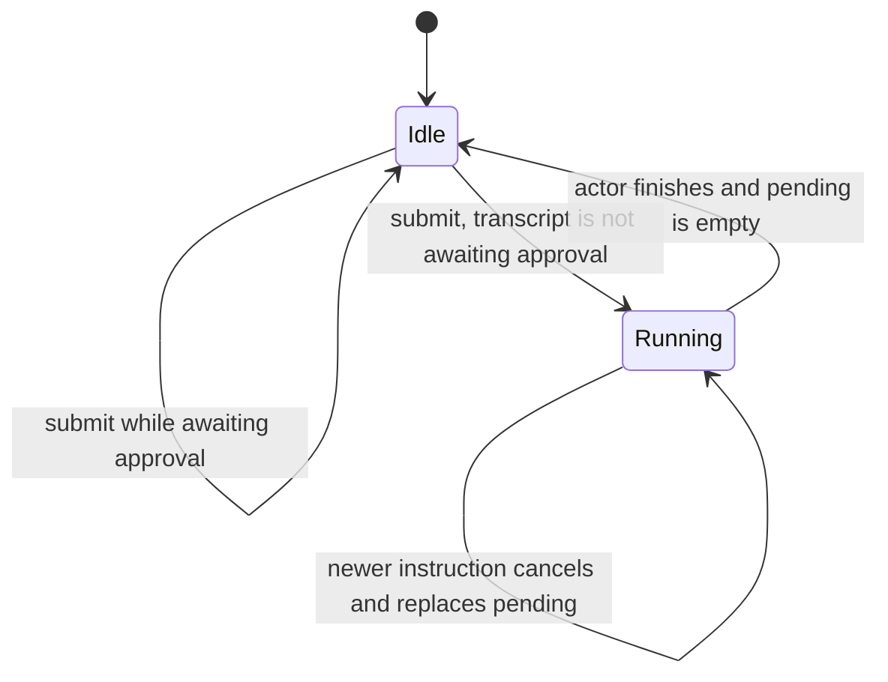
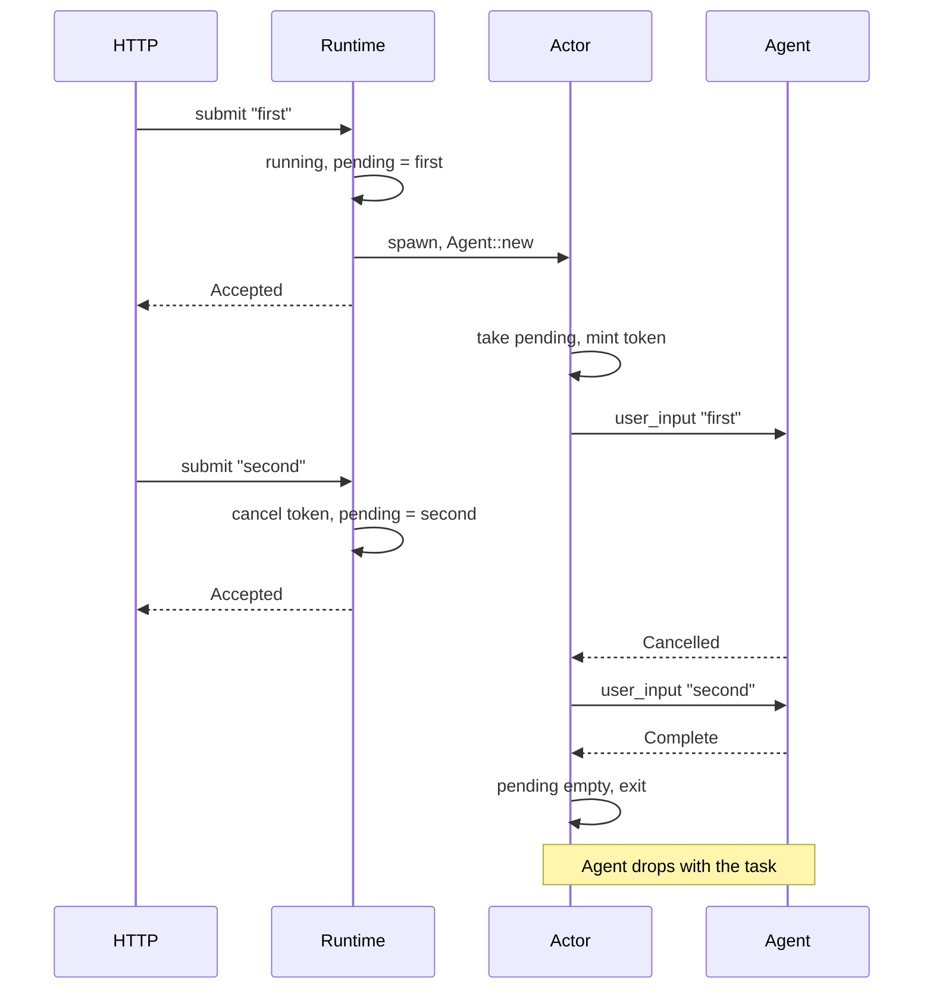

# Chat runtime

This page defines how a submitted instruction becomes one turn of the agent
loop, and how a newer instruction interrupts the one already running. It is
the design doc for the chat-instruction half of **M2** in the
[roadmap](../roadmap.md). Read it before writing code in
`crates/robi::domain::chat_message` or `crates/robi::adapters::chat_runtime`.

## What this page does not cover

| Topic | Where it belongs |
|---|---|
| The turn state machine, cancellation inside a model turn, and how a tool call is settled | [agent-loop.md](agent-loop.md) (M0) |
| Schema, migrations, chat-session CRUD, and the message route table | [persistence.md](persistence.md) (M2) |
| Provider wire format, retries, and the delta stream | [providers-streaming.md](providers-streaming.md) (M1) |
| Streaming those deltas to the window | `docs/design/architecture.md` and `docs/design/chat-ui.md` (M2). This slice has no SSE |
| Which tools need approval | `docs/design/permissions.md` (M3) |
| The model writing a title after a completed turn | [Session title](#session-title) on this page |

## Problem

`Agent::user_input` is safe for one caller. Two overlapping calls on one chat
session both append and both drive the model, and the transcript those calls
leave is not one a provider will accept.

The HTTP handler has to return before the model finishes. A second instruction
typed while the first is in flight has to replace it, not run beside it. An
instruction typed while the transcript is waiting on a tool decision must not
be appended ahead of that decision. The loop already enforces that last rule
inside `user_input`; the runtime has to surface it before it starts a turn.

The agent is not process state. One `Agent` kept for the life of the server
would be shared across chat sessions and would outlive the turn it was driving.

## Decision

`ChatRuntime` is a domain port. `SerializedChatRuntime` implements it. HTTP
talks only to `ChatMessageService`, which checks the chat session and the
instruction, then calls the port. `GET` of the transcript reads `MessageStore`
and does not take the actor lock.

One actor per chat session. That actor is the only `user_input` caller for the
session. Two chat sessions each have an actor, and those actors run at the
same time. They share the factory, not an agent.

The process stores an `AgentFactory`: the message store, the event sink, a
`ModelSource`, the tool registry, and `LoopConfig`. Building the actor calls
`Agent::new` from those pieces. The source is read when the actor starts, so
the agent receives the model and effort that are current then. Each field
resolves on its own: the active mode's session override, then that mode's
setting, then the fallback setting (`model`, `reasoning_effort`), then the
built-in default (`glm-5.3`, and no effort). The agent is moved into
the actor task and dropped when the actor goes idle. The next instruction for
that session builds another actor and another agent from the same factory. One
agent serves every instruction that actor drains before it goes idle.

`robi-api` fills the factory with `SqliteMessageStore`, `FanOutEventSink`, a
`SettingsModelSource` over the settings store, an empty `ToolRegistry`, and
`LoopConfig::default()`. The empty registry is the fallback for a factory
with no chat session service. When the service is present, the actor builds
a session registry for the stored mode and passes that same registry, the
workspace root, and the mode to `ModelSource::model`. The provider is offered
those tools, and the system prompt is assembled for them at the same time. See
[instructions.md](instructions.md) and [agent-modes.md](agent-modes.md).
The sink publishes each loop event on the in-process fan-out. The window
follows that stream and still reads the transcript with GET. A tool name the
model emits that is not in that registry fails as `NotFound` inside the loop;
the runtime's approval check still reads whatever the transcript already
contains. The tools themselves are in [read-tools.md](read-tools.md).

### Slot

Per session, under one `tokio::sync::Mutex` over a map of `SessionId` to slot:

| Field | Meaning |
|---|---|
| `running` | An actor task exists for this session |
| `pending` | The newest instruction the actor has not taken. A later submit replaces it |
| `cancel` | The token of the `user_input` the actor has entered. `None` until that call starts |

The lock is held across the idle-to-running transition, and across taking
`pending` and storing the new token. It is not held across `user_input` or
across the transcript read. Slots are not removed. One slot per session that
has been submitted to, for the life of the process.

### Submit



`submit` does this, in order:

1. If `running` is set, cancel the stored token when there is one, replace
   `pending` with this instruction, and return `Accepted`. The transcript is
   not read.
2. Otherwise read the transcript. If the newest unresolved assistant message
   has a call whose tool still returns needs-approval, check `running` again.
   A turn that started during the read is interrupted as in step 1. If the
   session is still idle, return `AwaitingApproval`. The instruction is not
   stored. An unfinished call the tool would run immediately is not this
   state; the next submit settles it and then appends.
3. Otherwise take the lock. If `running` became set while the transcript was
   being read, interrupt as in step 1. If it is still idle, set `running`,
   store the instruction as `pending`, drop the lock, spawn the actor, and
   return `Accepted`.

`Accepted` means the slot holds the instruction. The model has not run.
`AwaitingApproval` is the same predicate the loop uses before it refuses to
append: `unresolved_turn` finds the newest assistant message with unfinished
tool calls, and `requires_approval` on one of those calls returns
needs-approval. Calls that are approved and not yet run are not this state.
Neither is a `pending` call the tool would run immediately. `user_input` will
settle those, then append.

A blank or whitespace instruction never reaches `submit`.
`ChatMessageService` returns `BadRequest` first, and it also returns
`NotFound` when the chat session row is missing. The web layer maps
`Accepted` to `202` `{ "status": "accepted" }`, `AwaitingApproval` to `409`
with `{ "error": "chat session is awaiting approval" }`, `BadRequest` to
`400`, and `NotFound` to `404`.

### Actor



The actor loops:

1. Take the lock. If `pending` is empty, clear `running` and `cancel` and
   return. The agent drops with the task.
2. Take `pending`, mint a `CancellationToken`, store it on the slot, and drop
   the lock.
3. Call `user_input` with that token.
4. Log `Failed` at warn and any other `TurnOutcome` at debug. When the outcome
   is `Complete`, spawn the title task from [Session title](#session-title),
   then loop. The actor does not wait for that task.

Because the token is stored before the lock is dropped, a submit that arrives
during `user_input` cancels that call. A submit that arrives before step 2
finds `cancel` still empty and only replaces `pending`. The replaced text is
never passed to `user_input`.

### What an interrupt leaves in the transcript

The loop owns these outcomes. The runtime depends on them.

- An instruction still sitting in `pending` is replaced. It is never appended.
- Once `user_input` has appended the user message, cancellation during the
  model turn returns `Cancelled` and does not append a partial assistant
  message. The actor then runs the replacement, which appends the newer user
  message. The model's second transcript contains both user messages.
- `user_input` returns `Paused` without appending when the transcript is
  waiting on approval. Settle maps cancellation during tool execution to that
  same `Paused` result. The actor has already taken the instruction out of
  `pending`, so that text is not retried. The HTTP call already returned `202`
  if the slot was `running` when it was submitted.

The idle path avoids the third case by reading the transcript before it
spawns. The running path cannot: the decision to accept was made while a turn
was still in flight.

### Stop

`stop` cancels the in-flight turn and drops any instruction that has not
started. It does not queue a replacement.

1. If the slot is missing or `running` is false, return. The session is
   already idle.
2. Cancel the stored token when there is one, and clear `pending`.
3. Wait until that actor has cleared `running`. The wait is for the
   generation that was running when `stop` was called. A later actor does
   not hold this call.

The HTTP handler returns after that wait. `POST /chat_sessions/{id}/stop`
is `202` `{ "status": "stopped" }`. A missing session is `404`. Stopping an
idle session is the same `202`.

A user message already appended stays. A partial assistant message is not
appended. An instruction still in `pending` is discarded and is never
appended. The composer stays locked until this call returns.

### Session title

When `user_input` returns `Complete` and the chat session's `title` is still
null, the actor spawns a task that asks the same model for a short title and
writes it. A title set at create or by rename is left as it is. A cancelled,
paused, or failed turn does not name the session. If the title is still null
after that, the next completed turn tries again.

The call is `Model::generate` with one user message: a naming instruction plus
an excerpt of the latest user text and the latest assistant text. It uses a
fresh session id, so the provider conversation header is not the chat's id.
The prompt and the reply are not appended to the transcript. The reply's first
line is the title, with wrapping quotes and a trailing period removed, and it
is cut at 200 characters. An empty reply is not written.

The write is `UPDATE ... WHERE title IS NULL`. It moves `updated_at` and leaves
`last_used_at` alone. A rename that lands while the model is answering keeps
the renamed title.

After the row is stored, the task publishes `robi.agent.v1.session_updated`
on the fan-out. The shell refetches that session. The actor has already been
free to take the next instruction; the title task does not hold the slot.

## Interfaces

`ChatRuntime` (`crates/robi/src/domain/chat_message/runtime.rs`):

```text
submit(session, instruction) -> Result<SubmitOutcome, ServiceError>
running_session_ids() -> Vec<SessionId>
decide(session, call, reject) -> Result<(), ServiceError>
stop(session) -> Result<(), ServiceError>
```

`SubmitOutcome` is `Accepted` or `AwaitingApproval`.
`running_session_ids` is the sessions whose slot has `running` set. Idle
slots stay in the map and are left out. Nothing about this list is written
to the database.

`ChatMessageService` checks the instruction and the chat session, then calls
`submit`, `stop`, `MessageStore::messages`, or `MessageStore::message`.
`list_messages` and `get_message` do not call the runtime. `get_message`
loads that id through `MessageStore::message`.
Chat session responses copy `running_session_ids` into `has_pending_agent` on
each returned session. Get and list are the reads the window uses; create and
rename return the same field from the same snapshot.

`AgentFactory` (`crates/robi/src/adapters/chat_runtime.rs`) holds:

| Field | Role |
|---|---|
| `store` | `Arc<dyn MessageStore>` shared by every actor |
| `events` | `Arc<dyn EventSink>` |
| `models` | `Arc<dyn ModelSource>`, read when an actor starts |
| `tools` | `Arc<ToolRegistry>`. Used when `sessions` is absent. A session actor builds its own registry for the stored mode |
| `config` | `LoopConfig`, copied into each agent |
| `sessions` | `Option<Arc<ChatSessionService>>`. The title task reads and writes the row. Absent in tests that do not name sessions |
| `fanout` | `Option<Arc<EventFanOut>>`. Publishes `session_updated` after a title is stored |

`submit` builds the session tool registry for the stored mode and reads that
mode's override, then asks `models` for a model with that registry, mode, and
choice, before it marks the session running. `build` receives both. A missing
session, a missing key, an unknown model, or a bad effort returns the error
and leaves the slot idle. An actor that is already running keeps its model
and its tools; the instruction replaces the pending one. A mode or choice
changed while it runs applies to the next actor. Path rules are
reloaded on each tool call, so a `PATCH` applies to the next call without
starting a new actor.

`SerializedChatRuntime` stores the factory and the slot map. It does not store
an `Agent`.

The composition root is `robi-api`. It loads the settings store from
[persistence.md](persistence.md#settings) and passes a `SettingsModelSource`
to the factory.

## Rejected alternatives

1. **One `Agent` on the process, shared by every session.** Rejected. Sessions
   would share a turn, and the agent would outlive the actor that should own
   it. The factory is the process state.
2. **A new `Agent` on every `user_input` inside a busy actor.** Rejected. The
   agent is ephemeral to the actor. The actor builds one when it starts and
   drops it when it goes idle.
3. **A queue of every instruction.** Rejected. Latest wins. An instruction that
   has not started is replaced, and the replaced text is not run.
4. **The actor inside `robi-core`.** Rejected. Core stays the loop and its four
   traits. The runtime is an adapter over `user_input`.
5. **Holding the HTTP request until the turn finishes.** Rejected. `202` means
   the actor has the instruction.
6. **SSE as the transcript read.** Rejected. `GET` reads the persisted
   transcript, including while a turn is writing it. Live updates are the
   stream in [events-sse.md](events-sse.md).
7. **One actor for the whole process.** Rejected. Serialization is per chat
   session. Two sessions run concurrently.

## Failure modes

- Two idle submits that both pass the approval read: the lock lets one set
  `running` and spawn. The other sees `running` and becomes `pending`. One
  actor, one `user_input` at a time.
- A submit that lands before the actor stores a token replaces `pending` and
  has nothing to cancel. The actor then takes the newer text. The older text
  never starts.
- A submit while a turn is in flight returns `202`, cancels that turn, and
  leaves the replacement in `pending`. The user message already appended
  stays.
- A stop while a turn is in flight cancels that turn, drops `pending`, and
  returns after the actor exits. The user message already appended stays.
  Stopping an idle session returns `202` and changes nothing.
- `decide` while the actor is running returns `409`. While idle, it approves
  or rejects that call and resumes the turn.
- A submit while idle and awaiting approval returns `409`. The transcript is
  unchanged, and nothing is cancelled.
- A submit whose `user_input` then returns `Paused` was already accepted. The
  text is not appended and is not put back in `pending`.
- A store error while reading the transcript for the approval check is
  `NotFound` or `Unknown`. The instruction is not stored. A SQL failure is
  logged; the client sees the fixed `Unknown` message.
- Starting an actor, starting or resuming a turn, and the actor going idle
  are logged at info. Replacing a pending instruction is logged at info. The
  instruction text is not logged. Stopping a running actor is logged at info
  when the stop is requested and again when that actor has exited.
- A tool decision is logged at info with the call id and whether it was an
  approval. The rejection reason is not logged. A decision while the actor is
  running is logged at warn. A settle that fails is logged at error.
- Building the session model is logged at error when it fails. Preparing the
  actor is logged at info with the mode.
- `user_input` returning `Complete`, `Paused`, or `Cancelled` is logged at
  info. `Failed` is logged at error. The actor then takes the next `pending`
  instruction, or exits if there is none. The HTTP response was already `202`.
  A failed turn is not titled.
- An accepted instruction is logged at info with the session id. An instruction
  refused because the transcript is awaiting approval is logged at info. The
  instruction text is not logged.
- A title that is stored is logged at info. A title estimate that fails, or an
  empty reply, is logged or ignored. The turn's outcome is unchanged and the
  title stays null.
- A title that is already stored is not replaced, and the model is not asked.
- The actor is a detached task. Process shutdown drops it. A restart has no
  slots. The next submit builds a new actor, and a transcript that is waiting
  on approval gets `409` again.
- `GET` during a write is a normal SQLite read. It does not wait on the actor.

## Testing

- `SerializedChatRuntime` with a model that blocks until released: two
  overlapping submits run one `user_input` at a time, the first turn observes
  cancel, and the second transcript contains both the original user message
  and the newer instruction.
- `stop` on that same blocked model returns only after the actor is idle.
  The transcript keeps the user message and has no assistant message. A
  second `stop` on the idle session returns immediately.
- A transcript with a pending tool call whose tool needs approval returns
  `AwaitingApproval` and the message list is unchanged. A pending call the
  tool would run immediately is accepted; the tool runs, then the instruction
  is appended.
- `ChatMessageService` with a fake `ChatRuntime`: a blank instruction is
  `BadRequest` and the runtime is not called; a missing chat session is
  `NotFound` for submit, list, and get; a real instruction is passed through
  and list reads the store. Get returns the message with that id, and a
  missing message id is `NotFound`.
- A completed turn on an unnamed session stores the model's title and publishes
  `session_updated`. A session that already has a title does not ask the model
  again. A failed turn leaves the title null.
