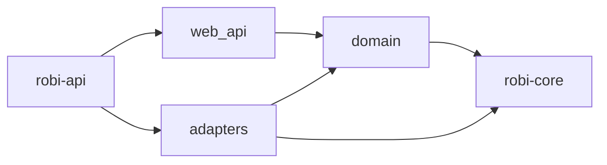

# Persistence

This page defines how Robi stores chat sessions and their messages, and how a
local HTTP API lists and edits chat sessions. It is the design doc for the
chat-session half of **M2**
in the [roadmap](../roadmap.md). Read it before writing code in
`crates/robi::{domain,adapters,web_api}`.

## What this page does not cover

| Topic | Where it belongs |
|---|---|
| The `MessageStore` trait, and emit-after-persist | [agent-loop.md](agent-loop.md) (M0) |
| How a submitted instruction is serialized and interrupted | [chat-runtime.md](chat-runtime.md) (M2) |
| IPC between the loop and the desktop UI | `docs/design/architecture.md` (M2) |
| Chat rendering | `docs/design/chat-ui.md` (M2) |
| API keys and the OS keychain | Deferred. They do not go in this database |
| Where the app's home directory lives | Still open. The server takes an explicit database URL until that is decided |
| Auto-title is a model call after the first turn | The call waits until a turn is persisted. This page fixes that the title starts unset |

## Problem

A chat session has to survive a process restart, and the loop has to rebuild a
turn from the transcript alone. That transcript is a sequence of `Message`
values. The desktop shell also needs a list — title, workspace, last used —
and those fields are not methods on `MessageStore`.

The HTTP API and the loop share one database. They are different ports: the
API edits chat session metadata, and the loop appends chat messages through
`MessageStore`.

## Decision

One SQLite file, applied with `sqlx` migrations, behind three modules in
`crates/robi`. `robi-core` stays the loop. It gains no HTTP stack and no
database driver.

- **`domain/`** holds the chat session model, `ChatSessionRepository`,
  `ChatSessionService`, `ChatMessageService`, `ChatRuntime`, and
  `ServiceError`. It performs no I/O. It may use `SessionId`, `WorkspaceId`,
  and `Message` from `robi-core`.
- **`adapters/`** holds the pool, the migrations, `SqliteChatSessionRepository`,
  `SqliteMessageStore`, and `SerializedChatRuntime`.
- **`web_api/`** holds Axum routes, DTOs, and OpenAPI. `AppState` carries the
  two services. Handlers do not see the pool or an `Agent`.
- **`robi-api`** (`crates/robi/src/bin/robi-api.rs`) is the composition root.
  It builds the factory the runtime uses and stores that factory on the
  runtime. `export-openapi` prints the spec. `src-tauri` is not wired to either.

`ChatSessionRepository` is the metadata port. `SqliteMessageStore` is
`MessageStore` on the same pool. That trait stays as M0 left it, including the
two synchronous methods. Those two call `block_in_place` and `block_on` on the
multi-thread runtime.

The process is single-user and binds a loopback address. There is no account
and no `user_id`.

### Schema

Migration `crates/robi/migrations/0001_chat_sessions.sql`.

`chat_sessions`:

| Column | Type | Notes |
|---|---|---|
| `id` | `TEXT PRIMARY KEY` | `SessionId`, UUIDv7, minted in the adapter |
| `workspace_id` | `TEXT NOT NULL` | `WorkspaceId`. A chat session does not move workspaces |
| `title` | `TEXT` | Null until set. At most 200 characters. The model writes it after the first turn when it is still null |
| `created_at` | `TEXT NOT NULL` | RFC 3339 |
| `updated_at` | `TEXT NOT NULL` | RFC 3339. Moves on title change |
| `last_used_at` | `TEXT NOT NULL` | RFC 3339. Set at create. Moves when a chat message is appended. A title edit and an in-place transcript update leave it alone |

Index: `(workspace_id, last_used_at DESC, id DESC)`.

`chat_messages` is the transcript. `SqliteMessageStore` reads and writes it.
`GET /chat_sessions/{id}/messages` reads it without taking the session actor:

| Column | Type | Notes |
|---|---|---|
| `id` | `TEXT PRIMARY KEY` | `MessageId` |
| `chat_session_id` | `TEXT NOT NULL` | References `chat_sessions(id)` `ON DELETE CASCADE` |
| `position` | `INTEGER NOT NULL` | Insertion order. UUIDv7 is not a total order within one millisecond |
| `body` | `TEXT NOT NULL` | `serde_json` of `robi_core::Message`, so tool-call status stays in the transcript |

Unique `(chat_session_id, position)`.

Every connection sets the pragmas a local file needs: `journal_mode=WAL`
(skipped for in-memory databases, which refuse WAL), `synchronous=NORMAL`,
`foreign_keys=ON`, `temp_store=MEMORY`, `cache_size=-20000`,
`busy_timeout=30000`. `foreign_keys` is per connection; without it the cascade
does not run.

Timestamps and ids are text. Queries use runtime `sqlx::query`, not the
compile-time macros.

### Chat session API

Base path `/api/v1`. One error body, `{ "error": "..." }`.

| Method | Path | Success | Failure |
|---|---|---|---|
| `GET` | `/health` | `200` `Ok` | |
| `POST` | `/chat_sessions` | `201` chat session | `400` if `workspace_id` is not a UUID or `title` is longer than 200 characters |
| `GET` | `/chat_sessions` | `200` list | `400` if `workspace_id` is present and not a UUID |
| `GET` | `/chat_sessions/{id}` | `200` chat session | `404` if missing, `400` if `id` is not a UUID |
| `PATCH` | `/chat_sessions/{id}` | `200` chat session | `404` if missing, `400` if `id` or `title` is invalid |
| `DELETE` | `/chat_sessions/{id}` | `204` | `404` if missing, `400` if `id` is not a UUID |

`POST` body is `{ "workspace_id", "title"? }`. Omitted, null, and `""` are stored
as null. After the first turn, the model writes a title when the column is
still null. A title passed on create is kept, and the model does not replace
it. That model call is not in this API yet; it runs when a turn is persisted.
`PATCH` body is `{ "title" }`. It updates `updated_at` and leaves
`last_used_at` and `workspace_id` alone. A body Axum cannot deserialize is
rejected by Axum (422), which is separate from a title the service refuses.

`GET /chat_sessions` orders by `last_used_at DESC, id DESC`. An optional
`workspace_id` query parameter limits the list to one workspace. There is no
cursor. A single-user chat session list is small enough to return whole.

DTOs use strings for ids and timestamps. The domain keeps `SessionId`,
`WorkspaceId`, and `DateTime<Utc>`. Every chat session response also carries
`has_pending_agent`. It is true while that session's actor is running, and it
is read from the runtime's in-memory slots. It is not a column.

### Chat messages and the runtime

| Method | Path | Success | Failure |
|---|---|---|---|
| `POST` | `/chat_sessions/{id}/messages` | `202` `{ "status": "accepted" }` | `400` if `id` is not a UUID or `instruction` is empty or whitespace, `404` if the chat session is missing, `409` if the transcript is waiting on a tool approval |
| `GET` | `/chat_sessions/{id}/messages` | `200` transcript, in order | `404` if the chat session is missing, `400` if `id` is not a UUID |

`POST` body is `{ "instruction" }`. The handler returns once the session actor
has taken the instruction. The actor, the factory, and the interrupt rules are
in [chat-runtime.md](chat-runtime.md).

`GET` returns each message's id, role, content, tool calls, and tool-call id.
It reads `MessageStore` and does not take the actor lock.

`ServiceError` is `BadRequest`, `NotFound`, `Conflict`, or `Unknown`. The web
layer maps those to 400, 404, 409, and 500. A SQL failure is logged and
returned as `Unknown` with a fixed message, so the client never sees driver
text.

### Configuration

Read in the `robi-api` binary only.

| Variable | Default | Meaning |
|---|---|---|
| `ROBI_DATABASE_URL` | `sqlite://robi.db?mode=rwc` | sqlx SQLite URL |
| `ROBI_BIND` | `127.0.0.1:1431` | Listen address. Must be loopback. `1431` stays off the Vite port `1430` |
| `OPENCODE_GO_API_KEY` | | Required. The process exits when it is missing or empty |
| `ROBI_MODEL` | `glm-5.3` | Model id passed to the provider |
| `ROBI_BASE_URL` | provider default | Optional base URL |
| `ROBI_EFFORT` | unset | Optional `low`, `medium`, or `high`. Any other value exits the process |

`make api` runs the server. `make dev-api` restarts it when `crates/robi` or
`crates/robi-core` change, and needs `cargo-watch`. Swagger UI is at `/docs`.
`make openapi-spec` writes `openapi/openapi.json`. `cargo run -p robi --bin
export-openapi` prints the same document.

### Frontend client

The React shell talks to this API with **openapi-fetch** over types generated
from `openapi/openapi.json`.

| Piece | Location |
|---|---|
| Spec | `openapi/openapi.json` (`make openapi-spec`) |
| Generated types | `src/api/schema.d.ts` (`pnpm run generate:api`) |
| Client | `src/api/client.ts` |
| Session wrappers | `src/api/sessions.ts` |

Web-only Vite (`pnpm dev` on `1430`) proxies `/api` to `127.0.0.1:1431`, so
`VITE_API_BASE_URL` stays empty in that mode. Run `robi-api` beside the UI.
There is no CORS layer on the API yet; packaged Tauri will need a different
path.

Until a workspace picker exists, the shell uses a fixed workspace UUID in
`src/workspace.ts` (`SHELL_WORKSPACE`) and shows `acme-storefront` as the label.
Create and list filter on that id. Null titles render as **New session**.

## Rejected alternatives

1. **JSON files, as gopi writes under `~/.gopi/`.** Rejected for the chat
   session store: a list query, a cascade delete, and a later index want one file with
   migrations. Token-usage history can share that file when it exists.
2. **A new crate for the HTTP stack.** Rejected for now. The modules are
   already shaped like a crate. Split when Tauri should stop compiling Axum
   and sqlx, or when build time says so.
3. **Chat session CRUD traits on `robi-core`.** Rejected. Core holds the four traits
   the loop calls. `ChatSessionRepository` is the API's port. `MessageStore` remains
   the loop's port over the same tables.
4. **Accounts, and a `user_id` column.** Rejected. One person, one machine.
5. **`CREATE TABLE IF NOT EXISTS` plus column backfill.** Rejected. The schema
   starts here, so a migration is the record of it.
6. **A normalized tool-call table.** Rejected for the transcript. The loop's
   `Message` value is already the document. A JSON `body` keeps approval and
   execution status in the one structure a restart reads back.
7. **Copying the first user message into the title.** Rejected. The model writes
   a short title after the first turn. The stored title stays null until that
   write, or until create or a rename supplies one.
8. **Cursor pagination.** Rejected for this list. Add it if a workspace grows
   past what one response should carry.

## Failure modes

- A missing chat session is `404`. The message names the id and does not distinguish
  "never existed" from "deleted".
- A title over 200 characters is `400` and is not written. A missing title is
  null, not an empty string, so a later turn can tell that the model has not
  named the chat session yet.
- Delete removes the chat session and, because foreign keys are on, its chat
  messages.
- `last_used_at` does not move on rename. A title edit is not use.
- In-memory pools (tests) skip WAL. File pools set it. Shared-cache memory is
  how adapter tests share one database across pooled connections.
- The loop's `InMemoryStore` is what `robi-core` tests use. `robi-api` drives
  the loop through `SqliteMessageStore` on this database.
- An instruction submitted while a tool call is waiting on approval is `409`.
  The transcript is unchanged.
- An empty or whitespace instruction is `400` and is not handed to the actor.

## Testing

- `ChatSessionService` tests use a fake `ChatSessionRepository`: create with and without
  a title, missing get, list filter, missing update, delete.
- Adapter tests use a shared-cache in-memory pool: round trip, list order,
  title update leaving `last_used_at` in place, delete of a missing row, and
  cascade from `chat_sessions` to `chat_messages`.
- `SqliteMessageStore` tests cover append order, update in place,
  `last_used_at` moving only on append, and a missing session.
- Runtime and instruction-service tests are in [chat-runtime.md](chat-runtime.md).
- `cargo test -p robi-core` does not link sqlx and does not open a socket.
