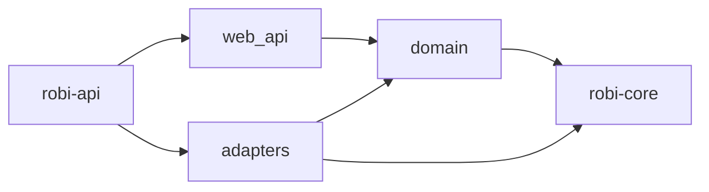

# Persistence

This page defines how Robi stores chat sessions and their messages, and how a
local HTTP API lists and edits chat sessions. It is the design doc for the
chat-session half of **M2**
in the [roadmap](../roadmap.md). Read it before writing code in
`crates/robi::{domain,adapters,web_api}`.

## What this page does not cover

| Topic | Where it belongs |
|---|---|
| The `MessageStore` trait, and emit-after-persist | [agent-loop.md](agent-loop.md) (M0) |
| How a submitted instruction is serialized and interrupted | [chat-runtime.md](chat-runtime.md) (M2) |
| IPC between the loop and the desktop UI | `docs/design/architecture.md` (M2) |
| Chat rendering | `docs/design/chat-ui.md` (M2) |
| API keys and other settings | This page, under [Settings](#settings). They do not go in this database. A later `SettingsStore` can keep secrets in the OS keychain |
| Where the app's home directory lives | Settings use `~/.robi`. The database file stays on `ROBI_DATABASE_URL` |
| Auto-title after a completed turn | [chat-runtime.md](chat-runtime.md). This page fixes that the title starts unset, and that a later write does not replace one already stored |
| The `tool_originals` rows a compressed shell result points at | [shell-output.md](shell-output.md). Deleting the session deletes them |

## Problem

A chat session has to survive a process restart, and the loop has to rebuild a
turn from the transcript alone. That transcript is a sequence of `Message`
values. The desktop shell also needs a list — title, workspace, last used —
and those fields are not methods on `MessageStore`.

The HTTP API and the loop share one database. They are different ports: the
API edits chat session metadata, and the loop appends chat messages through
`MessageStore`.

## Decision

One SQLite file, applied with `sqlx` migrations, behind three modules in
`crates/robi`. `robi-core` stays the loop. It gains no HTTP stack and no
database driver.

- **`domain/`** holds the chat session model, `ChatSessionRepository`,
  `ChatSessionService`, the workspace model, `WorkspaceRepository`,
  `WorkspaceService`, `ChatMessageService`, `ChatRuntime`, `SettingsStore`,
  `SettingsService`, and `ServiceError`. It performs no I/O. It may use
  `SessionId`, `WorkspaceId`, and `Message` from `robi-core`. Canonicalizing a
  workspace root is I/O, so that call is a method on `WorkspaceRepository`.
- **`adapters/`** holds the pool, the migrations, `SqliteChatSessionRepository`,
  `SqliteWorkspaceRepository`, `SqliteMessageStore`, `SerializedChatRuntime`,
  and `TomlSettingsStore`.
- **`web_api/`** holds Axum routes, DTOs, and OpenAPI. `AppState` carries the
  workspace service, the chat session service, the chat message service, and
  the settings service. Handlers do not see the pool or an `Agent`.
- **`robi-api`** (`crates/robi/src/bin/robi-api.rs`) is the composition root.
  It builds the factory the runtime uses and stores that factory on the
  runtime. `export-openapi` prints the spec. `src-tauri` is not wired to either.

`ChatSessionRepository` is the metadata port. `SqliteMessageStore` is
`MessageStore` on the same pool. The trait keeps the two synchronous methods
from M0. Those two call `block_in_place` and `block_on` on the multi-thread
runtime. `message` is a keyed read of one row.

The process is single-user and binds a loopback address. There is no account
and no `user_id`.

### Schema

Migration `crates/robi/migrations/0001_chat_sessions.sql` creates workspaces,
chat sessions, and chat messages. `0002_session_file_baselines.sql` creates the
baseline table. `0003_session_model_config.sql` adds the session model override.
`0004_session_mode.sql` adds `mode` and rewrites `model_config` into per-mode
objects.
The four path-rule columns default to `[]`.
They store session additions. The built-in secret and `.git` patterns are
applied in code and are not written on the row.

`workspaces`:

| Column | Type | Notes |
|---|---|---|
| `id` | `TEXT PRIMARY KEY` | `WorkspaceId`, UUIDv7, minted in the adapter |
| `name` | `TEXT NOT NULL` | Final path component of `root`. The sidebar workspace header shows this |
| `root` | `TEXT NOT NULL UNIQUE` | Canonical absolute directory. Opening the same directory again returns this row |
| `mcp_project_sha256` | `TEXT` | SHA-256 of `<workspace>/.robi/mcp.json` after the user enables that file. Null until then. See [mcp.md](mcp.md) |
| `created_at` | `TEXT NOT NULL` | RFC 3339 |

Index: `(created_at DESC, id DESC)`.

`chat_sessions`:

| Column | Type | Notes |
|---|---|---|
| `id` | `TEXT PRIMARY KEY` | `SessionId`, UUIDv7, minted in the adapter |
| `workspace_id` | `TEXT NOT NULL` | `WorkspaceId`. References `workspaces(id)` `ON DELETE CASCADE`. A chat session does not move workspaces |
| `title` | `TEXT` | Null until set. At most 200 characters. The model writes it after the first turn when it is still null |
| `path_allow_read` | `TEXT NOT NULL` | JSON array of regexes. `[]` on create. Appended to the empty built-in allow list. A more specific match lets that read through a deny. The compiled filter also allows reading `~/.robi/plans/<session_id>`. That allow is not stored |
| `path_allow_write` | `TEXT NOT NULL` | JSON array of regexes. `[]` on create. Appended to the empty built-in allow list. A more specific match lets that write through a deny |
| `path_deny_read` | `TEXT NOT NULL` | JSON array of regexes. `[]` on create. Appended after the built-in read denies |
| `path_deny_write` | `TEXT NOT NULL` | JSON array of regexes. `[]` on create. Appended after the built-in write denies |
| `allow_hosts` | `TEXT NOT NULL` | JSON array of hostnames. `[]` on create. `web_fetch` appends a host after the user approves that call. See [web-tools.md](web-tools.md) |
| `mcp_allows` | `TEXT NOT NULL` | JSON array of `{ "server", "tool" }`. `[]` on create. An MCP approval that allows the tool for this session appends one pair. See [mcp.md](mcp.md) |
| `mode` | `TEXT NOT NULL` | `ask`, `plan`, or `agent`. `agent` on create. Selects the tool registry and the prompt prefix |
| `model_config` | `TEXT NOT NULL` | JSON object. `{}` on create. Optional `agent`, `ask`, and `plan` objects, each with optional `model` and `reasoning_effort`. An absent key inherits that mode's setting, then the fallback setting, then the built-in model |
| `plan_path` | `TEXT` | Null until `write_plan` or `todos` writes a plan. Stored as `~/.robi/plans/<session_id>/<file>.md`. A later write replaces it. `updated_at` and `last_used_at` do not move |
| `created_at` | `TEXT NOT NULL` | RFC 3339 |
| `updated_at` | `TEXT NOT NULL` | RFC 3339. Moves on a title change, a path-rule edit, a host-allow edit, or a model-config edit |
| `last_used_at` | `TEXT NOT NULL` | RFC 3339. Set at create. Moves when a chat message is appended. A title edit and an in-place transcript update leave it alone |

Index: `(workspace_id, last_used_at DESC, id DESC)`.

`chat_messages` is the transcript. `SqliteMessageStore` reads and writes it.
`GET /chat_sessions/{id}/messages` reads it without taking the session actor:

| Column | Type | Notes |
|---|---|---|
| `id` | `TEXT PRIMARY KEY` | `MessageId` |
| `chat_session_id` | `TEXT NOT NULL` | References `chat_sessions(id)` `ON DELETE CASCADE` |
| `position` | `INTEGER NOT NULL` | Insertion order. UUIDv7 is not a total order within one millisecond |
| `body` | `TEXT NOT NULL` | `serde_json` of `robi_core::Message`, so tool-call status stays in the transcript |

Unique `(chat_session_id, position)`.

`session_file_baselines` is the pre-edit body of each path a chat session has
written or deleted. The edit tools insert it. Review reads it. See
[checkpoints.md](checkpoints.md).

| Column | Type | Notes |
|---|---|---|
| `chat_session_id` | `TEXT NOT NULL` | References `chat_sessions(id)` `ON DELETE CASCADE` |
| `path` | `TEXT NOT NULL` | Workspace-relative, `/` separators. A path outside the workspace starts with `..` |
| `baseline` | `TEXT NOT NULL` | UTF-8 body before this session's first change. `''` when the file did not exist |
| `created` | `INTEGER NOT NULL` | `1` when the file did not exist. `0` when it did |

Primary key `(chat_session_id, path)`. A second change of the same path does not replace the row.

Every connection sets the pragmas a local file needs: `journal_mode=WAL`
(skipped for in-memory databases, which refuse WAL), `synchronous=NORMAL`,
`foreign_keys=ON`, `temp_store=MEMORY`, `cache_size=-20000`,
`busy_timeout=30000`. `foreign_keys` is per connection; without it the cascade
does not run.

Timestamps and ids are text. Queries use runtime `sqlx::query`, not the
compile-time macros.

### HTTP API

Base path `/api/v1`. One error body, `{ "error": "..." }`.

| Method | Path | Success | Failure |
|---|---|---|---|
| `GET` | `/health` | `200` `Ok` | |
| `GET` | `/workspaces` | `200` list | |
| `POST` | `/workspaces` | `201` when the root is new, `200` when that canonical directory is already stored | `400` if `root` is empty, missing, or not a directory |
| `GET` | `/workspaces/{id}` | `200` workspace | `404` if missing, `400` if `id` is not a UUID |
| `DELETE` | `/workspaces/{id}` | `204` | `404` if missing, `400` if `id` is not a UUID. Sessions and their messages go with it |
| `GET` | `/models` | `200` catalog | The tool-capable models, each `{ "id", "display_name", "context_window" }` |
| `POST` | `/chat_sessions` | `201` chat session | `400` if `workspace_id` is not a UUID, `title` is longer than 200 characters, `mode` is not `ask`, `plan`, or `agent`, `model` is unknown, or `reasoning_effort` is not `low`, `medium`, or `high`. `404` if that workspace does not exist |
| `GET` | `/chat_sessions` | `200` list | `400` if `workspace_id` is present and not a UUID |
| `GET` | `/chat_sessions/{id}` | `200` chat session | `404` if missing, `400` if `id` is not a UUID |
| `PATCH` | `/chat_sessions/{id}` | `200` chat session | `404` if missing, `400` if `id` is not a UUID, `title` is invalid, a path pattern is not a regex, a host is empty or includes a scheme, port, or user info, `mode` is not `ask`, `plan`, or `agent`, `model` is unknown, or `reasoning_effort` is not `low`, `medium`, or `high` |
| `DELETE` | `/chat_sessions/{id}` | `204` | `404` if missing, `400` if `id` is not a UUID |

`POST /workspaces` body is `{ "root" }`. The adapter canonicalizes the path,
so a symlink and its target are one workspace. `name` is the last path
component. `GET /workspaces` orders by `created_at DESC, id DESC`.

`POST` body for a chat session is `{ "workspace_id", "title"?, "mode"?, "model_config"? }`. Omitted, null, and `""` are stored
as null. After a turn completes, the model writes a title when the column is
still null. A title passed on create is kept, and the model does not replace
it. That call is specified in [chat-runtime.md](chat-runtime.md).
`mode` is `ask`, `plan`, or `agent`. Omitted stores `agent`.
`model_config` is `{ "agent"?, "ask"?, "plan"? }`. Each mode object is
`{ "model"?, "reasoning_effort"? }`. Omitted stores `{}`.
`model` must be a catalog id. `reasoning_effort` is `low`, `medium`, or `high`.
`PATCH` body is `{ "title"?, "path_allow_read"?, "path_allow_write"?, "path_deny_read"?, "path_deny_write"?, "allow_hosts"?, "mode"?, "model_config"? }`.
Each field is optional. An omitted field stays as stored. A present path list
replaces that list. A present `allow_hosts` replaces that list. Each entry is
a hostname with no scheme, port, or user info. Inside one mode object, an
omitted key stays, a string sets that override, and `null` clears it. An
omitted mode object stays. `updated_at` moves when any field is present.
`last_used_at` and `workspace_id` stay put. An empty body returns the session
unchanged. A body Axum cannot deserialize is rejected by Axum (422), which is
separate from a title, a pattern, or a host the service refuses. Path lists
and how tools match them are in [read-tools.md](read-tools.md). Host matching
is in [web-tools.md](web-tools.md).

`GET /chat_sessions` orders by `last_used_at DESC, id DESC`. An optional
`workspace_id` query parameter limits the list to one workspace. There is no
cursor. A single-user chat session list is small enough to return whole.

DTOs use strings for ids and timestamps. The domain keeps `SessionId`,
`WorkspaceId`, and `DateTime<Utc>`. Every chat session response also carries
`has_pending_agent`. It is true while that session's actor is running, and it
is read from the runtime's in-memory slots. It is not a column.

### Chat messages and the runtime

| Method | Path | Success | Failure |
|---|---|---|---|
| `POST` | `/chat_sessions/{id}/messages` | `202` `{ "status": "accepted" }` | `400` if `id` is not a UUID or `instruction` is empty or whitespace, `404` if the chat session is missing, `409` if the transcript is waiting on a tool approval |
| `GET` | `/chat_sessions/{id}/messages` | `200` transcript, in order | `404` if the chat session is missing, `400` if `id` is not a UUID |
| `GET` | `/chat_sessions/{id}/messages/{message_id}` | `200` one message | `404` if the chat session or the message is missing, `400` if either id is not a UUID |
| `POST` | `/chat_sessions/{id}/tool_calls/{call_id}` | `202` `{ "status": "accepted" }` | `400` if an id is not a UUID or `decision` is not `approve` or `reject`, `404` if the chat session is missing, `409` if the actor is running |
| `POST` | `/chat_sessions/{id}/stop` | `202` `{ "status": "stopped" }` | `400` if `id` is not a UUID, `404` if the chat session is missing |

`POST` of a message body is `{ "instruction" }`. The handler returns once the
session actor has taken the instruction. `POST` of a tool call body is
`{ "decision": "approve" | "reject", "reason"?: string }`. `approve` runs the
call. `reject` refuses it; an empty reason becomes `rejected by the user`. The
actor then resumes the paused turn. `POST /chat_sessions/{id}/stop` cancels
the in-flight turn, drops any instruction that has not started, and returns
after that session's actor has exited. An idle session is the same `202`.
The actor, the factory, and the interrupt rules are in
[chat-runtime.md](chat-runtime.md).

`GET` of the list and `GET` of one message return each message's id, role,
content, tool calls, and tool-call id. When the provider reported tokens for
that turn, the message also includes `usage`: `{ "input", "output", "cached" }`.
`input` is that request's prompt size. The list calls `MessageStore::messages`.
The single-message read calls `MessageStore::message`, which loads that row
by id. Neither takes the actor lock. A message id that is absent from that
session is `404`.

`ServiceError` is `BadRequest`, `NotFound`, `Conflict`, or `Unknown`. The web
layer maps those to 400, 404, 409, and 500. A SQL failure or a failed settings
sync is logged and returned as `Unknown` with a fixed message, so the client
never sees driver text. Opening a workspace and creating a chat session are
logged at info with their ids. A successful settings write is logged at info
with the key and without the value.

### Settings

String settings live in memory and are read on every query. `~/.robi` is the
directory, from `HOME`. Non-secrets are `config.toml`. Secrets are
`secrets.toml`. Both are a flat table of strings. A missing file loads as
empty. The directory is created `0700`, and both files are written `0600`.
`secrets.toml` is refused when group or world can read it. A key that appears
in both files keeps the secrets copy.

`SettingsStore` is the port. `get` returns the in-memory value. `set` updates
that map, then rewrites both files, and restores the previous value when the
write fails. `TomlSettingsStore` is the first implementation. A later one can
keep secrets in the OS keychain without changing callers.

The API reads and writes only these keys. Each has a fixed secret flag. A key
that is not in this list is `400`.

| Key | Secret | Default |
|---|---|---|
| `opencode_go_api_key` | yes | None. A chat turn is `400` until this is set |
| `model` | no | `glm-5.3`, written on the first read when the key is absent |
| `reasoning_effort` | no | None. Optional `low`, `medium`, or `high`. Fallback when a mode has no effort |
| `model_ask`, `model_plan`, `model_agent` | no | None. Optional model id for that mode. Empty inherits `model` |
| `reasoning_effort_ask`, `reasoning_effort_plan`, `reasoning_effort_agent` | no | None. Optional effort for that mode. Empty inherits `reasoning_effort` |
| `base_url` | no | None. Optional provider base URL |
| `system_prompt` | no | None. Optional text added to the system prompt after the built-in block |
| `lsp` | no | `on`, written on the first read when the key is absent. `off` leaves the language-server tools unregistered. See [lsp.md](lsp.md) |
| `brave_search_api_key` | yes | None. `web_search` returns a tool error until this is set. See [web-tools.md](web-tools.md) |

A read of an absent key that has a default calls the same write as `PUT`: the
value is stored in memory and both files are rewritten, then the read returns
that value. A read of an absent key with no default returns `value: null` and
does not write a file. An empty value is rejected. `DELETE` removes a
non-secret key so the next read inherits. A secret key cannot be removed.

`SettingsModelSource` reads these keys when a session actor starts and passes
the result to `build_model`. A turn that is already running keeps its model.
The server starts without an API key: health and these routes work, and the
first chat turn fails until `opencode_go_api_key` is set.

| Method | Path | Success | Failure |
|---|---|---|---|
| `GET` | `/settings/{key}` | `200` setting | `400` if `key` is not in the whitelist |
| `PUT` | `/settings/{key}` | `204` | `400` if `key` is not in the whitelist, `value` is empty, or the secret flag does not match the key. `500` if the files could not be written |
| `DELETE` | `/settings/{key}` | `204` | `400` if `key` is not in the whitelist or the key is a secret. `500` if the files could not be written |

`PUT` body is `{ "value", "secret" }`. `GET` of a stored secret returns
`{ "key", "secret": true }` and omits `value`. `GET` of an unset key with no
default returns `{ "key", "secret", "value": null }`.

### Configuration

Read in the `robi-api` binary only.

| Variable | Default | Meaning |
|---|---|---|
| `ROBI_DATABASE_URL` | `sqlite://robi.db?mode=rwc` | sqlx SQLite URL |
| `ROBI_BIND` | `127.0.0.1:1431` | Listen address. Must be loopback. `1431` stays off the Vite port `1430` |

Provider credentials and model choices are [settings](#settings), not
environment variables. `examples/simple.rs` still reads `OPENCODE_GO_API_KEY`,
`ROBI_MODEL`, `ROBI_BASE_URL`, and `ROBI_EFFORT` for that one program.

`make api` runs the server. `make dev-api` restarts it when `crates/robi` or
`crates/robi-core` change, and needs `cargo-watch`. A Rust diagnostics call
still triggers that restart; see [lsp.md](lsp.md#failure-modes). Swagger UI is
at `/docs`.
`make openapi-spec` writes `openapi/openapi.json`. `cargo run -p robi --bin
export-openapi` prints the same document.

### Frontend client

The React shell talks to this API with **openapi-fetch** over types generated
from `openapi/openapi.json`.

| Piece | Location |
|---|---|
| Spec | `openapi/openapi.json` (`make openapi-spec`) |
| Generated types | `src/api/schema.d.ts` (`pnpm run generate:api`) |
| Client | `src/api/client.ts` |
| Session wrappers | `src/api/sessions.ts` |
| Workspace wrappers | `src/api/workspaces.ts` |

Web-only Vite (`pnpm dev` on `1430`) proxies `/api` to `127.0.0.1:1431`, so
`VITE_API_BASE_URL` stays empty in that mode. Run `robi-api` beside the UI.
There is no CORS layer on the API yet; packaged Tauri will need a different
path.

The shell shows one workspace at a time. The active id is
`localStorage` key `robi.activeWorkspaceId`. `/workspaces` is the list: search,
sort, create, and open. The sidebar links there under the workspace dropdown, and an empty list
opens that page instead of the chat. The workspace dropdown at the top of the
sidebar still switches the active workspace without leaving the chat. Add opens the system
folder dialog in the desktop window, and asks for a path in a normal browser.
List and create of chat sessions use that active id. Switching workspaces
clears the open session and shows the draft composer for the newly selected
workspace. Null titles render as **New session**.

Loop events are not REST. The shell opens one `EventSource` on
`/api/v1/events/stream` through the same proxy. Envelope, fan-out, and reconnect
rules are in [events-sse.md](events-sse.md).

## Rejected alternatives

1. **JSON files, as gopi writes under `~/.gopi/`.** Rejected for the chat
   session store: a list query, a cascade delete, and a later index want one file with
   migrations. Token-usage history can share that file when it exists.
2. **A new crate for the HTTP stack.** Rejected for now. The modules are
   already shaped like a crate. Split when Tauri should stop compiling Axum
   and sqlx, or when build time says so.
3. **Chat session CRUD traits on `robi-core`.** Rejected. Core holds the four traits
   the loop calls. `ChatSessionRepository` is the API's port. `MessageStore` remains
   the loop's port over the same tables.
4. **Accounts, and a `user_id` column.** Rejected. One person, one machine.
5. **`CREATE TABLE IF NOT EXISTS` plus column backfill.** Rejected. The schema
   starts here, so a migration is the record of it.
6. **A normalized tool-call table.** Rejected for the transcript. The loop's
   `Message` value is already the document. A JSON `body` keeps approval and
   execution status in the one structure a restart reads back.
7. **Copying the first user message into the title.** Rejected. The model writes
   a short title after the first turn. The stored title stays null until that
   write, or until create or a rename supplies one.
8. **Cursor pagination.** Rejected for this list. Add it if a workspace grows
   past what one response should carry.

## Failure modes

- A missing chat session is `404`. The message names the id and does not distinguish
  "never existed" from "deleted".
- A missing workspace is `404`. Creating a chat session for an unknown
  workspace is the same. Deleting a workspace removes its sessions and, because
  foreign keys are on, their messages.
- A workspace root that is empty, missing, or a file is `400` and is not written.
- A title over 200 characters is `400` and is not written. A missing title is
  null, not an empty string, so a later turn can tell that the model has not
  named the chat session yet.
- Delete removes the chat session and, because foreign keys are on, its chat
  messages.
- `last_used_at` does not move on rename. A title edit is not use.
- In-memory pools (tests) skip WAL. File pools set it. Shared-cache memory is
  how adapter tests share one database across pooled connections.
- The loop's `InMemoryStore` is what `robi-core` tests use. `robi-api` drives
  the loop through `SqliteMessageStore` on this database.
- An instruction submitted while a tool call is waiting on approval is `409`.
  The transcript is unchanged.
- An empty or whitespace instruction is `400` and is not handed to the actor.

## Testing

- `WorkspaceService` tests use a fake `WorkspaceRepository`: create stores the
  directory name, a second open of the same canonical root does not insert,
  a missing path is rejected before insert, an empty root never canonicalizes,
  a duplicate insert returns the existing row, list order, and delete of a
  missing id.
- Workspace adapter tests use a shared-cache in-memory pool: canonical root round trip,
  one row for a repeated open and for a symlink to that directory, rejection
  of a missing path and of a file, list order, and delete cascading to
  `chat_sessions` and `chat_messages`.
- `ChatSessionService` tests use a fake `ChatSessionRepository`: create with and without
  a title, empty path lists on create, a path pattern that does not compile,
  missing get, list filter, missing update, a null title written once
  and not replaced, an empty or oversized generated title refused, delete, and create against
  an unknown workspace.
- `SqliteChatSessionRepository` tests use a shared-cache in-memory pool: round trip, list order,
  title update leaving `last_used_at` in place, empty path lists on create,
  a patch of one list leaving the others, a null title written once and
  not replaced, delete of a missing row,
  create when the workspace row is absent, and
  cascade from `chat_sessions` to `chat_messages`.
- `SqliteMessageStore` tests cover append order, update in place,
  `last_used_at` moving only on append, a single-message lookup, and a missing
  session.
- Runtime and instruction-service tests are in [chat-runtime.md](chat-runtime.md).
- Settings service tests reject a key outside the whitelist, an empty value,
  and a known key stored with the wrong secret flag. A read of an unset
  `model` writes `glm-5.3` through the store. A read of an unset key with no
  default returns an empty value and leaves the store unchanged. The TOML adapter tests round-trip both
  files, refuse a group-readable `secrets.toml`, and check that a failed write
  leaves the previous value in memory. `SettingsModelSource` tests check that
  a write between two builds is what the second build uses.
- `cargo test -p robi-core` does not link sqlx and does not open a socket.
