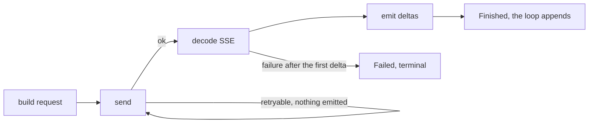

# Providers and streaming

This page defines how Robi reaches a model provider: the request it builds, the
delta protocol a response becomes, and how it retries, times out, cancels, and
reports failure. It is the design doc for **M1** in the [roadmap](../roadmap.md).

The first implementation is one OpenAI-compatible chat-completions client, wired
to **OpenCode Go**. Read this page before writing code in `crates/robi::providers`.

## What this page does not cover

| Topic | Where it belongs |
|---|---|
| The `Model` trait, the `Delta` enum, and the loop that consumes it | [agent-loop.md](agent-loop.md) (M0) |
| The IPC encoding of a delta, and how the UI subscribes | `docs/design/architecture.md` (M2) |
| Where the API key lives, and the settings UI that produces it | `docs/design/persistence.md` (M2) |
| Token accounting and compaction triggers | `docs/design/context-management.md` (M3) |

This page fixes the in-process provider boundary. The delta *vocabulary* is already
fixed by M0; M1 adds emitters, not variants.

## Problem

The M0 loop is frozen: it drives an async, cancellable `Model` and consumes a
stream of deltas. M1 makes that real, and every hard part sits in the adapter:

- **A provider accepts one shape of transcript and no other.** Robi's transcript
  has no `system` role, and its tool-call ids are UUIDs the provider never issued.
  Both need a mapping rule, and the rules are load-bearing.
- **A stream can fail after it has already produced output.** A retry that fires
  mid-stream renders a partially duplicated message. The retry boundary has to be
  a property of the design, not a hope.
- **The endpoint is a proxy in front of 33 models from different labs.** The
  fields that carry reasoning are not in OpenAI's schema, and a strict decoder
  drops them or fails the turn.
- **A cancelled turn must leave a resolvable transcript.** Cancellation arrives
  while a socket is open, so the adapter owns part of that guarantee.

## Scope

**In scope.** One provider family, OpenAI-compatible chat completions, and one
instance of it, OpenCode Go. Streaming deltas, tool calling, reasoning traces,
retries, cancellation, a model catalog, an SSE decoder, and the tests for each.

**Out of scope.** The Anthropic client, the OpenAI *Responses* API, embeddings,
structured outputs, image inputs, per-session model selection in a UI, and the
settings and keychain layer. This milestone defines the seam that layer plugs
into; it does not build it.

## Provider facts

| Fact | Value |
|---|---|
| Base URL | `https://opencode.ai/zen/go/v1` |
| Chat endpoint | `POST {base}/chat/completions`, SSE when streaming |
| Model list | `GET {base}/models` |
| Model id | Config uses `opencode-go/<model-id>`; the provider receives `<model-id>` alone |
| Auth | `Authorization: Bearer <api key>` |
| Session header | `x-opencode-session: <stable id per conversation>` |
| User agent | The agent's own name, `robi/0.1` |
| Catalog | 33 models, all with tool calling and reasoning |

Sources: [OpenCode Go](https://opencode.ai/docs/go/),
[OpenCode providers](https://opencode.ai/v2/docs/providers/),
[models.dev: opencode-go](https://models.dev/providers/opencode-go/).

These facts come from vendor documentation, not from a live probe, and the vendor
serves tool-less models elsewhere. The catalog lists only the tool-capable ones, so
every entry above is one this loop can drive. The live tests in
[Testing](#testing) are what would confirm the framing; they are not written yet.

## Decisions

### D1 — A hand-written adapter, not an OpenAI SDK

Take no OpenAI SDK. Write one adapter for one wire format, covering only the
subset the transcript needs.

- **There is no official OpenAI Rust SDK.** OpenAI ships Python, Node, .NET, Java,
  and Go; Rust is an open feature request
  ([openai-go #628](https://github.com/openai/openai-go/issues/628)). "Use the
  SDK" therefore means a third-party crate, today
  [`async-openai`](https://crates.io/crates/async-openai).
- **An SDK does not remove the work that carries the risk.** The delta vocabulary
  is Robi's and frozen from M0. An SDK returns its own types, so the transcript
  mapping, delta mapping, tool-call assembly, cancellation path, timeouts, and
  error classification are written either way. The SDK replaces HTTP and SSE
  plumbing: three files of the module tree below.
- **A typed decoder drops exactly the fields this endpoint needs.**
  `reasoning_content` is not in OpenAI's schema. Reading it through `async-openai`
  means bypassing the typed stream with `create_stream_byot` and a custom chunk
  type, as in [agent-driver-rs #2](https://github.com/Shearerbeard/agent-driver-rs/pull/2)
  on `async-openai` 0.41.1. That work comes *with* the dependency, not instead of
  it, and a strict decoder fails a turn on a line our decoder skips. A proxy
  fronting 33 models from different labs emits lines no one schema describes.
- **The costs are concrete.** A large transitive tree, a version pin, and an MSRV
  that may exceed the workspace's 1.75 pin.

**Rejected:** `async-openai` or a comparable crate. It supports a custom base URL,
per-request headers, and SSE streaming, so it would work. This is a judgement
call favouring tolerance and a small dependency tree, not a proven conclusion.

**This decision is cheap to reverse.** The adapter sits behind
`robi_core::Model`, and `wire.rs`, `sse.rs`, and `stream.rs` stay separate. Swap
the plumbing in one file. Re-open the decision when a second provider shows the
plumbing duplicating, or when the provider count passes two.

### D2 — The adapter injects the system prompt

`robi_core::message::Role` has `User`, `Assistant`, and `Tool`, and the
transcript holds no system message. Build the request with
`{"role":"system","content": settings.system_prompt}` prepended.

**Rejected:** adding `Role::System` to `robi-core`. That is a core change for a
provider-shaped concern, and prompt assembly belongs in a `robi-core::prompt`
module, which M3's project-instructions work will introduce anyway.

**Consequence, accepted:** a session record cannot show what the model was told,
because the system prompt never enters the transcript.

### D3 — The provider's tool-call id is the wire id; the UUID stays the loop's identity

The chat format requires the id in an assistant `tool_calls[]` entry to equal the
`tool_call_id` of the answering `tool` message. The provider mints its own id
(`call_abc123`); Robi mints a UUID.

Store the provider's id and send it back:

```rust
// crates/robi-core/src/message.rs
    /// The id the provider issued for this call, when it issued one.
    ///
    /// The wire id: a stateless request body must repeat what the provider handed
    /// out. Not identity — the loop keys on `id`, so a provider id that is reused,
    /// absent, or malformed cannot confuse approval or lookup.
    #[serde(default, skip_serializing_if = "Option::is_none")]
    pub provider_call_id: Option<String>,
```

Request building sends `provider_call_id` when present and the `ToolCallId` string
otherwise. An OpenCode Go turn always provides one, so the fallback covers
fixtures, a replayed transcript, and a server that omits the field.

**Keep both ids, because they answer different questions.** The wire needs the
provider's id to accept the request. The loop needs a stable local key: `ToolCallId`
indexes `Message::tool_call_id`, `Agent::approve`, `Agent::reject`, and the
pending-call scan. A provider id is an opaque string from an endpoint fronting 33
models, nothing guarantees it is unique across turns, and a duplicate would make
two calls indistinguishable to `approve`.

A single `ToolCallId -> wire id` map, built by scanning the transcript's assistant
messages, resolves both the assistant entry and the matching tool result, so the
two always agree. The lookup is needed either way, because a tool-result message
carries only the local id.

**Rejected: widening `ToolCallId` to `Uuid | Opaque(String)`.** It changes a type
the loop compares and looks up, in serialization and at every construction site,
to carry a string the loop never reads.

**Rejected: an adapter-side `ToolCallId -> provider id` map.** The adapter is
stateless, and the transcript is the only state that survives a restart. After a
restart the map is empty, so a resumed conversation sends a tool result whose id
the provider no longer recognizes. That failure is silent and appears only on
resume.

**Why the change is small.** The field is additive, so `ToolCallId` stays a UUID
and `#[serde(default)]` keeps existing serialized transcripts deserializing.
`ToolCall` has one construction site, `ToolCall::new`, and no struct-literal
construction anywhere in the crate. The field follows the `args_error` precedent:
an optional annotation an adapter sets.

**What sets it.** `Delta::ToolCallStart` does not change. The vocabulary is fixed
from M0, and no consumer needs the provider's internal id mid-stream. The adapter
keeps the provider id in per-index assembly state and stamps it on the `ToolCall`
inside the `Finished` message, which the loop appends as it is.

### D4 — The session header is the loop's `SessionId`, passed to the model

The vendor asks for a stable id per conversation in `x-opencode-session`, for
routing and prompt caching. The loop already holds exactly that value: `Agent`
carries a `SessionId` from `MessageStore::create_session` through every turn, and
`model_turn` has it one line above its call to `Model::generate`. Pass it in and
send it as the header. The adapter treats it as an opaque string.

That means one signature change to `Model::generate`:

```rust
async fn generate(
    &self,
    session: SessionId,
    transcript: &[Message],
    cancel: CancellationToken,
) -> Result<ModelStream, ModelError>;
```

The id is minted once, when the store opens a session, and is persisted with it, so
it is identical on every turn of a conversation and identical after a restart.

Send the header on `POST /chat/completions` and nowhere else: not on a model-list
request, not on a catalog refresh, which is vendored (D9).

**This is a deliberate change to a trait the M0 doc froze, and it is the right
one.** Three reasons:

- **It is not a new concept.** The id already reaches the call site. Deriving the
  key from the transcript's first message would invent a proxy for a value the loop
  is already holding.
- **The proxy is fragile.** Compaction (M3) can drop the first message, which
  silently changes the key and loses the prompt cache the header exists to keep. A
  design whose own caveat is "the key may change" has the wrong key.
- **The trait was incomplete, not merely inconvenient.** Per-session model
  selection (F1.4) needs a router mapping a session to a configured model, and a
  `Model` received only the transcript and the cancellation token. Without the
  session id in the signature that router cannot be written; it would have to
  re-derive the session from the transcript, which is the same fragile trick again.

[agent-loop.md](agent-loop.md) owns the `Model` trait, so it is updated in the same
change, per the working rule that documentation ships with the behavior.

**Rejected: deriving the header from the transcript's first message.** It works
until compaction, and it makes the key an accident of transcript content rather
than a fact about the conversation.

**Rejected: an in-memory random id per session.** It changes across a process
restart, which defeats the caching it exists for.

**Rejected: a `ModelCallContext` struct holding the session.** One field today, and
a struct added for a second field that may never arrive is speculative. When a
second per-call input appears — a token budget, a retrieval hint — wrap the
signature then and move the id into it.

### D5 — `ModelError` stays two-variant

`robi_core::error::ModelError` has `Provider(String)` and `StreamClosed`.
Retryability is decided inside the adapter, so the loop never needs it. The adapter
encodes the HTTP status and a stable kind word in the message text, as in
`rate limited (429)`.

**Deferred:** a structured `ModelError::Http { status, retryable, body }`, when the
M2 UI must render a rate limit differently from a rejected key. Recording the
deferral keeps the loop frozen at M1.

### D6 — A hand-written SSE decoder

Decode SSE with about 60 lines over `Response::bytes_stream()`. That keeps exact
control of the inter-chunk timeout and of cancellation, which a wrapper hides.

The decoder reads a byte stream, not lines, and handles what the spec requires:

- Join multi-line `data:` fields into one payload, separated by `\n`.
- Accept both CRLF and LF line endings.
- Ignore `:` comment lines, and `event:`, `id:`, and `retry:` fields.
- Dispatch the accumulated payload on a blank line.
- Treat `data: [DONE]` as end of stream.

**Rejected:** `reqwest-eventsource`, `async-sse`, and `eventsource-stream`, which is
effectively unmaintained.

### D7 — Retry only before the first delta

Allow a retry only while the adapter has emitted nothing: a connect failure, a
retryable status, a timeout waiting for response headers, or a failure before the
first `Delta`. After the first delta, a failure is terminal and becomes
`Delta::Failed(ModelError::StreamClosed)`, so the loop ends the turn without
appending.

That boundary is what stops a retry from duplicating a partially rendered message.



Policy:

| Response | Retry |
|---|---|
| 429 | Yes, after the `Retry-After` delay when present |
| 5xx | Yes |
| Connect failure, or timeout on response headers | Yes |
| 400, 401, 403, 404, 422 | No |
| Cancellation | No |
| Inter-chunk gap over `chunk_timeout` | No |
| Anything after the first delta | No |

Backoff is exponential with full jitter, 500 ms base, 8 s cap, 3 attempts.
`Retry-After` accepts both delta-seconds and an HTTP date.

### D8 — Credentials come from a factory, and the model never looks behind it

An `OpenAiCompatibleModel` takes a fully-constructed `ProviderSettings` and reads
no environment variable, no file, and no keychain. M2 adds the layer that produces
one: settings storage plus the OS keychain.

`providers::factory::build_model` owns construction, so the model type stays a leaf
and one place knows how a provider is assembled. It takes the `ToolRegistry` as well
as the settings, because the request body carries the tool definitions and
`Model::generate` is handed only the transcript. A live test builds the same way and
reads the key from the environment itself, which keeps this boundary honest.

**Switching models goes through a `ModelRouter`.** It is a `Model` itself, so
`Agent` keeps holding one `Arc<dyn Model>` and never learns that switching exists.
It resolves the session's model — session override, then provider default — and
dispatches:

```rust
// providers/router.rs (M2)
pub struct ModelRouter {
    client: reqwest::Client,          // shared: one connection pool, one TLS setup
    catalog: Arc<ModelCatalog>,
    settings: Arc<dyn SessionSettingsSource>, // where a session's choice is stored
    defaults: ProviderSettings,
}

#[async_trait]
impl Model for ModelRouter {
    async fn generate(&self, session: SessionId, transcript: &[Message],
                      cancel: CancellationToken) -> Result<ModelStream, ModelError> {
        let resolved = self.resolve(session).await?;
        self.model_for(resolved).generate(session, transcript, cancel).await
    }
}
```

Building a model assembles a settings struct, so a switch costs nothing per turn;
cache the per-session model rather than re-resolving settings on every `generate`.
Sharing one `reqwest::Client` across every model is what keeps a switch from
duplicating the connection pool.

**Not** by swapping the `Arc<dyn Model>` on the `Agent`. That produces a global
switch rather than a per-session one, and it needs `&mut self` or interior
mutability on an agent that several calls already drive concurrently.

**Deferred to M2:** the router, and the picker that writes a session's choice.
M1 has no UI and one provider, so `Arc<dyn OpenAiCompatibleModel>` already behaves
as a router with a single entry; wiring it is `Agent::new(Arc::new(router))`. D4's
signature change is what makes the router writable at all: it receives the
`SessionId` it needs to pick a model, so it waits on the UI, not on a missing input.

**Deferred to M2:** the switch taking effect at a turn boundary. A turn calls
`generate` several times in the tool loop, so a change landing mid-turn would run
half an exchange on one model. The UI knows the boundaries from `TurnStarted` and
`TurnFinished`, so the composer gates the picker and no trait change is needed.

### D9 — The catalog is vendored, tool-capable models only, and owns the window

Keep a checked-in model table, generated from a models.dev snapshot, plus a loader
for user overrides. Fetching at startup makes the app fail without connectivity,
and a live desktop tool should not phone home to render a context meter.

Two rules:

- **List only models that call tools.** A model that cannot call tools cannot drive
  this loop, so listing one only invites a session that fails. `build_model`
  validates the configured model against the catalog at construction and fails with
  an error naming the id, rather than discovering the problem on the first turn.
- **`context_window` is the model's own advertised window**, with no plan-tier
  arithmetic. The vendor's tiered figures (Grok 4.7 at 200K, GPT 6 Luna at 272K)
  are *pricing* boundaries. They belong in the price table M2 uses for cost, never
  in the window M3's meter reads.

M1 needs `id`, `display_name`, `context_window`, `max_output`, and
`supports_reasoning`. Pricing rides along from the snapshot, unused until M2.

## Modules

`AGENTS.md` puts providers in a module of `crates/robi`, not a crate of its own.

```
crates/robi-core/src/model.rs     # Model::generate takes the session id (D4)
crates/robi-core/src/agent.rs     # model_turn passes the id it already holds (D4)
crates/robi-core/src/message.rs   # + ToolCall.provider_call_id (D3)
crates/robi/src/providers/
  mod.rs          # re-exports, ProviderId, ModelId
  config.rs       # ProviderSettings, redacting ApiKey
  factory.rs      # build_model(settings); M2 fills where a settings object comes from
  router.rs       # (M2) maps a session to its configured model, for switching (D8)
  error.rs        # ProviderError, and its mapping into ModelError
  retry.rs        # RetryPolicy, backoff, classify
  catalog/        # mod.rs, opencode_go.rs — vendored, generated
  openai/         # mod.rs (impl Model), wire.rs, sse.rs, stream.rs
crates/robi/tests/provider.rs  # the fake SSE server and its cases

M1 makes three edits to `robi-core`: one additive field (D3), one parameter on
`Model::generate` (D4), and one new cancellation point at the call site. The third
exists because a cancel that fires before response headers arrives would otherwise
surface as a connection failure rather than `Cancelled`. All three are recorded in
[agent-loop.md](agent-loop.md), which owns the transcript types and the `Model`
trait. Everything else in the core stays as M0 left it: the turn state machine, the
approval path, the delta vocabulary, and the other three traits.

`docs/roadmap.md` F0.1 names `robi-providers` as the M1 crate. `AGENTS.md` is the
layout authority and says `crates/robi`; follow `AGENTS.md`, and fix the roadmap.

## Dependencies

Declare these in the root `[workspace.dependencies]` and reference them from
`crates/robi/Cargo.toml`. Run `cargo add` to resolve versions, and commit the
updated `Cargo.lock`.

| Dependency | Features | Why |
|---|---|---|
| `reqwest` | `json`, `stream`, `rustls-tls`, `default-features = false` | HTTP and streaming; rustls avoids an OpenSSL system dependency in a bundled app |
| `futures-util` | — | `StreamExt` over `bytes_stream()` |
| `bytes` | — | The SSE decoder's input |
| `http` | — | `StatusCode`, `HeaderName` |
| `tracing` | — | Request lifecycle logs, with the key redacted |

Already in the workspace: `async-trait`, `serde`, `serde_json`, `thiserror`,
`tokio` (add the `stream` feature), `tokio-util`, and `uuid`.

Dev only: `axum` for the fake server, and the `net` feature of `tokio` for the
listener.

`robi-core` gains no dependency. `cargo tree -p robi-core` stays short, and that
command is the audit.

## Interfaces

```rust
// crates/robi-core/src/message.rs — core change 1 of 2 (D3)
pub struct ToolCall {
    pub id: ToolCallId,
    // ...existing fields...
    pub provider_call_id: Option<String>,   // serde(default, skip_serializing_if)
}

// crates/robi-core/src/model.rs — core change 2 of 2 (D4)
#[async_trait]
pub trait Model: Send + Sync {
    async fn generate(
        &self,
        session: SessionId,        // new: the id the loop already holds
        transcript: &[Message],
        cancel: CancellationToken,
    ) -> Result<ModelStream, ModelError>;
}

// crates/robi-core/src/agent.rs — core change 3 of 3 (D7, cancellation)
// `model_turn` selects on the cancel token around `generate`, so a cancel before
// the response headers arrive is `Cancelled` rather than a transport failure:
let stream = tokio::select! {
    biased;
    () = cancel.cancelled() => return Err(TurnError::Cancelled),
    stream = self.model.generate(*session, &transcript, cancel.clone()) => stream?,
};

// providers/config.rs
#[derive(Clone)]
pub struct ProviderSettings {
    pub id: ProviderId,             // "opencode-go"
    pub base_url: String,
    pub api_key: ApiKey,            // Debug and Display print "<redacted>"
    pub model: ModelId,             // "glm-5.3"
    pub system_prompt: String,
    pub session_header: Option<HeaderName>, // Some("x-opencode-session")
    pub user_agent: String,         // "robi/0.1"
    pub header_timeout: Duration,   // 5 min
    pub chunk_timeout: Duration,    // 5 min
    pub retry: RetryPolicy,
    pub reasoning_effort: Option<ReasoningEffort>,
    pub session_key_override: Option<String>, // defaults to the SessionId the loop passes (D4)
}

// providers/factory.rs — the seam M2 fills
pub fn build_model(
    settings: ProviderSettings,
    tools: Arc<ToolRegistry>,   // the request carries the tool definitions, and
                                // `Model::generate` is not given them, so the
                                // adapter holds the registry
) -> Result<Arc<dyn Model>, ProviderError>;
// No env var, no file, no keychain behind this: the credential is already in `settings`.

// providers/retry.rs
pub struct RetryPolicy { pub max_attempts: u32, pub base: Duration, pub cap: Duration }
pub enum Retry { Yes { after: Option<Duration> }, No }
pub fn classify(status: StatusCode, headers: &HeaderMap) -> Retry;

// providers/openai/wire.rs
/// The id sent on the wire per call: the provider's own id when the transcript
/// carries one, else the `ToolCallId`.
pub fn wire_call_ids(transcript: &[Message]) -> HashMap<ToolCallId, String>;

// providers/openai/mod.rs
#[async_trait]
impl Model for OpenAiCompatibleModel {
    async fn generate(
        &self,
        session: SessionId,
        transcript: &[Message],
        cancel: CancellationToken,
    ) -> Result<ModelStream, ModelError>;
}
```

`generate` sends the request under `header_timeout`, then spawns one task that owns
the response body and forwards deltas over an `mpsc` channel wrapped in
`ModelStream`. That task selects on `cancel.cancelled()` around every chunk read,
so a cancel drops the body and closes the connection instead of leaving a task
parked in `chunk().await`. After a cancellation the task sends no
`Delta::Failed`, because the loop already owns the cancelled outcome.

## Request mapping

| Transcript | Chat-completions request |
|---|---|
| `settings.system_prompt` | prepended `{"role":"system","content":…}` (D2) |
| `Role::User` | `{"role":"user","content": msg.content}` |
| `Role::Assistant` | `content`, plus `tool_calls` when the message has calls |
| `Role::Assistant` with calls | `tool_calls: [{ id: wire_id(call), type: "function", function: { name, arguments } }]` |
| `Role::Tool` | `{"role":"tool","tool_call_id": wire_id_for(msg.tool_call_id), "content": msg.content}` |
| `ToolRegistry::tools()` | `tools: [{ type: "function", function: { name, description, parameters } }]` |
| — | `stream: true`, `stream_options: {"include_usage": true}` |
| `settings.reasoning_effort` | `reasoning_effort`, only when set |
| — | `model`: `settings.model` |
| — | headers: `Authorization`, `x-opencode-session`, `User-Agent`, `Content-Type` |

`arguments` is `serde_json::to_string(&call.args)`. A call with `args_error` sends
its stored raw text when the adapter kept it, and `"{}"` otherwise; the loop fails
that call before execution either way, so the value exists only for the provider to
accept the transcript.

`ToolRegistry::tools()` sorts by name, so the serialized `tools` array is
byte-stable across runs. That matters twice: an unstable array breaks prompt
caching, and it makes golden tests noisy.

## Response mapping

| SSE payload | `Delta` |
|---|---|
| `choices[0].delta.content` | `Text` |
| `delta.reasoning_content`, or `delta.reasoning` | `Reasoning` |
| `tool_calls[i]` with an id and name | `ToolCallStart { index: i, id: <minted>, name }` |
| `tool_calls[i].function.arguments` | `ToolCallArgs { index: i, fragment }` |
| the array index advances, or `finish_reason` arrives | `ToolCallEnd { index: prev }` |
| a chunk's `usage` | `Usage` |
| `data: [DONE]` | `Finished(<assembled Message>)` |
| `{"error": …}` inside a 200 stream | `Failed` |

Read both spellings of the reasoning field, `reasoning_content` and `reasoning`.
The field name is provider-specific, and which one arrives varies by model.

The assembled message reuses the `ToolCallId` minted at `ToolCallStart`, so the
delta events and the transcript agree, as [agent-loop.md](agent-loop.md) requires.
It carries the provider's own id as `provider_call_id`, which is what the next
request sends back (D3).

Quirks to handle, each with a test:

- A chunk can split mid-JSON across two TCP reads.
- A server can omit `tool_calls[].index`. Assume a single call then, and reject the
  turn when a second tool name appears.
- A server can omit `tool_calls[].id`. `provider_call_id` stays `None`, and the
  request falls back to the UUID string.
- Usage arrives on a chunk whose `choices` array is empty.
- `finish_reason: "length"` reports a truncated message. `Message` has nowhere to
  put that, so a truncated turn currently reads as `Complete`. See
  [Known gaps](#known-gaps).
- A malformed line is skipped and logged at debug level. One bad keepalive must not
  kill a turn.

## Failure modes

| Failure | Handling | Retry |
|---|---|---|
| 401, 403 | `Provider` naming a rejected credential, key redacted | No |
| 404, or a model absent from the catalog | Name the model id | No |
| A catalog model without tool support | Refused at `build_model`, naming the id | No |
| 400, 422 | Surface the provider's message; the body is deterministic | No |
| 429 | Honour `Retry-After`, else back off | Yes, before the first delta |
| 5xx | Back off | Yes, before the first delta |
| Connect failure, or header timeout | Treat as transport | Yes, before the first delta |
| Inter-chunk gap over `chunk_timeout` | Terminal; a stalled stream is not recoverable in place | No |
| Failure after the first delta | `Delta::Failed(StreamClosed)` | No |
| Stream ends with no `[DONE]` and no `finish_reason` | `StreamClosed`; the message is not settled | No |
| Malformed SSE line | Skip, log at debug | — |
| Tool arguments that do not parse | `ToolCall.args_error`, never `{}` (agent-loop Deviation 3) | — |
| A provider that omits a tool-call id | `provider_call_id` stays `None`; fall back to the UUID string | — |
| Cancellation before response headers | Return `Err` keyed off the token; the loop reports `Cancelled` | No |
| Cancellation mid-stream | Drop the body; send nothing further | No |

The API key never reaches a log, an error message, an event, or a test fixture.
`ApiKey`'s `Debug` and `Display` both print `<redacted>`, and request building never
formats a header map.

## Testing

`cargo test -p robi` passes with no live network. A fake server binds `127.0.0.1:0`
with `axum`, returns a scripted SSE body, and delays between chunks, so chunk
splitting, timeouts, and cancellation are deterministic.

Link loopback access to run it inside the sandbox, or run the suite unsandboxed.

| Test | Asserts |
|---|---|
| Core field round trip | `provider_call_id: None` serializes without the field, and a transcript written before the field existed still deserializes |
| Core field is not identity | `approve`, `reject`, and the pending-call scan resolve by `id`; two calls sharing a `provider_call_id` stay distinct |
| Request body | Transcript order, the injected system prompt, the tool array, and `stream_options` serialize as expected; two builds produce an identical tools array, so prompt caching and golden tests hold |
| Provider id on the wire | The stream's provider ids are stored, and the next request carries them on both the assistant entry and the tool result |
| Provider id absent | Deltas that omit `tool_calls[].id` leave `provider_call_id` `None`, and both halves of the request still agree on the local id |
| Session id reaches the model | A stub records the `SessionId` it was given, and it equals the session the turn ran in, across every turn of one conversation |
| Session header | Every chat request carries `x-opencode-session` equal to that `SessionId`, plus the bearer credential and a `robi/` user agent |
| Model validation | `build_model` rejects an unknown id and a tool-less model, each naming the id |
| Text and reasoning | Chunks become `Text` and `Reasoning` deltas, both field spellings are read, and reasoning stays out of the message |
| Tool-call assembly | Interleaved fragments assemble in order, with ids that match the `ToolCallStart` deltas, and a second call at one index is refused rather than merged |
| SSE edge cases | A chunk boundary inside a `data:` line, a split multi-byte character, CRLF endings, a `:` comment, multi-line `data:`, and a final event with no blank line all parse |
| Usage chunk | A final chunk with an empty `choices` array yields `Usage`, reaches the finished message, and is not lost when it follows `finish_reason` |
| Malformed tool args | A truncated argument string sets `args_error`, not `{}` |
| Mid-stream error | An `{"error": …}` object in a 200 stream becomes `Failed`, not a panic |
| Retry | `Retry-After` is honoured; 429 then success sends two requests with exactly one `Finished`; 401 sends one; 500 sends `max_attempts` naming the status; backoff never exceeds its exponential ceiling (asserted directly, since full jitter is random) |
| No retry after a delta | A failure after the first delta sends no second request, and a stall past `chunk_timeout` ends the turn as `Failed` rather than being retried |
| Cancel | Cancelling while the request is in flight and while awaiting a chunk both give `Cancelled`, and neither appends a message |
| End to end | `Agent::user_input` with a real `OpenAiCompatibleModel` streams a turn, appends the assistant message, and completes |
| Live text, `#[ignore]` | **Not written.** A real turn streams text; needs `ROBI_LIVE_OPENCODE=1` and a key, read by the test |
| Live tool call, `#[ignore]` | **Not written.** A real turn calls a tool, and the stored provider id round-trips and is accepted back |

The last two are not written. Every pass above is against a server this repository
controls, so the vendor's exact framing stays an assumption until something talks
to the real endpoint. [Trying it by hand](#trying-it-by-hand) is the shorter route
to that: run the example once with a real key, and check streaming, a tool call,
and the approval pause in one run.

## Known gap
Recorded rather than papered over:

- **No live turn has been run.** The framing, the header names, and the model ids
  come from vendor documentation, not from a response. The fake server in
  `tests/provider.rs` encodes the same assumptions, so it cannot catch a wrong one.
- **A truncated message reads as `Complete`.** `finish_reason: "length"` has nowhere
  to go in `Message`, so the transcript cannot distinguish a finished answer from
  one the output limit cut off. Add a field to `Message` when a UI needs to show it.
- **The catalog's figures are not verified against the endpoint.** A window that is
  larger than the provider enforces means a context meter that under-reports.
- **The system prompt is invisible to a session record** (D2).
- **Per-session model selection has no implementation** (D8); the `ModelRouter`
  arrives with M2, and so does the rule for the turn boundary it applies at.
- **A tool-call id can outlive the model that issued it.** `provider_call_id` is
  recorded from whichever model answered, so after a switch a stored id was issued
  by a different model. A stateless endpoint only needs internal consistency, so
  this is normally fine; decide when the router lands whether to send the stored id
  anyway or fall back to the local UUID, since M1 has one provider.
- **One provider is wired.** The adapter generalizes to any OpenAI-compatible
  endpoint, but Kimi, DeepSeek, and OpenRouter need their own base URL, auth, and
  catalog entries before they work.

## Where this landed

Built, in the order the plan called for:

1. **`robi-core` first**, because everything compiles against it: the
   `ToolCall.provider_call_id` field (D3), the `session` parameter on
   `Model::generate` (D4), the cancellation select at the `model_turn` call site,
   and the `StubModel` update in `testkit.rs`. `robi-core` gained no dependency.
2. **`crates/robi`**, with `providers` as its first module — `config`, `error`,
   `retry`, `catalog`, `factory`, and the `openai` adapter (`wire`, `sse`,
   `stream`, and the `Model` impl). Dependencies stay off the core: `reqwest` with
   `rustls-tls` and no default features, plus `futures-util`, `bytes`, `http`, and
   `tracing`.
3. **Tests** — 51 in `robi` (unit) and 17 in `crates/robi/tests/provider.rs`
   against a scripted `axum` SSE server. `cargo test --workspace` runs offline.
4. **An entrypoint** — `crates/robi/examples/simple.rs`, which drives the whole
   stack by hand. See [Trying it by hand](#trying-it-by-hand).

To run the full check:

```sh
cargo test --workspace
cargo clippy --workspace --all-targets -- -D warnings
```

Next, in order: run one real turn against OpenCode Go with the entrypoint below,
then F1.4's selection (which needs the `ModelRouter` from D8), then Anthropic's own
wire format under F1.1.

## Trying it by hand

`cargo run -p robi --example simple` builds a model and an agent, registers two
tools, and runs a conversation. It is the smallest program that exercises the
adapter, the transcript, the registry, and the approval path together, and it is
the quickest way to check a change against a real endpoint.

```sh
export OPENCODE_GO_API_KEY=...
cargo run -p robi --example simple                  # the scripted two turns
cargo run -p robi --example simple -- "Add 40 and 2" # one prompt instead
```

| Variable | Required | Default | Meaning |
|---|---|---|---|
| `OPENCODE_GO_API_KEY` | yes | — | The bearer credential |
| `ROBI_MODEL` | no | `glm-5.3` | Model id, in the provider's own spelling |
| `ROBI_BASE_URL` | no | the vendor's | Point at another endpoint, including a local fake |
| `ROBI_EFFORT` | no | unset | `low`, `medium`, or `high` |

The system prompt is fixed in the file rather than read from the environment, and
it forbids mental arithmetic on purpose. A model that answers from memory produces
a correct number without calling a tool, which leaves the tool path, the approval
pause, and the provider's tool-call id round trip all untested.

It runs two turns unless you pass a prompt:

1. `Add 2 and 3.` — the tool needs no approval, so the turn completes on its own.
2. `Now multiply 454 by 543.` — the tool needs approval, so the turn **pauses**.
   The pending call is printed, and `y` or `n` on the terminal approves or rejects
   it. Answering nothing, or closing stdin, counts as a rejection: a call that
   asked for a decision fails closed.

Then it prints the transcript, each call's approval and execution status, and the
token counts. Both answers are worth running: approving exercises
`approve` + `resume`, and rejecting exercises the rejection the model reads.

**What it found.** The first run listed an `addition` call for approval that turn
one had already run to completion. `Agent::pending_tool_calls` filtered on
`ApprovalStatus::Pending` alone, and the loop records a decision only when a user
makes one, so a call that needed no approval keeps `Pending` for its whole life.
The filter now also requires `needs_execution`, which is the same predicate the
rest of the loop already used. Two `robi-core` tests cover it.

**Still open.** An executed auto-approved call reads back as
`approval_status: Pending`, which is now harmless but will render oddly in a UI.
Decide in M3, when the first no-approval tools ship, whether the loop should mark
an auto-approved call `Approved` at plan time instead.


