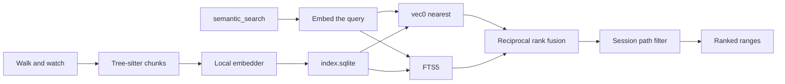

# Semantic search

This page settles **D6** and **D7** and defines how a workspace becomes a
searchable index. It is the design for **F7.2** in the
[roadmap](../roadmap.md). The read tools and the session path filter are in
[read-tools.md](read-tools.md). The LSP client is `docs/design/lsp.md` and is
not required for the first index.

## What this page does not cover

| Topic | Where it belongs |
|---|---|
| Grep, find, and the path filter | [read-tools.md](read-tools.md) |
| LSP navigation, diagnostics, and rename | `docs/design/lsp.md` (M7) |
| How a tool result is compressed | `docs/design/tool-output-compression.md` (M9) |
| Agent event types on the SSE stream | [events-sse.md](events-sse.md). This page adds one index event on that same stream |

## Problem

`grep` finds the bytes the model already knows to look for. A question like
"where do we persist a chat session" does not name `SqliteMessageStore`. The
model then spends the turn guessing identifiers. A useful answer is a short
list of source ranges, with paths and line numbers, ranked by meaning and
still able to hit an exact symbol.

The index has to keep up with edits, stay inside one workspace, and leave
secret files out. It also has to be obvious when it is running. A background
job that indexes a laptop with no control is a bug.

## Decision

Chunk source with tree-sitter, embed the chunks on device, and store the
vectors in a per-workspace SQLite file. Retrieval fuses a vector search with
a full-text search over the same chunks. The model calls `semantic_search`.
`grep` stays the tool for an exact string.



The index is derived. Deleting the file and scanning again is a valid
repair. Chat sessions never live in this file.

### D6: Embeddings stay on device

The first embedder is local. The model is `nomic-ai/nomic-embed-text-v1.5`,
768 dimensions, run on CPU through ONNX (`fastembed`). Document text is
prefixed with `search_document: `. Query text is prefixed with
`search_query: `. Those prefixes are part of the model, and the stored
vectors are meaningless without them.

The embedder applies each prefix once. A library that already inserts
the prefix must not be wrapped with a second copy.

Weights download once into `~/.robi/models/`. The index records `model_id`
and `dimensions` in its meta table. A different id or width deletes the
file and builds a new one. Chat does not wait on the download. Until the
weights are present, `semantic_search` returns no hits and
`state: "downloading"`.

`Embedder` is the seam. A hosted implementation can be added later behind
the same trait. It is not the default, and this page does not add a
setting for one.

### D7: One sqlite-vec file per workspace

The file is `~/.robi/index/<workspace_id>/index.sqlite`. `workspace_id` is
the id from the session store. The directory is created when that workspace
is first indexed.

The crate is `crates/robi-index`. It uses `rusqlite` with bundled SQLite,
FTS5 enabled, and `sqlite-vec` registered on every connection. The session
database stays on `sqlx` in `crates/robi`. The two files are not attached
to each other.

`robi-core` does not depend on this crate. Tree-sitter, ONNX, and SQLite
extensions stay out of the loop.

Meta keys, all text:

| Key | Value |
|---|---|
| `model_id` | `nomic-ai/nomic-embed-text-v1.5` |
| `dimensions` | `768` |
| `grammar_set` | A constant bumped when chunk rules change |
| `workspace_id` | The workspace this file belongs to |

```sql
CREATE TABLE files (
  path TEXT PRIMARY KEY,
  content_hash TEXT NOT NULL,
  language TEXT NOT NULL
);

CREATE TABLE chunks (
  id INTEGER PRIMARY KEY,
  path TEXT NOT NULL,
  start_line INTEGER NOT NULL,
  end_line INTEGER NOT NULL,
  symbol TEXT NOT NULL,
  kind TEXT NOT NULL,
  body TEXT NOT NULL
);

CREATE VIRTUAL TABLE chunks_fts USING fts5(
  symbol,
  body,
  content = 'chunks',
  content_rowid = 'id'
);

CREATE VIRTUAL TABLE chunk_vec USING vec0(
  chunk_id INTEGER PRIMARY KEY,
  embedding float[768]
);
```

`path` is workspace-relative with `/` separators. `start_line` and
`end_line` are 1-based and inclusive. `kind` is `symbol` or `window`.
`content_hash` is the SHA-256 of the file bytes. `chunk_vec.chunk_id`
matches `chunks.id`. The embedding blob is 768 little-endian `f32` values.

There is no migration history. A meta mismatch, a missing table, or a file
that will not open deletes the file and starts a scan. Progress goes back
to zero.

### What gets indexed

The walker is the `ignore` crate with gitignore rules on and hidden files
skipped. That is the same default `grep` uses when it walks. `target/`,
`node_modules/`, and `.git/` stay out because gitignore or the walk already
skips them.

Also skipped, before parse:

- A path the built-in read denies would refuse (`.env`, private keys,
  `credentials.json`, `secrets.json`, and the other patterns in
  [read-tools.md](read-tools.md)). Session allow rules do not pull those
  files into the index. A session deny is applied at query time.
- A file larger than 1 MiB.
- A file whose first 8 KiB contains a NUL byte.
- An extension with no grammar in the table below.

| Language | Extensions | Chunk nodes |
|---|---|---|
| Rust | `.rs` | `function_item`, `struct_item`, `enum_item`, `trait_item`, `impl_item`, `const_item`, `static_item`, `type_item`, `mod_item` |
| TypeScript | `.ts`, `.tsx` | `function_declaration`, `class_declaration`, `method_definition`, `interface_declaration`, `type_alias_declaration` |
| JavaScript | `.js`, `.jsx`, `.mjs`, `.cjs` | `function_declaration`, `class_declaration`, `method_definition` |
| Python | `.py` | `function_definition`, `class_definition` |
| Go | `.go` | `function_declaration`, `method_declaration`, `type_declaration` |
| Markdown | `.md` | `section` |

A matching node that contains another matching node is dropped. The inner
node is the chunk. An `impl` therefore contributes its methods, not a
second copy of the whole block. The impl type is still part of `symbol`.

`symbol` is the ancestor names from the file root down to that node,
joined by `.`. Rust and Go use `::`. Names come from the grammar
(`name`, `type_identifier`, the method receiver), not from the compiler.
`src/domain/chat.rs` plus `impl ChatSessionService` plus `fn append`
stores `ChatSessionService::append`. The path is a separate column.

Import and use lines at the file root are collected, capped at 500 bytes,
and prepended to the embedding input. They are not a separate chunk.
Module-level comments are not indexed on their own.

The embedding input, after the model's document prefix, is:

```text
path
symbol

<imports>

<body>
```

`body` is the node's source. A body over 2048 bytes is split on direct
children. Each piece repeats the node's first line, so a split method
keeps its signature. A piece that is still over 8192 bytes is cut into
line windows of at most 8192 bytes with a 20-line overlap, and those
pieces are `kind: "window"`. The embedding input itself is capped at
8192 bytes. Bytes are the limit so the index does not take a tokenizer
dependency. Nomic's context is 8192 tokens, so a byte cap of that size
fits.

A file that does not parse becomes line windows of the same size, all
`kind: "window"`, and `symbol` is empty. The rest of the workspace still
indexes.

### Keeping the index current

Indexing starts when a workspace has at least one open chat session in
this process, and stops when the last one closes. One task per workspace
owns the writer connection. Readers use other connections. WAL mode lets
a search run during a write.

The first run walks the tree. After that, `notify` watches the root.
Events for one path collapse for 500 ms. The file is hashed, and a hash
that matches `files.content_hash` does not parse or embed. A changed or
new file deletes that path's chunks and inserts the new ones in one
transaction. A missing file deletes that path. A removed directory
deletes every path under that prefix.

Embeddings run in batches of 16, one batch at a time, on the same task.
The task finishes the current file before it honors a pause.

Pause and resume:

`PUT /api/v1/workspaces/{id}/index` with `{ "state": "paused" }` or
`{ "state": "running" }`. An unknown state is `400`. Pausing is stored
in the meta table under `paused` so a restart stays paused. `running`
clears it and resumes the scan.

`GET /api/v1/workspaces/{id}/index` returns:

| Field | Meaning |
|---|---|
| `state` | `downloading`, `indexing`, `ready`, `paused`, or `failed` |
| `files_done` | Files hashed during this scan |
| `files_total` | Files the walk has seen |
| `error` | Short text when `state` is `failed`, otherwise null |

`ready` means the walk and the pending watcher events are caught up.
`failed` means the last scan stopped on an error that is not a single
bad file. The next `running`, or the next open of a session, tries
again. One unreadable file is skipped and counted, and does not fail
the scan.

The shell shows this status for the active session's workspace and
offers pause and resume. It reads the GET on connect, because the
stream does not replay. While the workspace is open it listens for
`robi.index.v1.progress` on the existing `EventSource`.

| Field | Value |
|---|---|
| `source` | `robi/index` |
| `type` | `robi.index.v1.progress` |
| `subject` | Workspace id |
| `data` | The same object as the GET |

The shell ignores the frame when `subject` is not the active workspace.
This page is the contract for that type. [events-sse.md](events-sse.md)
keeps the agent types.

There is no battery API in this version. The index runs only while a
session for that workspace is open, and the user can pause it.

### Retrieval

`semantic_search` embeds the query, then runs both searches with k = 40:

- `chunk_vec` nearest by `embedding MATCH`, ordered by distance.
- `chunks_fts` `MATCH` on the query string. A query that is not valid
  FTS syntax is searched as a quoted phrase. An FTS miss does not drop
  the vector hits.

Fusion is reciprocal rank with the constant 60:

```text
score(chunk) = Σ 1 / (60 + rank)
```

Rank is 1-based in each list. A chunk in both lists adds both terms.
The merged list is sorted by score descending, then by `path`, then by
`start_line`.

The session path filter then drops any hit the session may not read,
and any hit outside the optional `path` prefix. Filtering happens after
fusion so a denied file cannot occupy a slot by being ranked first.
The tool returns at most `limit` surviving hits. The default limit is
8. The maximum is 20.

Returned `text` is the stored `body`. The synthetic path, symbol, and
import prefix are not returned; `path` and `symbol` are fields. The
whole result stops at 32 KiB of `text`, the same budget as `grep`.
A cut chunk ends with a marker, and `truncated` is true.

The result also includes `state`, `files_done`, and `files_total`, so
a partial index is visible to the model. Empty `hits` with
`state: "indexing"` is success. The model can call `grep`.

LSP symbol hits are a third ranked list into the same fusion function
once a language server is running. This page does not spawn one. v1
passes the vector list and the FTS list.

### Tool

`semantic_search` lives in `crates/robi/src/tools/` and is registered in
every mode that registers `grep`, including explore. It is
`Concurrent`. `requires_approval` returns allow immediately. The tool
closes over the session the same way the read tools do, and it reloads
the path filter on each call.

| Argument | Rule |
|---|---|
| `query` | Required string. Empty is `invalid arguments` |
| `path` | Optional. Workspace-relative directory, or a file. A denied path is `path is not allowed` and no hits are returned. Default is the workspace root |
| `limit` | Optional integer, default 8, maximum 20. Above the maximum is `invalid arguments` |

```json
{
  "query": "where is a chat session written to sqlite",
  "state": "ready",
  "files_done": 120,
  "files_total": 120,
  "truncated": false,
  "hits": [
    {
      "path": "crates/robi/src/adapters/chat_runtime.rs",
      "start_line": 40,
      "end_line": 88,
      "symbol": "SqliteMessageStore::append",
      "language": "rust",
      "text": "..."
    }
  ]
}
```

The description tells the model to use this tool for a question about
behavior, and to use `grep` when it already has the identifier or the
exact string. It also says that `indexing` and `downloading` mean the
corpus is incomplete.

## Interfaces

`crates/robi-index` exposes:

```rust
trait Embedder: Send + Sync {
    fn model_id(&self) -> &str;
    fn dimensions(&self) -> usize;
    async fn embed_documents(&self, texts: &[String]) -> Result<Vec<Vec<f32>>, IndexError>;
    async fn embed_query(&self, text: &str) -> Result<Vec<f32>, IndexError>;
}

struct Index { /* one workspace file */ }

impl Index {
    fn open(workspace_id: WorkspaceId, root: &Path) -> Result<Self, IndexError>;
    fn status(&self) -> IndexStatus;
    fn pause(&self);
    fn resume(&self);
    fn search(&self, query_vec: &[f32], fts: &str, limit: usize) -> Result<Vec<ChunkHit>, IndexError>;
}
```

`ChunkHit` is `path`, `start_line`, `end_line`, `symbol`, `language`,
`kind`, `body`, and `score`. `search` does not know about sessions. The
tool applies the path filter and the byte cap.

The chunker is a pure function: source bytes, language, and path in;
chunks out. Tests call it without a database and without a model.

The composition root in `robi-api` starts one index task per open
workspace and passes an `Arc<Index>` into the tool context. A test
builds the tool with a fake `Embedder` that returns fixed vectors.

## Tests

- One fixture per grammar: a short file, the expected `symbol`, line
  range, and `kind`. A nested impl asserts a single method chunk.
- A file over 8192 bytes asserts a `window` piece that still starts
  with the signature line.
- A syntax error asserts windows and an empty `symbol`, and the next
  file in the scan still commits.
- Hash skip: a second pass with the same bytes does not call the
  embedder. One changed byte does.
- A `.env` and a gitignored file produce no rows.
- Fusion: a chunk ranked only by FTS outranks a weak vector-only chunk
  when the ranks say so, using the formula above.
- The tool drops a hit the session path filter denies, and a hit
  outside `path`.
- Default `cargo test` uses the fake embedder. A test that downloads
  weights is `#[ignore]`.

## Rejected alternatives

- **Hosted embeddings as the default.** Every index and every query
  would send source off the machine, and a workspace scan would need an
  API key. D6 keeps the model local. The trait leaves room for a hosted
  embedder later.
- **Qdrant, or any separate vector server.** Robi is one process on
  loopback. A second daemon is an install and a failure mode the index
  does not need.
- **LanceDB.** A workspace is tens of thousands of chunks, which a
  brute-force `vec0` scan answers interactively. A second storage
  engine would sit beside SQLite before the size required it.
- **Vectors inside the session database.** The index is large,
  rebuildable, and written on every save. A lock or a corrupt page
  there must not block chat. D4's session file stays the session file.
- **Fixed line windows as the only split.** A window cuts a function
  in half and glues the next one on. Tree-sitter keeps the symbol as
  the unit. Windows are the fallback when a node is too big or the
  file does not parse.
- **Pure vector search.** Identifier queries are most of what a coding
  session asks, and a vector model is weak on exact names. FTS over the
  same chunks covers that. `grep` remains for a raw pattern.
- **A cross-encoder rerank in v1.** It is a second model download and
  a second runtime. Reciprocal rank fusion is the whole rerank until
  measured queries show it is not enough.
- **Re-embedding on every save event.** A watcher fires per keystroke.
  The 500 ms collapse plus the content hash skips a file that did not
  change.
- **One global index for every workspace.** Chunks from two trees would
  share a file, and deleting a workspace would mean a selective delete
  against a live writer. One file per workspace id deletes with
  `rm` of that directory.
- **Tree-sitter inside `robi-core`.** Grammars and the embedding
  runtime are large optional dependencies. The loop only sees a tool
  result.
- **Blocking the turn until the scan finishes.** The first query after
  opening a repo would wait on the whole tree. A partial index with
  an honest `state` is the result.

## Failure modes

- Weights are missing or the download fails. `state` is `downloading`
  or `failed`. The tool returns no hits. `grep` still runs.
- The ONNX runtime fails on a batch. That file is skipped, `error` on
  the status records the path and the message, and the scan continues
  with the next file. A failure on every batch sets `state` to
  `failed` and stops until resume.
- The index file is corrupt or the meta keys disagree. The file is
  deleted and a scan starts. Sessions are untouched.
- A chunk's source file changes or disappears after it was stored.
  The next watcher event replaces or deletes those rows. A search can
  return a range that has since moved; `read_file` is how the model
  checks the bytes.
- The session may not read a path. The hit is omitted. The tool does
  not say that a hidden hit existed.
- The query is empty, or `limit` is out of range. `invalid arguments`.
  The index is not queried.
- `path` does not resolve or is denied. `path is not allowed`. No hits.
- Pause arrives mid-file. That file commits, then the task stops.
  `state` is `paused`. Resume continues the walk, and hashes skip
  files already stored.
- The workspace root is renamed on disk. The session store's canonical
  root is the root the walker uses. A new root is a new workspace id
  and a new index file. The old directory under `~/.robi/index/` is
  removed when the workspace row is removed.
- Cancellation of the tool call returns `cancelled` and does not stop
  the index task.
