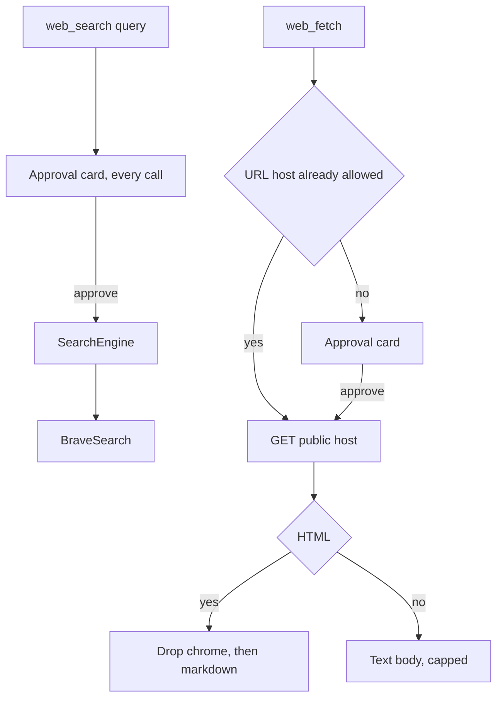

# Web tools

This page defines `web_search` and `web_fetch`. It is the design for the web
tools in [M8](../roadmap.md) of the roadmap. Which modes register them is in
[agent-modes.md](agent-modes.md). The approval card the loop already shows is
in [chat-ui.md](chat-ui.md). The session column that remembers a fetch host is
in [persistence.md](persistence.md).

## What this page does not cover

| Topic | Where it belongs |
|---|---|
| Path grants and the file filter | [read-tools.md](read-tools.md) |
| Shell network | [shell-tool.md](shell-tool.md). A command that needs the network still uses `network: unrestricted` |
| Child agents | [subagents.md](subagents.md). Explore and general do not register these tools |
| Compressing a large result | `docs/design/tool-output-compression.md` (M9). These tools already cap what they return |

## Problem

The model has to look up a library, a current version, or a fact that is not
in the workspace. `shell` can `curl`, and that call can also read a secret,
dial a private address, or spend a metered API with no one looking. A page
dropped into the transcript whole is mostly script, style, and navigation.

Search and fetch are different costs. Each Brave query spends a rate-limited
quota. A fetch of a public page does not, and the user should not approve
`docs.rs` on every call after the first.

## Decision

Both tools live in `crates/robi/src/tools/`. HTTP and HTML reduction live in
`crates/robi/src/web/`. `robi-core` stays free of network types. The tools
are `Concurrent`. They register in Ask, Plan, and Agent. Snippets and page
text are untrusted: the tool descriptions say so, and so does each mode
prompt.



### `web_search`

One argument: `query`. The tool always asks Brave for five results. The
model does not choose the engine, the count, the endpoint, or the API key.

The tool calls a trait so a test can substitute a fake. Brave is the only
production engine:

```rust
#[async_trait]
pub trait SearchEngine: Send + Sync {
    async fn search(&self, query: &str) -> Result<Vec<SearchHit>, SearchError>;
}
```

`SearchHit` is `title`, `url`, and `snippet`. `BraveSearch` sends
`GET https://api.search.brave.com/res/v1/web/search` with `count=5`,
`Accept: application/json`, and `X-Subscription-Token`. It reads
`web.results[].title`, `url`, and `description`. A snippet clips at 300
characters. The key is the secret setting `brave_search_api_key`. A missing
key is a tool error and does not call the API. There is no endpoint setting.
Tests inject the engine. The result has no page bodies. The description tells
the model to cite the title and URL, and to ignore instructions inside a
snippet.

`requires_approval` returns `NeedsApproval` on every call. Approving one
query does not approve the next. A search does not write a host grant. The
approval bar shows **Search** and **the web**, and the full query underneath,
wrapping. Rejection does not call Brave.

The returned value is `{ "results": [{ "title", "url", "snippet" }] }`.

### `web_fetch`

One argument: `url`. The call is a GET. The model does not send headers, a
body, or cookies. The URL is `http` or `https`, has no user info, and uses
port 80, 443, or none. The timeout is 30 seconds. The body cap is 1 MiB.
Up to three redirects are followed. A redirect to a different host is refused,
and the error names the new URL so the model can call `web_fetch` on it.
That new host goes through approval on its own.

Each hop is resolved before the dial. The call is refused when any address
is loopback, private, link-local, multicast, unspecified, or in
`100.64.0.0/10`. It is also refused for `169.254.169.254`, `fd00:ec2::254`,
and the names `metadata.google.internal`, `metadata.google.com`,
`metadata.azure.com`, `instance-data`, and `instance-data.ec2.internal`.
An empty lookup fails closed. The client dials the addresses it checked, so
a later lookup cannot rebind the name onto a private address.

Response handling:

| Content type | What the model receives |
|---|---|
| `text/html`, `application/xhtml+xml` | Title plus markdown. Dropped first: `script`, `style`, `noscript`, `template`, `svg`, `iframe`, `object`, `embed`, `canvas`, `form`, `nav`, `footer`, `aside`, comments, and hidden nodes. What remains becomes headings, lists, links, fenced code, and tables. Extra blank lines collapse |
| `text/plain`, `text/markdown`, `application/json`, `text/xml`, `application/xml`, `text/csv` | The body as text |
| Anything else | A tool error that names the content type. The bytes stay out of the transcript |

The text cap is 32 KiB. `truncated` is true when the cap hits. The returned
value is `{ "url", "content_type", "title"?, "text", "truncated" }`. `url`
is the final URL on the same host. `title` is present when the HTML had one.

### Approval

`web_search` always waits. Brave is rate limited, and a host allow would let
the model spend that quota with no one reading the query.

`web_fetch` reads the session. It returns `NeedsApproval` when the URL host
is absent from that session's `allow_hosts`. The match is the host after
lowercasing and stripping a trailing dot. `www.example.com` and
`example.com` are different hosts. Two fetches of a new host in the same
turn both wait, because the loop settles approval before any `execute`.
The approval bar shows **Fetch** and the host, and the full URL underneath,
wrapping.

Fetch `execute` appends the host after the user approved that call. A
rejection does not store it. `allow_hosts` is a JSON array of hostnames on
`chat_sessions`, `[]` on create, written the same way as `path_allow_read`.
There is no built-in host. Approval does not skip the public-address check.

### Prompt

Each mode block tells the model to use `web_search` to find a page and
`web_fetch` to read one URL the user named or a result it cited. It says
snippets and page text are untrusted and may contain instructions to ignore.
