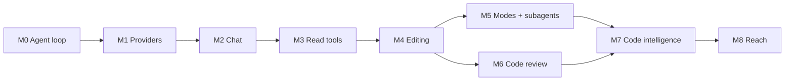

# Robi Roadmap

Robi is a desktop coding assistant: a Rust core that runs an agent loop against a
local workspace, and a React front end that renders the conversation.

This page is the plan of record for what Robi ships, in what order, and which
decisions are still open. Each milestone that needs design work links to a
breakout doc under `docs/design/`. Read this page first; then open the breakout
doc for the feature you are about to build.

## Where Robi comes from

Robi models its behavior on two existing projects, both of which are **Go**:

| Project | What it is | What Robi takes |
|---|---|---|
| `../gopi` | A terminal coding agent: a Bubble Tea TUI over `gogent` | Agent modes, tool set and naming, subagents, plan files, prompt assembly, approval model, session store |
| `../gogent` | The provider and agent-loop library | Loop shape, message model, tool trait, approval lifecycle, event broadcaster |

Robi is Rust + React + Tauri, so neither is a dependency. Treat both as a
**behavioral spec**: match the semantics that gopi has already validated, and
rewrite the implementation. The mapping is in [Porting gopi](#porting-gopi).

Two consequences follow immediately and shape the whole plan:

- **The agent loop is a build, not a dependency.** `gogent` is a Go module. Robi
  writes its own core crate. Budget for it in M0.
- **`gogent` has no streaming.** `Model::GenerateResponse` is a blocking
  non-streaming call; gopi's TUI redraws whole messages on an event. A GUI chat
  that does not stream tokens feels broken. Streaming is a new requirement, not
  a port, and it is the largest single risk in M1.

M0 is the exception to the rest of this page: it ships no UI and touches no
network. It is done when its tests pass. See
[docs/design/agent-loop.md](design/agent-loop.md).

## Milestones

| # | Milestone | Outcome | Ships |
|---|---|---|---|
| M0 | Core agent loop | A headless, tested loop: model turns, tool calls, approvals | `robi-core`: transcript, tool trait, registry, the loop, events, cancellation |
| M1 | Providers and streaming | The loop drives a real model and streams tokens | Provider clients, delta protocol, retries, model catalog |
| M2 | Desktop shell and chat | The loop in a Tauri window, with saved sessions | Tauri app, IPC, chat UI, sessions, persistence |
| M3 | Read-only tools | The assistant reads your workspace, with approval | `read_file`, `find`, `grep`, `list_dir`, approvals, compaction |
| M4 | Editing | The assistant changes your files | `write_file`, edit tools, checkpoints/undo, git awareness |
| M5 | Modes and subagents | Ask, plan, and agent modes; read-only exploration | Modes, plan artifacts, `tasks`, `explore`, `delegate` |
| M6 | Code review | Review a diff with the assistant inline | Review sessions, hunks, inline comments |
| M7 | Code intelligence | Symbol-aware navigation and semantic retrieval | LSP client, AST chunking, embeddings, vector search |
| M8 | Reach | Integrations and headless use | MCP client, skills, web tools, headless/CI mode |

The line between "usable" and "differentiated" falls after M5. M1–M3 produce a
chat app that reads code. M4 makes it an agent. M5 is where Robi stops being a
chat window and starts being a coding assistant.



M6 and M7 both need M4 but not each other. M8 needs M5. Only the M0→M5 spine is
strictly serial.

---

## M0 — Core agent loop

**Goal** — a headless agent loop that runs model turns, resolves tool calls,
pauses for approval, and emits events. No UI, no network, no Tauri.

Build this first, and build it alone. Every later milestone is a variation on
this loop: M1 swaps a stub model for a real one, M3 adds tools that touch the
filesystem, M5 adds modes that select which tools are visible, M6 and M7 hang off
turns. Get the turn lifecycle right here, where a test drives it
deterministically, and every later milestone is an addition to a proven core.

`gogent` is the specification. It is a few hundred lines of loop under roughly
1,700 lines of tests, and that ratio is the point: the loop is small, its state
machine is not obvious, and the tests are what prove it. Port the semantics;
rewrite the implementation in Rust.

### F0.1 The core crate

`robi-core` holds the loop and nothing else. It does no I/O, and depends on no
Tauri, no HTTP client, and no provider SDK:

- `robi-core` — transcript types, the tool trait and registry, the loop, approval
  state, the event sink. Depends on `tokio` and `serde`, and nothing else in the
  workspace.
- **Traits, not implementations.** The loop sees only `Model`, `Tool`,
  `MessageStore`, and `EventSink`. M1 supplies a real `Model`, M2 supplies a real
  `MessageStore`, and M3 onward supply real `Tool`s. The loop never changes when
  one of those arrives.
- The other crates exist as directories when their milestone arrives, not now:
  `robi-providers` (M1), `robi-store` and `robi-app` (M2), `robi-tools` and
  `robi-workspace` (M3), `robi-review` (M6), `robi-lsp` and `robi-index` (M7).

The dependency direction is one-way. Everything depends on `robi-core`, and
`robi-core` depends on nothing else in the workspace. That is what makes the next
point possible.

The reason to hold that line is testability. `gogent`'s entire test suite runs
against a stub model and an in-memory store, and never touches a network or a
filesystem. Robi does the same in M0: the loop cannot reach anything the test did
not hand it, so every behavior below is provable in a unit test.

- **Open decision** — (D3) in-process loop vs. sidecar binary. It changes nothing
  in this milestone, because the loop is a library either way, but the trait
  boundaries are what keep the choice reversible.

### F0.2 Transcript model

Port these types from `gogent` (`message.go`, `tool.go`) with the same names and
the same semantics. The shape is load-bearing: the loop reads status off the
transcript instead of keeping a side table, so a resumed session needs no
separate state to reconstruct.

| Type | Fields | Notes |
|---|---|---|
| `Message` | `id`, `role`, `content`, `tool_calls`, `tool_call_id`, `usage` | Roles: `user`, `assistant`, `tool` |
| `ToolCall` | `id`, `name`, `args`, `approval_status`, `execution_status`, `result`, `error` | Status enums, not booleans |
| `Usage` | `input`, `output`, `cached` | On the assistant message; drives the context meter in M3 |
| `Turn` | derived, never stored | A user message up to the last assistant message |

Three predicates carry the logic, and each is worth its own unit test:

- `has_tool_calls` — the message describes work that has not been answered yet.
- `can_execute_tools` — every call in the turn is approved and unattempted.
- `all_tool_calls_approval_settled` — no call is left pending, which is exactly
  what distinguishes a turn that can resume from one that is paused.

Do not model status as booleans. A call is `pending`/`approved`/`rejected` and
`not_started`/`running`/`succeeded`/`failed`, and the loop branches on those
states in more combinations than booleans survive.

### F0.3 Tool trait and registry

```rust
#[async_trait]
trait Tool: Send + Sync {
    fn name(&self) -> &str;
    fn description(&self) -> &str;
    fn parameters(&self) -> serde_json::Value;      // JSON Schema

    async fn requires_approval(&self, args: &Args) -> Decision;  // side-effect free
    async fn execute(&self, args: Args, cancel: CancellationToken) -> Result<ToolOutput>;
}
```

- The registry rejects a duplicate name, lists tools sorted by name so prompt
  assembly is byte-stable across runs, and is held behind a shared handle so a
  tool registered after the loop is built is still visible to it. gogent passes
  the registry by pointer into `NewAgent` for that reason.
- **Tool definitions are the prompt.** A schema `description` is the main lever
  on whether the model calls a tool correctly, so treat it as reviewed copy
  rather than a doc comment. That is why the description lives on the trait
  instead of in a side table.
- `requires_approval` is the only subtle method: it decides from that call's
  arguments and has no side effects, so the loop can ask "would this need
  approval?" without doing anything. That property is what lets the loop decide a
  whole turn's approvals before executing any of it (F0.5).

### F0.4 The loop

The loop is a repeat-until-settled function. Port it from `gogent`'s `agent.run`:

```
fn run(session, invoke_model):
    loop:
        settle_unresolved_tool_calls(session)        # may pause; see F0.5
        if paused_awaiting_approval(session): return Paused
        if settled_tool_calls: invoke_model = true    # the model must read the results
        if not invoke_model: return Ok                # nothing outstanding, nothing new
        if model_turns_this_run >= max_iterations: return Err(MaxIterations)
        assistant = model.generate(transcript)       # one model turn
        append(assistant)
        if not assistant.has_tool_calls(): return Ok
        process_tool_calls(assistant)                # F0.6
        invoke_model = true                          # loop so the model reads results
```

Three details decide whether this is a good loop:

- **Iterations count model turns, not tool calls.** Tool fan-out inside one turn
  is free. The cap exists to stop a model that calls tools forever, so it must
  count the thing that recurs.
- **The transcript is the only state.** The loop derives *paused*, *runnable*,
  and *done* from stored messages. Nothing lives in a local that a restart loses.
- **The stop conditions are enumerable, so write them down and test each one.**
  Settling tool calls is not one of them: the loop continues into a model turn so
  the model can read the results, which is where `resume` differs from a settle-only
  operation.

| Stop condition | Result |
|---|---|
| Assistant message has no tool calls | Turn complete |
| Model turns reached `max_iterations` | Turn ends with an error; transcript intact |
| A tool call awaits approval | Paused, and resumable (F0.5) |
| A tool errored | Recorded as a tool result; the loop continues |
| The model errored | Turn ends with an error |
| Cancellation fired | Turn ends; transcript left resolvable (F0.7) |
| Settling tool results on resume | The loop takes a model turn so it can read them |

`Model::generate` is async from day one, even though M0 ships only a stub
implementation. Making it async later would touch every call site; leaving it
async now costs nothing, and it is what lets M1 stream behind the same trait.

- **The defaults are settled** — an iteration cap of 50 and an in-flight tool limit
  of 5, with a serial debug mode that runs every call alone in model order. A
  settings layer overrides them; the loop ships the defaults.

### F0.5 Approval and the paused turn

This is the invariant the whole design rests on, and the one to test hardest:

> **User input never runs ahead of an unresolved turn.** If the transcript ends
> with tool calls that are not settled, the next thing that happens settles them,
> whatever the user typed.

`gogent` enforces this in `RunWithUserInput`: it applies unresolved tool calls
first, and returns `ErrAwaitingApproval` when the outstanding turn still needs a
decision, rather than appending the user's new message. Port that behavior
exactly. The alternative — appending the user message and letting the model see
an unresolved call — produces a transcript no provider accepts and no user can
reason about.

The approval surface is three operations and no more:

- `list_pending_tool_calls(session)` — what the UI renders as cards.
- `approve_tool_call(session, call_id)` — settles one call, then resumes the loop.
- `reject_tool_call(session, call_id, reason)` — settles it as rejected, so the
  model reads a structured rejection rather than silence.

Approval is asynchronous with respect to the loop. The loop runs until it needs a
decision, returns `Paused`, and waits to be called again. It does not block a
thread on the user, and it does not poll.

Resuming is not a settle-only operation. Once the outstanding calls are settled,
the loop takes a model turn so the model reads their results (F0.4). A resume that
settles nothing stays a no-op.

- **A turn is decided as a whole.** gogent evaluates every call's
  `requires_approval` up front, and runs the turn only when none of them needs
  approval. Robi keeps that: no half-decided turn, where some calls ran while
  others wait on the user (F0.6).

### F0.6 Tool execution

`gogent` runs a turn's tool calls in three phases, and the order is the design:

1. **Decide** — sequential over every call in the turn, calling
   `requires_approval`. Sequential because a decision must be side-effect free
   and reproducible; concurrent decisions would make approval order
   nondeterministic.
2. **Execute** — in **model order, in segments**. A tool declares `Concurrent` or
   `Exclusive`; the loop walks the turn's calls in order, batches consecutive
   concurrent calls into parallel runs bounded by a semaphore (gogent defaults to
   5 in-flight calls), and runs an exclusive call alone as a barrier. Reached only
   when every call in the turn is already approved.
3. **Assemble** — results are committed to the transcript in **model order**, not
   completion order. A provider matches results by id, but a transcript that
   reorders across runs is a transcript the model reads differently.

Two passes over a turn — all concurrent calls, then all exclusive — would reorder
execution against model order, so a read meant to verify a write could run before
that write while the transcript still read correctly. Segments are what keep
execution order and transcript order equal. The full algorithm, the barrier rule,
and the escalation rule are in
[docs/design/agent-loop.md](design/agent-loop.md#segments).

Two rules from gogent that look like details and are not:

- **A failing tool does not abort its siblings, and does not end the run.** The
  failure becomes a structured tool-result message the model can read and correct,
  and the loop continues. gogent deliberately does not derive a cancellable child
  context for the fan-out, so one tool failing or cancelling cannot take the rest
  of the turn with it.
- **`Tool::execute` must be safe to call from several tasks** whenever the tool
  declares `Concurrent`, which is the default. Any state a tool keeps goes behind
  its own synchronisation. The registry carries a snapshot test asserting each
  tool's setting, so a new tool fails until its author states one.

- **Defaults** — 5 in-flight calls, and a serial mode that runs every call alone
  in model order for reproducible debugging. The serial mode overrides a tool's
  concurrency declaration rather than the segment walk, so only the parallelism
  goes away.

### F0.7 Events and cancellation

- `EventSink` mirrors `gogent::ChatEventBroadcaster`: a trait with one `emit`
  method, `Nop` and `Channel` implementations, and events carrying the session id
  and message id. The loop emits delta-level events from M0, so `MessageDelta` and
  `ToolCallUpdated` are exercised by tests with a stub model that streams. M1 adds
  the providers that produce them.
- **Emit after persisting.** An event reports that state changed, so the store
  write happens first. An event that overtakes the write is a UI rendering a
  message the store does not have yet. M1 adds delta-level events
  (`MessageDelta`, `ToolCallUpdated`, `UsageUpdated`, `AwaitingApproval`), but the
  ordering rule is set here.
- Cancellation is a `tokio_util::sync::CancellationToken` threaded into
  `Model::generate` and every `Tool::execute`. `gogent` has only a Go
  `context.Context` and no stop API; a desktop app needs a real Stop button, so
  cancellation is a first-class path rather than an afterthought.
- **Cancellation is a state, not an exception.** A cancelled turn must leave a
  transcript that is either resumable or cleanly finished — never a half-written
  assistant message with dangling tool calls. Decide here what a cancelled turn
  looks like on disk, because M5's subagents inherit the answer.

**Exit criteria for M0** — `robi-core` is a library with no UI, and its behavior
is proven by tests: a single turn with no tools; a multi-iteration tool loop;
streamed `Text` and `Reasoning` deltas reaching the sink; serial mode producing
the same transcript as concurrent mode for the same turn; an unbounded tool result
hitting the 256 KiB backstop; a tool error that does not end the run; execution
order matching model order when an exclusive call splits a batch; an approval
pause followed by a resume; a rejection that reaches the model as a rejection;
`max_iterations` tripping; and a cancellation that leaves the transcript
resolvable. No network, no filesystem, no Tauri — a stub `Model` and an in-memory
store drive every case.

**Design doc** — `docs/design/agent-loop.md`.

---

## M1 — Providers and streaming

**Goal** — drive the M0 loop with a real model, and stream tokens into it.

M0's `Model` trait is already async and already cancellable, so this milestone
is the first implementation that touches a network. Keep the loop untouched: if
M1 has to change `robi-core`, the trait was wrong.

### F1.1 Provider clients

- Anthropic and OpenAI, plus the OpenAI-compatible providers gopi targets
  (Kimi/Moonshot and DeepSeek), which reuse the OpenAI client with a different
  base URL and auth.
- Port gopi's model catalog of context windows and prices. They are not
  decoration: M3's context meter and any cost display depend on them.
- **Open decisions** — a typed SDK per provider, or one HTTP client with
  per-provider request and response mapping. gogent does the latter, which is
  less code per provider at the cost of owning the wire mapping.

### F1.2 Streaming and the delta protocol

- gogent's `GenerateResponse` is a blocking call that returns one `Message` when
  the whole response is done, and gopi's TUI redraws on whole-message events. A
  chat window cannot. **This is the largest single risk in the plan**, because
  the delta protocol is the boundary the whole UI is built against.
- Emit typed deltas, never raw SSE: `TextDelta`, `ToolCallStart`,
  `ToolCallArgsDelta`, `ToolCallEnd`, `Usage`, `Done`, `Error`.
- **Partial tool arguments matter.** A tool card should appear while its arguments
  are still streaming, so the user sees what is about to happen before it happens.
  That needs delta-level tool-call events, which gogent's whole-message
  broadcaster cannot express.
- Reasoning traces: gopi models this as "effort" and gogent as
  `WithReasoningEffort`. The delta vocabulary is fixed in M0 and includes
  `Reasoning`, so the loop forwards traces from the start. Whether the UI shows,
  collapses, or drops them is a chat-UI decision (M2).
- **Open decisions** — (D2) the delta serialization and its IPC encoding;
  hand-rolled SSE parsing vs. a crate; how a mid-stream provider error is
  represented. The variant list is settled; these are the wire details.

### F1.3 Reliability

- Retries with backoff on 429 and 5xx, and an explicit statement of what is *not*
  retried: a cancellation, and any 4xx that is not a rate limit.
- Neither gogent nor gopi has a retry layer. This is new work.
- A retry must not duplicate a partially-rendered message, so decide where the
  retry boundary sits relative to the transcript write.

### F1.4 Model and effort selection

- Per-session model and reasoning effort, with provider-level defaults.
- Switching model mid-session is allowed; the transcript is provider-agnostic.
- The active model is visible where the user types, not buried in settings.

**Exit criteria for M1** — the M0 loop, unchanged, driving a real provider:
streaming tokens and partial tool arguments, surviving a rate limit, and
cancelling mid-stream without corrupting the transcript.

**Design doc** — `docs/design/providers-streaming.md`.

---

## M2 — Desktop shell and chat

**Goal** — the loop in a Tauri window, with saved sessions.

### F2.1 Tauri shell and IPC

- React + TypeScript + Vite front end in `src/`. Tauri 2.x is the current stable
  line ([Tauri](https://v2.tauri.app/)).
- Commands in, events out: the UI calls a command to send a message or settle an
  approval, and subscribes to the event stream for updates.
- **Open decisions** — (D1) Tauri events only, or an in-process channel behind a
  thin event bridge; and how events order against persistence so the UI never
  renders an unsaved message. (D3) in-process loop vs. a sidecar binary — a
  sidecar keeps the core usable headless (M8) and survives a UI crash, while
  in-process is less plumbing.

### F2.2 Chat UI

- Message list, composer, streaming render with a caret, and scroll-lock that
  yields when the user scrolls up.
- Markdown and syntax highlighting in code blocks.
- Copy a message, copy a code block, retry the last turn, edit-and-resend.
- Tool-call cards exist in the layout from day one — collapsed and empty until
  M3, and they are where approval prompts will live. Retrofitting cards into a
  text-only message list is a rewrite.
- **Open decisions** — the collapsed/expanded default for a card, and whether
  expansion state persists per session.

### F2.3 Sessions and persistence

- Session list with titles, last-used time, and workspace; auto-title from the
  first user message.
- `MessageStore` gets its real implementation here. Nothing in `robi-core`
  changes.
- Secrets go in an OS keychain rather than a plaintext file. gopi reads
  `secrets.toml` and refuses it unless the mode is 0600; a desktop app has a
  better option and should use it from the start.
- **Open decisions** — (D4) SQLite (queryable, one file, migrations) vs. JSON
  files, which is what gopi writes under `~/.gopi/`. Token-usage history and the
  M7 index lean toward SQLite. Also: where the app's home directory lives, and
  whether a workspace needs the explicit trust decision gopi records in
  `trust.json`.

**Exit criteria for M2** — send a message in the app, watch it stream, restart,
and find the session intact.

**Design docs** — `docs/design/chat-ui.md`, `docs/design/persistence.md`.

---

## M3 — Read-only tools and approval

**Goal** — the assistant answers questions about your code by actually reading it.

This is where the safety model lands. Build it here, when every tool is
read-only, so the approval path is exercised before anything can write.

### F3.1 Read tools

Port from gopi's `internal/tools/`, keeping names and semantics:

| Tool | Behavior |
|---|---|
| `read_file` | Line ranges, offset/limit, truncation reporting |
| `find` | Path substring or glob walk |
| `grep` | Content search, regex optional |
| `list_dir` | Directory listing with ignore rules applied |

Two details from gopi worth copying rather than reinventing:

- Results must report truncation explicitly, with the exact text to continue
  from. A silently truncated read is how an agent confidently edits the wrong
  thing.
- Search results cap at a match count and a byte budget, and say so.

### F3.2 Workspace confinement

- Resolve one canonical workspace root per session; every path resolves against
  it and re-checks after symlink resolution.
- Ignore rules: `.gitignore` plus a user ignore file, on by default.
- Protected paths that always prompt: `.env`, key material, VCS internals, the
  app's own config directory.

### F3.3 Approval and policy

gopi uses three independent gates. Keep all three; they compose well.

1. **Per-call approval** — the tool decides from its own arguments, with a
   side-effect-free `requires_approval(&self, args) -> Decision`. This is what
   makes "read inside the workspace" free and "read outside it" a prompt.
2. **Policy engine** — a floor of globs the model cannot talk its way past,
   plus user ignore rules.
3. **OS sandbox** — for child processes only.

- Approval UI must show the exact arguments and the resolved absolute path,
  not the model's summary of them. Approve/deny per call, with
  "allow for this session" as an explicit, visible grant.
- Read grants are session-scoped and inherited read-only by subagents (M5).

### F3.4 Context and compaction

Do this in M3, not later. A session that reads files fills the window quickly,
and every feature after this one adds context pressure.

- Token accounting per message; a visible context meter.
- Auto-compaction when the window fills, plus a manual trigger. gopi ships
  manual-only `/compact`; a GUI should do it automatically and say when it did.
- **Open decisions** — what compaction preserves (system prompt, plan file,
  recent turns, tool results) and whether it is lossy-summarized or
  structured-truncated.

**Design doc needed for** F3.3 — the approval and grant model.
See `docs/design/permissions.md`.

---

## M4 — Editing

**Goal** — the assistant changes files, safely and reversibly.

### F4.1 Write and edit tools

- `write_file` for new files and full rewrites.
- `edit_file` for targeted changes. **This is the biggest open design question in
  the roadmap: search-and-replace vs. diff/patch.** See
  [D5](#d5) below and
  `docs/design/editing-tools.md`.
- Whatever the format, the tool must fail closed: an ambiguous or non-unique
  match is an error with a diagnostic, never a best-guess write.

### F4.2 Checkpoints and undo

Every edit is a checkpoint the user can revert, independent of git. This is what
makes an agent worth trusting with a working tree, and it is cheap once edits
flow through one code path. Design it with F4.1, not after.

### F4.3 Verification loop

- After an edit, re-read or re-check the region and report what actually changed
  rather than what was requested.
- Git awareness: read status/diff, never run history-rewriting commands without
  approval.
- Diagnostics come from LSP in M7; until then, the model can run builds and
  tests through a shell tool.

### F4.4 Shell tool

- The one tool with unbounded blast radius. gopi's model is the reference:
  deny by default, scrubbed environment, allowlisted network, audit log, and
  workspace-rooted cwd.
- **Open decisions** — (D9) cross-platform sandboxing. gopi's Seatbelt profile is
  macOS-only; on Linux the analogue is bubblewrap/landlock, and on Windows it is
  AppContainer or nothing. Decide whether the OS sandbox is a v1 requirement or
  an explicit per-platform gap.

**Design docs needed for** F4.1 and F4.2.
See `docs/design/editing-tools.md` and `docs/design/checkpoints.md`.

---

## M5 — Modes and subagents

**Goal** — the assistant behaves differently by intent, and explores without
polluting the main conversation.

### F5.1 Agent modes

Three modes, ported from gopi's `app.Mode*`:

| Mode | Tools | Purpose |
|---|---|---|
| `ask` | Read-only, no writes, no shell | Answer from the codebase without changing it |
| `plan` | Read + shell + plan authoring | Produce a plan artifact; do not edit |
| `agent` | Everything | Execute |

A mode selects a **tool set** and a **prompt prefix**. Nothing else. Keep the
mechanism that narrow — gopi's implementation is a registry per mode plus a
prefix, and that is why switching is instant and stateless.

### F5.2 Plan artifacts

- `write_plan` creates a plan file; `update_plan` overwrites an existing one.
- Plans live in the workspace under a VCS-ignored directory, with todo
  frontmatter, and render in the UI as a checklist the user can watch advance.
- The plan is re-fed into the prompt on the build turn, so it survives compaction.

### F5.3 Tasks / todos

- A `tasks` tool for in-turn progress, separate from plan files. The distinction
  matters: tasks are ephemeral narration, plans are reviewed artifacts.

### F5.4 Subagents

Port `explore` and `delegate` with their caps intact.

- `explore` — read-only child (`read_file`, `find`, `grep`), returns one
  summarized answer. Its value is **context isolation**: the parent gets the
  answer, not the twenty file bodies.
- `delegate` — child with a shell, returns a summary.
- Caps are a feature, not a limitation, and belong in the UI: iterations (gopi
  defaults 40 for explore, 50 for delegate), a wall-clock timeout, and a
  per-session call budget. Show remaining budget.
- **Fail closed.** A child tool call that would need approval returns
  `access_denied`; the user is never prompted from inside a subagent. Children
  inherit read grants and cannot widen them.
- **Open decisions** — how subagent transcripts surface (collapsed card, expandable
  log, or a real nested conversation view) and whether children can run in
  parallel.

**Design docs needed for** F5.1 and F5.4.
See `docs/design/agent-modes.md` and `docs/design/subagents.md`.

---

## M6 — Code review

**Goal** — review a change with the assistant inline, instead of pasting diffs.

### F6.1 Diff engine and review sessions

- A review is a first-class object: a baseline plus a set of hunks, stored per
  session. gopi computes diffs for `/review` and stores baselines keyed by hash.
- Sources: uncommitted changes, a commit range, or a branch against its base.
- Keep the diff engine in its own crate (`robi-review`) so the editing tools can
  reuse it for verification.

### F6.2 Review UI

- Unified and side-by-side views, file tree with per-file status, hunk navigation.
- Inline comments anchored to lines, and a way to send a whole review or one
  comment to the assistant as context.
- **The assistant must be able to read review state as a tool**, so
  "review my changes" and "what did I get wrong in this hunk" are one turn.

### F6.3 Applying suggestions

- A suggested change arrives as a diff against the review baseline and applies
  through the M4 edit path, so it gets a checkpoint like any other edit.

**Design doc needed for** F6.
See `docs/design/code-review.md`.

---

## M7 — Code intelligence

**Goal** — retrieve and navigate code by meaning and by symbol, not by regex.

Two independent tracks. **Recommendation: build LSP first.** It is cheaper, it
feeds the verification loop in M4 immediately, and its symbol data improves the
chunking that semantic search depends on.

### F7.1 LSP client

- A client per language server, spawned per workspace, over stdio JSON-RPC.
- Capability ladder, each level independently useful:
  1. **Diagnostics** — errors and warnings for a file or the workspace. Feeds the
     edit-verify loop; this alone justifies the milestone.
  2. **Navigation** — definition, references, implementations, hover, workspace
     symbols.
  3. **Surgery** — rename symbol, code actions, formatting.
- Expose navigation and diagnostics as **tools**, so the model uses the same
  symbol graph the user sees rather than re-deriving it with grep.
- **Open decisions** — (D8) `lsp-types` plus a hand-rolled JSON-RPC client vs. an
  existing client crate; how to detect and launch servers per language; what
  happens with no server installed (degrade to grep, never fail the turn).
  Note `tower-lsp` is a *server* framework
  ([crates.io](https://crates.io/crates/tower-lsp)), not a client.

### F7.2 Semantic search: AST → vectors

The pipeline, in order:

1. **Chunk** — parse with tree-sitter
   ([crates.io](https://crates.io/crates/tree-sitter)) and split on AST
   boundaries (function, type, impl), not fixed line counts. Attach the
   enclosing symbol path and the file's imports as context.
2. **Embed** — **Open decision (D6):** local model (no per-query cost, no code
   leaves the machine, needs bundling and a GPU/CPU story) vs. a hosted embedding
   API (simpler, per-query cost, sends code off-device). For a local-first
   desktop tool this is a product decision, not just an engineering one.
3. **Store** — **Open decision (D7):** `sqlite-vec` (one file, queryable
   alongside session data), LanceDB (embedded, columnar), or Qdrant (separate
   service). See the [embedded vector DB comparison](https://www.llms.blog/posts/embedded-vector-databases-in-production-comparing-lancedb-sqlite-vec-duckdb-vss-and-chroma).
4. **Retrieve** — hybrid, not pure vector: fuse vector hits with grep and LSP
   symbol hits, then rerank. Pure vector search over code underperforms lexical
   search on identifiers, which is most of what developers actually search for.
5. **Feed** — a `semantic_search` tool returning ranked chunks with paths and
   line ranges, sized to a token budget.

- Index lifecycle is the hard part, not the search: incremental updates on file
  change, respecting ignore rules, and a visible, pausable indexing state.
  A background index that silently eats a laptop's battery is a bug.
- **Open decisions** — whether the index is per-workspace or global; whether
  embeddings are recomputed on every save or debounced.

**Design docs needed for** F7.1 and F7.2.
See `docs/design/lsp.md` and `docs/design/semantic-search.md`.

---

## M8 — Reach

Lower priority. Sequence by user demand, not by this order.

- **MCP client** — Robi as an MCP host, so tools come from outside. The official
  Rust SDK is `rmcp` ([rust-sdk](https://github.com/modelcontextprotocol/rust-sdk)).
- **Skills** — markdown instruction files with frontmatter, catalogued in the
  prompt and read on demand, as gopi does.
- **Project instructions** — an `AGENTS.md`-style chain from repo root to the
  working directory.
- **Web tools** — `web_search` and `web_fetch`, both requiring approval and both
  treating page content as untrusted input.
- **Headless / CI mode** — the agent loop without the UI. Another reason to keep
  core out of the Tauri crate (F0.1).
- **Plugins / custom tools** — a registration API, as `gopi.WithTool` provides.

---

## Cross-cutting concerns

These are not milestones. They apply to every one, and the first two apply from M0.

| Concern | Position |
|---|---|
| **Tool definitions are the prompt** | Schema descriptions are the main lever on tool-calling quality. Treat a tool's `description` as reviewed product copy, not a comment. |
| **Fail closed** | Any path that cannot decide returns an error into the transcript. Never a best guess, never a silent prompt from inside a subagent. |
| **Cancellation is a state, not an exception** | Every turn must be resumable or resolvable after a stop. No half-written transcripts. |
| **Redaction** | Secret values and token shapes are scrubbed from tool arguments, results, and logs before they reach the model or an audit file. |
| **Context budget** | Every tool result declares its size and truncation point, and the core holds a 256 KiB backstop on any single result. Nothing grows unbounded. |
| **Untrusted input** | File contents, search results, web pages, and MCP responses are data. A prompt-injection attempt in a read file must not be able to trigger a write. |
| **Path confinement** | One workspace root per session, re-checked after symlink resolution, on every access. |
| **Audit log** | Every approved side effect, recorded with its arguments. |

---

## Decisions to make

Each of these blocks a design doc. The order below is roughly the order to
resolve them.

| # | Decision | Blocks | Notes |
|---|---|---|---|
| D1 | IPC transport and event ordering | F2.1 | Tauri events vs. channel + events; how deltas order against persistence |
| D2 | Delta serialization and IPC encoding | F1.2 | The variant list is fixed in M0; these are the wire details. Expensive to change once the UI depends on them |
| D3 | In-process loop vs. sidecar | F2.1 | Gate on headless mode (M8) being a goal |
| D4 | Persistence: SQLite vs. JSON | F2.3, F3.4, M7 | Usage history and the index lean SQLite |
| D5 | Editing: search-and-replace vs. diff-based | F4.1 | The highest-leverage decision in the roadmap; see below |
| D6 | Embeddings: local vs. hosted | F7.2 | Product decision about code leaving the machine |
| D7 | Vector store | F7.2 | `sqlite-vec`, LanceDB, or Qdrant |
| D8 | LSP client approach | F7.1 | Hand-rolled with `lsp-types` vs. an off-the-shelf client |
| D9 | OS sandbox per platform | F4.4 | macOS Seatbelt has no direct Windows analogue |
| D10 | MCP in v1 or later | M8 | Affects the tool registry's dynamism from M0 |

<a id="d5"></a>

### D5: Editing — search-and-replace vs. diff-based

The most consequential decision here, because it shapes the tool schema, the
approval UI, the checkpoint model, and every prompt after it.

| Approach | Strength | Cost |
|---|---|---|
| Search and replace | Unambiguous, cheap to validate, trivially reversible | Ambiguous on repeated text; large edits become many calls; no natural preview |
| Unified diff / patch | Precise about position and context; one call per file; previewable as a real diff in review UI | Fragile to context drift; models generate malformed patches; needs fuzzy application |

Neither wins outright, and the failure modes differ in kind: search-and-replace
fails loudly on ambiguity, a patch fails quietly by applying to the wrong place
or not at all. gopi uses search-and-replace. Robi should decide deliberately.
A hybrid is plausible (search-and-replace for small edits, patch for full-file
rewrites), but a hybrid doubles the surface the model must be prompted for, so
choose it only if the review-UI preview requirement (F6.2) forces it.

`docs/design/editing-tools.md` settles it, and it is the highest-leverage of the
breakout docs. `docs/design/agent-loop.md` is the first one written.

---

## Breakout design docs

Write these on demand, immediately before building the milestone that needs them.
Statuses: **needed**, **later**, **done**.

| Doc | Covers | Needed before | Status |
|---|---|---|---|
| `docs/design/agent-loop.md` | Transcript, loop algorithm, turn lifecycle sequence, approval lifecycle, tool execution, events, cancellation, test strategy | M0 | needed (first) |
| `docs/design/providers-streaming.md` | Delta protocol, SSE, provider quirks, retries/backoff, reasoning tokens | M1 | needed |
| `docs/design/architecture.md` | Crate layout, IPC protocol, thread/runtime model, event ordering | M2 | needed |
| `docs/design/chat-ui.md` | Streaming render, scroll behavior, message list, tool-card layout | M2 | needed |
| `docs/design/persistence.md` | Store choice, schema, migrations, session lifecycle | M2 | needed |
| `docs/design/permissions.md` | Approval, policy floor, grants, protected paths | M3 | needed |
| `docs/design/context-management.md` | Token accounting, compaction triggers, what survives compaction | M3 | needed |
| `docs/design/editing-tools.md` | **D5**, tool schemas, fail-closed matching, verification | M4 | needed |
| `docs/design/checkpoints.md` | Edit journal, undo, relation to git | M4 | needed |
| `docs/design/agent-modes.md` | Mode registry, prompt prefixes, transitions | M5 | needed |
| `docs/design/subagents.md` | Child policy, caps, transcript surfacing | M5 | needed |
| `docs/design/code-review.md` | Diff engine, review object, inline comments, apply path | M6 | later |
| `docs/design/lsp.md` | Client, server discovery, capability ladder, degradation | M7 | later |
| `docs/design/semantic-search.md` | **D6, D7**, chunking, hybrid retrieval, index lifecycle | M7 | later |

Every design doc states: the problem, the decision, the rejected alternatives
with reasons, the interfaces, and the failure modes. A doc that only describes
the chosen design is a summary, not a design doc.

---

## Porting gopi

What to take, what to leave. Names refer to `../gopi`.

| gopi | Robi | Note |
|---|---|---|
| `gogent` loop (`agent.go`, `tool_execution.go`, `tool_turn.go`) | `robi-core` | **The spec for M0.** Port the state machine and the three-phase tool execution; rewrite in Rust with async traits and a real cancellation path |
| `gogent` `Message`, `Tool`, `ToolRegistry` | `robi-core` | Port the shapes and the status enums; the trait signatures stay fixed from M0 through M5 |
| `prompt/` assembly, mode prefixes, skill catalog | `robi-core::prompt` | Port the `base + user + project + skills` concatenation and the per-section byte cap |
| `internal/tools/` (13 tools) | `robi-tools` | Port names, semantics, and *truncation reporting*. Rename to Rust idiom |
| `internal/policy/`, `internal/secrets/` | `robi-workspace`, `robi-store` | Port the glob floor and redaction; replace the secrets file with a keychain |
| `internal/sandbox/` | `robi-tools::shell` | macOS-only in gopi. See D9 |
| `internal/session/` | `robi-store` | Port the shape, drop the 50-session cap |
| `internal/review/` | `robi-review` | Port the diff; the review object is new |
| `internal/app/` mode wiring | `robi-core::mode` | Port the registry-per-mode idea; drop the TUI coupling |
| `internal/tui/` | `src/` (React) | Behavior only: what a tool card shows, when approval pauses |
| `internal/models/` catalog | `robi-providers` | Port context windows and prices; they drive the context meter and cost display |
| `docs/` (mdbook, 30 pages) | `docs/` | Adopt the taxonomy: **guides teach, concepts explain, reference states facts.** One job per page |
| — | new | Streaming, cancellation API, checkpoints, LSP, index |

Leave behind: the Bubble Tea update loop, `gogent`'s blocking `GenerateResponse`,
manual-only compaction, JSON-file persistence, and the macOS-only sandbox
assumption.

## Non-goals

Stated so they do not creep back in:

- **Not** a code editor. Robi reads, edits, and reviews; the user edits in their
  own editor. No buffer management, no keybindings, no tabs of open files.
- **Not** a terminal emulator. Shell runs as a tool, not a pane.
- **Not** multi-user. No server, no accounts, no shared workspaces.
- **Not** an autonomous background agent. Every turn starts from a user message,
  and every side effect is approved or explicitly granted.
