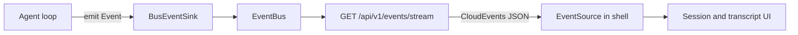

# Events and SSE

The UI learns what the loop did through one Server-Sent Events stream. The loop
emits a core `Event` on `EventSink`. `crates/robi` wraps that event in a
CloudEvents envelope, fans it out in process, and writes the envelope as JSON
on `GET /api/v1/events/stream`. The Solid shell opens one `EventSource`.

This page is the design for **event delivery** in **M2** of the
[roadmap](../../roadmap.md). It settles the "events out" half of decision **D1**:
the desktop shell receives loop events over HTTP SSE on `robi-api`, not over
Tauri events. Commands (send a message, settle an approval) stay HTTP as
[chat-runtime.md](chat-runtime.md) and [persistence.md](../persistence/persistence.md) already
describe them. Process placement of the loop (in-process vs. sidecar) stays
**D3** and belongs in `docs/src/design/core/architecture.md` when that page is written.

## What this page does not cover

| Topic | Where it belongs |
|---|---|
| The `Event` enum and emit-after-persist | [agent-loop.md](../core/agent-loop.md) (M0) |
| Provider SSE into the model client | [providers-streaming.md](../providers/providers-streaming.md) (M1) |
| Who may call `user_input`, interrupt, approval refusal | [chat-runtime.md](chat-runtime.md) (M2) |
| Message REST and the transcript snapshot | [persistence.md](../persistence/persistence.md) (M2) |
| Streaming caret, scroll-lock, tool-card layout | `docs/src/design/shell/chat-ui.md` (M2) |
| In-process loop vs. sidecar, command IPC | `docs/src/design/core/architecture.md` (M2) |
| Index progress (`robi.index.v1.progress`) | [semantic-search.md](../intelligence/semantic-search.md) (M7). It is published on this same stream. A `session_id` filter also lets through index progress whose subject is that session's workspace |



## Problem

`EventSink` is a single consumer. The UI needs many subscribers (tabs, a
reconnect) and a stable wire format that is not the Rust enum. Tauri events
would only reach the desktop webview. The web UI already talks to `robi-api`
through the Vite `/api` proxy, so the same process should push events.

A raw dump of `Event` also cannot grow. Later producers (session renamed,
review ready) need a common envelope. CloudEvents 1.0 is that envelope.

## Decision

**One in-process bus under `domain/events/`, one SSE route, one shell
`EventSource`.**

`robi-core` keeps `Event` and `EventSink` unchanged. `domain` depends on
`robi-core` and on neither `web_api` nor `adapters`. Fan-out is queues, not a
socket and not a file.

| Module | Role |
|---|---|
| `domain/events/envelope.rs` | `EventEnvelope`, `from_payload`, and `from_core_event` |
| `domain/events/bus.rs` | `EventBus`: publish and subscribe |
| `domain/events/sink.rs` | `BusEventSink` implements `EventSink` |
| `domain/events/mod.rs` | Re-exports for the composition root |
| `web_api/events.rs` | Axum handler only: subscribe, filter, write frames |

`AppState` holds `event_bus: Arc<EventBus>`. The agent runtime receives
`BusEventSink`. The endpoint is also testable with a publisher that calls
`publish` directly.

Rejected alternatives:

1. **Tauri events as the only UI stream.** Rejected for event delivery. `pnpm
   dev` has no Tauri process. SSE on the API the shell already proxies covers
   web and desktop the same way.
2. **A second `EventSink` method that speaks JSON.** Rejected. Core must not
   know CloudEvents or HTTP.
3. **Per-feature EventSources.** Rejected. Browsers cap HTTP/1.1 connections.
   One shell connection carries every agent type.
4. **Replay of `message_delta` on reconnect.** Rejected. Deltas are ephemeral.
   Reconnect refetches the transcript over HTTP, then follows the live stream.
5. **An unbounded subscriber queue.** Rejected. A slow tab must not stall the
   loop or grow without bound. When the queue is full, drop a `message_delta`
   if one is queued. Otherwise drop the oldest frame.

## Wire contract

### Endpoint

`GET /api/v1/events/stream`

| Query | Rule |
|---|---|
| `event_types` | Repeated. Optional. When present, only envelopes whose `type` is in the list. When absent, every agent type. |
| `session_id` | Optional UUID. When present, only envelopes whose `subject` equals that session id, plus index progress and MCP status whose subject is that session's workspace, session create/update/delete, `robi.app.v1.error`, and `turn_started` / `turn_finished` for any session. Message and tool frames for another session stay off this stream. |
| `workspace_id` | Optional UUID. The shell always sets this and does not set `session_id`. Every session frame is delivered. Index progress and MCP status are limited to this workspace. |

Response headers:

- `Content-Type: text/event-stream`
- `Cache-Control: no-cache`
- `X-Accel-Buffering: no`

An idle stream sends an SSE comment every 15 seconds so a proxy does not treat
it as finished. `EventSource` ignores comments.

Vite proxies `/api` to `127.0.0.1:1431` for `pnpm dev` and for
`ROBI_EXTERNAL_API=1`. Those modes use a same-origin URL:
`/api/v1/events/stream?...`. The desktop app asks the shell for the bound origin
and opens the stream on that host.

OpenAPI may describe the path and query parameters. The body is an SSE stream,
not a JSON schema the client generator can call. The contract of record is this
page.

### SSE frame

```text
id: <cloudevents id>
event: <cloudevents type>
data: <full EventEnvelope JSON>

```

`event` and `data.type` are the same string. The client may dispatch on either.

### EventEnvelope

CloudEvents 1.0.

| Field | Value |
|---|---|
| `specversion` | `"1.0"` |
| `id` | New UUIDv7 per emit |
| `source` | `"robi/agent"` |
| `type` | Table below |
| `time` | RFC 3339 UTC |
| `subject` | Session id. Always set for agent events |
| `data` | JSON object for that type |

### Type map

Source enum: `crates/robi-core/src/event.rs`.

| Core `Event` | `type` | `data` |
|---|---|---|
| `TurnStarted` | `robi.agent.v1.turn_started` | `{ "session_id" }` |
| `MessageAdded` | `robi.agent.v1.message_added` | `{ "session_id", "message_id" }` |
| `MessageUpdated` | `robi.agent.v1.message_updated` | `{ "session_id", "message_id" }` |
| `MessageDelta` | `robi.agent.v1.message_delta` | `{ "session_id", "message_id", "delta" }` |
| `ToolCallUpdated` | `robi.agent.v1.tool_call_updated` | `{ "session_id", "message_id", "tool_call_id" }` |
| `AwaitingApproval` | `robi.agent.v1.awaiting_approval` | `{ "session_id", "tool_call_id" }` |
| `TurnFinished` | `robi.agent.v1.turn_finished` | `{ "session_id", "outcome" }` |

These are not core `Event`s. Build them with `EventEnvelope::from_payload`.
`data` is a cue, not the stored row.

| `type` | `source` | `subject` | `data` | When |
|---|---|---|---|---|
| `robi.session.v1.created` | `robi/session` | session id | `{ "session_id" }` | After a session row is stored |
| `robi.session.v1.updated` | `robi/session` | session id | `{ "session_id", "title"?, "turn_display"? }` | After any stored field changes, including a generated title. `title` is set when the change is a rename. `turn_display` is set when the display summary changes |
| `robi.session.v1.deleted` | `robi/session` | session id | `{ "session_id" }` | After the session row is removed |
| `robi.app.v1.error` | `robi/app` | `app` | `{ "message" }` | A failure the user should see. `message` is short text. The first publisher is an MCP server that failed to start |
| `robi.mcp.v1.status` | `robi/mcp` | workspace id | `{ "workspace_id" }` | After an MCP server is marked starting, connected, or failed, and once when the stream opens. The shell refetches `GET /workspaces/{id}/mcp` |

A `session_id` query still delivers these four types, plus `turn_started` and
`turn_finished` for every session. The four are the session list and
process-wide failures. The turn pair updates a sidebar row that is not on
screen. Message frames for another session stay filtered out.

`outcome` is one of:

| Core `TurnOutcome` | JSON |
|---|---|
| `Complete` | `{ "kind": "complete" }` |
| `Paused` | `{ "kind": "paused" }` |
| `Cancelled` | `{ "kind": "cancelled" }` |
| `Failed` | `{ "kind": "failed", "message": "<short text>" }` |

`delta` is tagged with `kind`. Serialization lives in `domain/events`, not in
`robi-core`.

| Core `Delta` | JSON |
|---|---|
| `Text` | `{ "kind": "text", "text" }` |
| `Reasoning` | `{ "kind": "reasoning", "text" }` |
| `ToolCallStart` | `{ "kind": "tool_call_start", "index", "id", "name" }` |
| `ToolCallArgs` | `{ "kind": "tool_call_args", "index", "fragment" }` |
| `ToolCallEnd` | `{ "kind": "tool_call_end", "index" }` |
| `Usage` | `{ "kind": "usage", "usage": { ... } }` |
| `Finished` | `{ "kind": "finished" }` — no message body; the shell waits for `message_added` |
| `Failed` | `{ "kind": "failed", "message" }` |

Emit-after-persist still holds. `message_added` and `message_updated` name ids
the store can return. `message_delta` names the message the model stream
already fixed, before the finished row exists. The shell does not append that
text. Those two events are the cue to `GET` the row. See [Solid](#solid).

A reconnect does not replay deltas. On `EventSource` `open`, including the
first connect, the shell refetches the session list and the active transcript.
A frame published before the socket existed is recovered from the store.

## Bus

`EventBus::subscribe` returns that subscriber's own bounded queue (capacity
**1024**) and a drop handle that unsubscribes. `publish` clones the envelope
into every queue.

When a queue is full, drop a `message_delta` if one is queued, and otherwise
drop the oldest frame. The loop's `emit` must not wait on a slow client. A
dropped delta is recovered by the next stored message, not by blocking the
agent. A stored-message frame is what the shell refetches, so it stays ahead
of a token burst.

`BusEventSink::emit` maps `Event` to `EventEnvelope` and publishes. A
subscriber that has disconnected is removed; that is not an error for the loop.

## Solid

One connection for the shell, mounted from `ChatChrome`.

| Piece | Role |
|---|---|
| `src/features/chat/useAgentEvents.ts` | One `EventSource` on `/api/v1/events/stream`, with the open workspace's `workspace_id` and the agent `event_types`. It does not set `session_id`. Reconnects on error, with an epoch so a stale handler cannot apply |
| Envelope parse | `JSON.parse(event.data)` as `EventEnvelope`; dispatch on `type` |

Handlers stay thin. They refetch HTTP and update the activity phase. They do
not write message text from a frame. Two refetches of the same URL can be in
flight together; only the one that started later is applied. A slower earlier
`GET` of that message, session, session list, or index status is dropped. The
behavior is specified in [chat-ui.md](chat-ui.md).

| `type` | Shell |
|---|---|
| `robi.agent.v1.turn_started` | Phase `thinking` when that session is on screen. Otherwise the sidebar marks that row running, and does not fetch its transcript |
| `robi.agent.v1.message_delta` | When that session is on screen: `reasoning` keeps **Thinking**, `text` switches to **Responding**. Other kinds are ignored. The `text` field is not stored. A frame for another session does not change the phase and does not fetch |
| `robi.agent.v1.message_added`, `robi.agent.v1.message_updated`, `robi.agent.v1.tool_call_updated` | When that session is on screen: `GET /chat_sessions/{id}/messages/{message_id}` and upsert that row. One GET is in flight per message; a newer frame schedules one trailing GET. A full transcript reload merges with any row upserted after that reload started. `tool_call_updated` refreshes the review strip immediately, then once more after a burst goes quiet. A frame for another session does not fetch |
| `robi.agent.v1.awaiting_approval` | When the desktop window is not in front, one OS notification for that pause. A click focuses the window and selects the session. See [chat-ui.md](chat-ui.md) |
| `robi.agent.v1.turn_finished` | When that session is on screen: phase `idle`, then refetch the session and the message list. A `failed` outcome is recorded and shown under the window title until dismissed. When the desktop window is not in front, the same message is one OS notification; a click focuses the window and selects the session. The refetch does not put the phase back on `thinking` when `has_pending_agent` is still set: the actor clears that flag after this event. A `turn_started` that arrives during the refetch, including the next piece of work, sets `thinking` and the refetch leaves it. When another session is on screen: clear that row's running mark. A `failed` outcome is still recorded and shown under the window title until dismissed, and posted as that same notification when the window is not in front. No transcript fetch |
| `robi.session.v1.created`, `robi.session.v1.updated` | `GET /chat_sessions/{id}` and replace that session in the list. A title carried on the frame is applied immediately. A frame that carries `turn_display` applies that value to the row immediately and still refetches. A fetch that started before the frame does not overwrite `turn_display` or put the running spinner back on an `awaiting_approval` row. A title-only frame does not refetch. A fetch that started before a title, or before a local insert, does not wipe them. The phase is unchanged |
| `robi.session.v1.deleted` | Drop that session from the list. The phase is unchanged |
| `robi.app.v1.error` | Record `message` and show it at the top of the shell until it is dismissed |
| `robi.index.v1.progress` | `GET /workspaces/{id}/index` for `subject` when that workspace is active. A successful GET is reused for 10 seconds, and concurrent frames share one request. The stream publishes once when it opens, then again as the index changes |
| `robi.mcp.v1.status` | `GET /workspaces/{id}/mcp` for `subject` when that workspace is active. The stream publishes once when it opens, then again as a server's status changes. The tray does not poll |

Do not open a second `EventSource` per feature.

On every successful `open`, refetch the session list and the transcript for
the session on screen. Selecting a session and that open share one in-flight
transcript read. The list merge keeps a row inserted locally after the fetch
started. The stream stays open across session switches. Changing workspace
closes it and opens a URL with the new `workspace_id`. A frame for another
session does not reset the 2-second catch-up wait, and it does not fetch that
session's transcript.

## Failure modes

- **Slow subscriber.** A queued `message_delta` drops first. Otherwise the
  oldest frame drops. The agent keeps running. While the phase is `thinking`
  or `responding` and no frame for the session on screen has arrived for 2
  seconds, the shell refetches the session and the message list. A frame for
  that session resets the wait. A frame for another session does not.
- **Malformed `data`.** The client ignores that frame and stays connected.
- **Filter mismatch.** A client that asks for `event_types` it does not handle
  still receives them; unknown `type` values are ignored.
- **API down.** The reconnecting hook backs off and retries. Session list
  refetch runs on the next successful `open`.
- **Publish before any subscriber.** The event is discarded. That matches
  `ChannelSink`: nobody listening is not the loop's problem. The transcript is
  already written.
- **`Finished` delta without a body.** The UI must not invent message content
  from that variant. It waits for `message_added` and the transcript GET.

## Testing

- `domain/events`: `from_core_event` covers every `Event` variant; `from_payload`
  fills the envelope; the bus delivers to two subscribers; a full queue drops
  a `message_delta` before a stored-message frame, and otherwise drops the
  oldest and keeps the newest; unsubscribe stops delivery.
- `web_api`: an Axum test publishes one envelope and reads one SSE frame with
  the `id`, `event`, and JSON `data` lines. A `session_id` query drops a
  different subject.
- Frontend: the reconnecting hook against a fake `EventSource` applies one
  envelope and ignores a frame from a previous epoch. A full browser pass waits
  until the agent runtime publishes real events.

## Implementation order

1. `domain/events` (`EventEnvelope`, `EventBus`, `BusEventSink`) and unit tests.
2. `GET /api/v1/events/stream` and a synthetic publish test.
3. `useReconnectingEventSource` and `useAgentEventsSSE` in the shell. Handlers
   may no-op until the transcript state is real.
