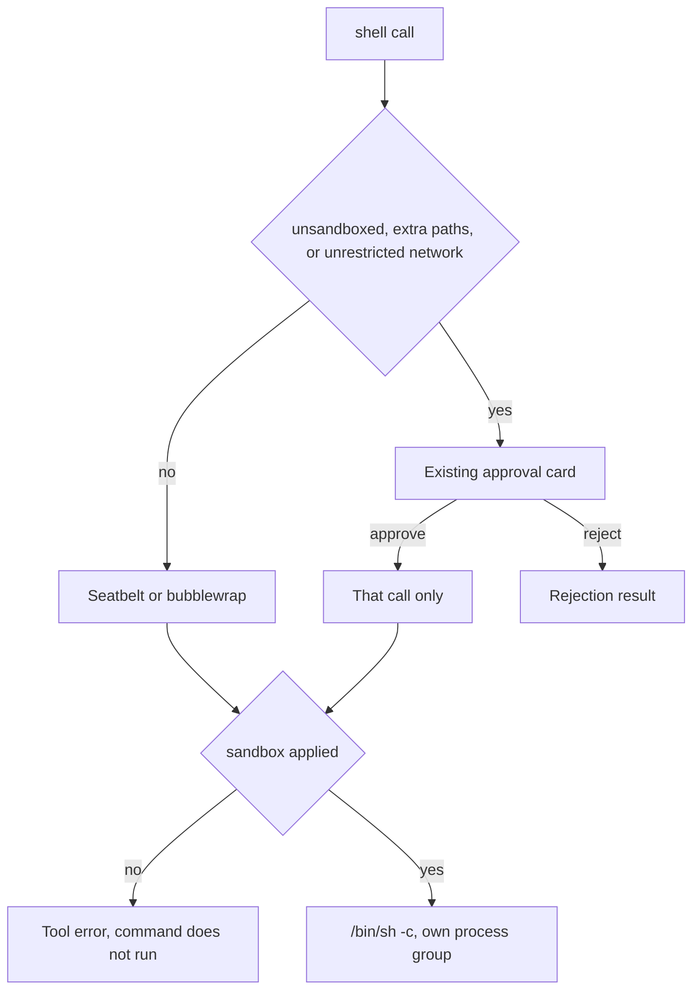

# Shell tool

This page settles **D9** and defines the `shell` tool. It is the design for
**F4.4** in the [roadmap](../../roadmap.md). Path rules the file tools share are
in [read-tools.md](read-tools.md). The approval card the loop already shows is
in [chat-ui.md](../shell/chat-ui.md). The roadmap's D9 is this sandbox. The "D9" heading
in [providers-streaming.md](../providers/providers-streaming.md) is a separate decision about
the model catalog.

## What this page does not cover

| Topic | Where it belongs |
|---|---|
| Session grants and the path filter | [read-tools.md](read-tools.md) |
| A host allowlist and its loopback proxy | A later mode on the same profile. The first shell has `deny` and `unrestricted` |
| Subagent shells | `docs/src/design/core/subagents.md` (M5) |
| A dedicated audit file beyond the transcript | Later. The tool result is the record of what ran |
| Collapsing a large stdout or stderr before the model sees it | [shell-output.md](../compression/shell-output.md). The tool still returns the capped streams |

## Problem

The model has to run builds and tests. A command is the one tool that can
`cat` a file the read tools refused, write outside the workspace, or reach
the network. Checking the command string cannot stop that. `git status` and
`npm test` also have to work without an approval card on every call, or the
user learns to approve without reading.

## Decision

One `shell` tool lives in `crates/robi/src/agent/tools/`. The OS profile it builds
lives in `crates/robi/src/agent/sandbox/`. `robi-core` does not spawn a process.
The tool is `Exclusive`.

Every command starts sandboxed. `unsandboxed: true` is the opt-out, and that
call always returns `NeedsApproval`. A sandboxed command that stays inside
the default profile runs immediately. There is no silent fallback, and a
denied command is not retried outside the sandbox.

The host process is the trust root. It holds API keys and computes each
profile. It is not sandboxed.

### Platform

| OS | Mechanism | When it cannot be applied |
|---|---|---|
| macOS | `/usr/bin/sandbox-exec -p` with a generated Seatbelt profile | The sandboxed call is refused |
| Linux | `bwrap`. Landlock does not hide a directory or drop the network namespace, so it is not a second layer | The sandboxed call is refused when `bwrap` is missing |
| Windows | No sandbox in this design | A sandboxed call is refused. `unsandboxed: true` still runs after approval |

### Filesystem

Seatbelt is last-match-wins, and the bubblewrap mounts follow the same
order: a later rule beats an earlier one. A directory grant is applied, then
the floor is applied again, so the grant cannot open an `.env` inside it.

Reads start allowed on `/`. Then these trees are denied: `$HOME`, `/Users`,
`/private`, `/var`, `/tmp`, and `/Volumes`. Then these are allowed again:

- The canonical workspace, for read and write.
- A private temp directory created for that command, for read and write.
  Shared `/tmp` stays denied, so the command cannot rendezvous with an
  unsandboxed process through a temp file. Each ancestor of an allowed path,
  including `/private` and `/Users`, allows metadata reads so `realpath` can
  walk to that path. Those ancestors are not readable as files.
- `/private/var/select` and `/var/select`, so `/bin/sh` can read its locale
  file and `xcode-select` can read the `developer_dir` symlink. `/var` and
  `/tmp` themselves may be read as symlinks, so those paths resolve. Their
  other children stay denied. `/var/select` holds only those symlinks.
- The system CA bundle, which the `*.pem` floor would otherwise hide.
- `/dev/null`, for read and write.
- These home trees, read-only, when the directory exists. Each mount is the
  canonical absolute path, after symlink and firmlink resolution, and the
  home deny uses that same resolved home:
  `~/.cargo/bin`, `~/.rustup`, `~/.local/bin`, `~/.pyenv`,
  `~/.local/share/uv`, `~/go/bin`, `~/sdk/go`, `~/.nvm`, `~/.volta`,
  `~/.fnm`, `~/.local/share/fnm`, `~/.bun`, `~/.local/share/pnpm`, and
  `~/Library/pnpm`.
- Session `allow_read` grants that resolve outside the workspace. A write
  grant does not become a shell write root.
- `path_allow_read` and `path_allow_write` from general settings, read from
  the settings store when the profile is built. A line starting with `~/`
  is the home directory, resolved to an absolute path. Read paths open for
  read. Write paths open for read and write. A session write grant still
  does not.

Writes are the workspace and the private temp directory. `write_paths` adds
paths for that call only, after approval, and the command stays sandboxed.

Inside the workspace, `.git` stays readable and write-denied. `git status`
works. A commit, an index update, or any other write under `.git` does not,
until the user approves that call. Approving `write_paths` that names `.git`
or a path inside it opens that path for the command. Approving a write of
the rest of the workspace does not. File tools already ask before they
change a path the filter denies, and `.git` is one of those denies. The
shell is wider than the read tools, which omit `.git` from the transcript.

The floor matches the read tools, and the OS profile enforces it. Case is
folded. The path is canonical after symlink resolution.

- `.env` and `.env.*`
- `*.pem` and `*.key`
- `id_rsa` and `id_ed25519`
- `credentials.json` and `secrets.json`
- `~/.ssh`, `~/.aws`, `~/.kube`, `~/.gnupg`, `~/Library/Keychains`, and `~/.robi`

`.gitignore` says what git tracks. It is not copied into the floor.

### Network

`deny` is the default, including DNS. `network: "unrestricted"` keeps the
filesystem profile and needs approval. Any other value is an error. A host
allowlist through a loopback proxy is a later mode on this profile. The
first shell does not start that proxy.

### Environment

The child does not inherit the parent environment. These names are never
copied: `DYLD_*`, `LD_PRELOAD`, `LD_LIBRARY_PATH`, and any name containing
`KEY`, `TOKEN`, `SECRET`, `PASSWORD`, or `CREDENTIAL`.

A sandboxed command has `HOME` set to the real home directory so programs
can resolve `os.homedir()`. The filesystem profile still denies that tree.
A CLI that reads login state from the home directory cannot see it unless a
read allow covers the path. `unsandboxed: true` is how that command runs
with the home directory readable.

`PATH` is built for the call:

- These prefixes, when the directory exists: `/usr/bin`, `/bin`,
  `/usr/sbin`, `/sbin`, `/usr/local/bin`, `/opt/homebrew/bin`.
- Entries from the parent `PATH` whose canonical path is outside `$HOME`
  and outside the workspace, plus entries under the toolchain trees above.
  `.`, a relative entry, and anything else inside the workspace or home are
  dropped, so a repo cannot place its own `ls` first.
- `~/.cargo/bin`, `~/.local/bin`, `~/go/bin`, and `~/.pyenv/shims` when they
  exist, so those bins are present even when the parent `PATH` omitted them.
  Versioned Node, fnm, Volta, Bun, and pnpm bins stay on `PATH` only when
  the parent process already listed them, and only because their tree is a
  read root.
- Directories from `path_entries`, when they exist. A line starting with
  `~/` is the home directory. Each one is also a read allow, so the sandbox
  can open it. Each executable in those directories is reached through a
  wrapper in the private temp directory. The wrapper runs the binary with
  its absolute path as the command name, so a packaged program that opens
  its own file finds that path instead of a name in the workspace.

Also set:

- `TMPDIR`, `TMP`, and `TEMP` to the private temp directory.
- `HOME`, `USER`, and `LOGNAME`. `HOME` is the real home directory. The
  profile still denies that tree except for the toolchain roots and the
  read allows.
- `CARGO_HOME` and `RUSTUP_HOME` when those trees were opened.
- `GIT_CONFIG_GLOBAL` and `GIT_CONFIG_SYSTEM` are `/dev/null`, so Git does
  not open `~/.gitconfig` or the system config. An unsandboxed command does
  not set these, and Git reads the user's files.
- The parent `LANG` when it matches a locale token. Otherwise `C.UTF-8`.

An approved unsandboxed command copies the parent `PATH` unchanged,
including relative entries and directories inside the workspace or home,
then appends directories from `path_entries` that exist. The filesystem and
network profile are not applied. Credential files are then reachable
because the user approved that call. Secret names are still dropped.

### Arguments

`requires_approval` looks only at this call. A value that does not parse, or
a `cwd` that does not resolve, returns `AllowImmediately` so `execute`
reports the error and the user is not prompted. The trait has no reason
channel. The summary line shows the command's first argument, such as `curl` or
`find`. The command and its output sit in one bordered panel,
the same shape as an edit card. Closed, the panel shows the last four lines
of output. A shadow on the top edge means earlier lines were left out. Open, it shows the full command as a `$` prompt, then the whole
output, wrapped, and after approval that open panel is at most four lines
tall. Earlier lines scroll. An approval starts open without that cap: the
title and buttons on the first row, and the command under them.

| Argument | Default | When it asks |
|---|---|---|
| `command` | required | It does not ask on its own |
| `cwd` | workspace root | It must resolve inside the workspace, sandboxed or not |
| `unsandboxed` | false | Always, when true |
| `read_paths`, `write_paths` | empty | When either list is non-empty. The command stays sandboxed |
| `network` | `deny` | When `unrestricted` |

`cwd` uses the same resolution as a read: `~` expands to `$HOME`, a relative
path joins the workspace, and symlinks are resolved. A result outside the
canonical workspace root is an error.

The child is `/bin/sh -c` with the command, in its own process group, with
`cwd` as the working directory. The group is killed at `tool_timeout_seconds`
(default 120). Cancellation kills the same group.

The result is `exit_code`, `stdout`, `stderr`, `truncated`, and `sandboxed`.
Output is capped by `LoopConfig::max_tool_result_bytes` (256 KiB). When
`truncated` is true, the result says so. When a sandboxed command's stderr
shows that a path was blocked, the result adds `hint` naming that path and
telling the model to call again.

A sandbox denial names the blocked path and tells the model to call again
with `read_paths`, `write_paths`, or `unsandboxed`. That call is a new
approval. The refused command is not run again. A stored path rule that is
not a literal prefix, an exact file, or `^.*$` refuses the sandboxed
command. The four allow and deny lists stay as they are. The profile is
emitted in Seatbelt's last-match order from those lists.

## Rejected alternatives

- **An approval card on every command.** The sandbox already bounds an
  ordinary build. Prompting on each one trains the user to approve without
  reading. The card is for the call that leaves the default profile.
- **Retrying a denied command unsandboxed.** OpenCode can ask for
  `bash:unsandboxed` and run the same command again. Robi returns the
  denial. The model asks with `unsandboxed: true`, and the user sees that
  flag before the command runs.
- **Allowing commands by pattern** (`git *`, `npm *`). A pattern is not an
  OS boundary. `cat ~/.ssh/id_rsa` bypasses a denied read.
- **A fixed `PATH` of system directories only.** Gopi's list misses
  `cargo`, `rustup`, and `~/.local/bin`. The constructed `PATH` adds those
  roots and still drops a workspace entry.
- **Inheriting the parent environment.** That copies API keys and
  `DYLD_INSERT_LIBRARIES` into a process the model controls.
- **Leaving the rest of `$HOME` readable.** Codex and Claude's
  sandbox-runtime read most of the home directory and deny a list. A missed
  credential directory is then readable. Robi denies the home directory and
  re-allows the workspace and a short toolchain list.
- **Shared `/tmp` as a write root.** Another process can plant a file there
  for the command to run. The command gets a private temp directory.
- **Bubblewrap plus Landlock.** Landlock does not hide a path or remove the
  network namespace. `bwrap` is the Linux mechanism.
- **A Windows sandbox in this design.** There is no Seatbelt equivalent to
  ship here. A sandboxed call is refused. An approved unsandboxed call is
  the path that still runs.
- **Running unsandboxed when the sandbox cannot be applied.** That path is
  the bypass. The command does not run.

## Failure modes

- An empty `command` is `command is required`.
- `unsandboxed` is not a boolean, or `network` is not `deny` or
  `unrestricted`: the argument is invalid and the command does not run.
- `cwd` does not resolve, or it resolves outside the workspace: the command
  does not run, and the error names the argument the model passed.
- A path rule on the session that the sandbox cannot order is
  `path rule cannot be enforced by the sandbox`, and the command does not run.
- On a platform with no sandbox, or when `sandbox-exec` or `bwrap` fails,
  a sandboxed call is refused. It is not run outside the profile.
- `tool_timeout_seconds` (default 120), or cancellation, kills the process group. The
  result says the command was killed.
- Output past `max_tool_result_bytes` sets `truncated` and keeps the prefix.
- Rejecting the approval card does not call `execute`.
