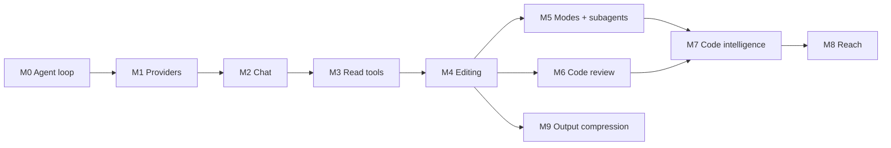

# Robi Roadmap

Robi is a desktop coding assistant: a Rust core that runs an agent loop against a
local workspace, and a React front end that renders the conversation.

This page is the plan of record for what Robi ships, in what order, and which
decisions are still open. Each milestone that needs design work links to a
breakout doc under `docs/src/design/`. Read this page first; then open the breakout
doc for the feature you are about to build.

## Where Robi comes from

Robi models its behavior on two existing projects, both of which are **Go**:

| Project | What it is | What Robi takes |
|---|---|---|
| `../gopi` | A terminal coding agent: a Bubble Tea TUI over `gogent` | Agent modes, tool set and naming, subagents, plan files, prompt assembly, approval model, session store |
| `../gogent` | The provider and agent-loop library | Loop shape, message model, tool trait, approval lifecycle, event broadcaster |

Robi is Rust + React + Tauri, so neither is a dependency. Treat both as a
**behavioral spec**: match the semantics that gopi has already validated, and
rewrite the implementation. The mapping is in [Porting gopi](#porting-gopi).

Two consequences follow immediately and shape the whole plan:

- **The agent loop is a build, not a dependency.** `gogent` is a Go module. Robi
  writes its own core crate. Budget for it in M0.
- **`gogent` has no streaming.** `Model::GenerateResponse` is a blocking
  non-streaming call; gopi's TUI redraws whole messages on an event. A GUI chat
  that does not stream tokens feels broken. Streaming is a new requirement, not
  a port, and it is the largest single risk in M1.

M0 is the exception to the rest of this page: it ships no UI and touches no
network. It is done when its tests pass. See
[docs/src/design/core/agent-loop.md](design/core/agent-loop.md).

## Milestones

| # | Milestone | Outcome | Ships |
|---|---|---|---|
| M0 | Core agent loop | A headless, tested loop: model turns, tool calls, approvals | `robi-core`: transcript, tool trait, registry, the loop, events, cancellation |
| M1 | Providers and streaming | The loop drives a real model and streams tokens | Provider clients, delta protocol, retries, model catalog |
| M2 | Desktop shell and chat | The loop in a Tauri window, with saved sessions | Tauri app, IPC, chat UI, sessions, persistence |
| M3 | Read-only tools | The assistant reads your workspace, with approval | `read_file`, `find`, `grep`, `list_dir`, approvals, compaction |
| M4 | Editing | The assistant changes your files and runs commands | `write_file`, edit tools, checkpoints/undo, git awareness, sandboxed shell |
| M5 | Modes and subagents | Ask, plan, and agent modes; read-only exploration | Modes, plan artifacts, `tasks`, `explore`, `delegate` |
| M6 | Code review | Review a diff with the assistant inline | Review sessions, hunks, inline comments |
| M7 | Code intelligence | Symbol-aware navigation and semantic retrieval | LSP client, AST chunking, embeddings, vector search |
| M8 | Reach | Integrations and headless use | MCP client, skills, web tools |
| M9 | Tool output compression | Large tool results reach the model smaller, and the original stays retrievable | Content-routed compression, a retrieve tool, savings on the context meter |

The line between "usable" and "differentiated" falls after M5. M1–M3 produce a
chat app that reads code. M4 makes it an agent. M5 is where Robi stops being a
chat window and starts being a coding assistant.



M6 and M7 both need M4 but not each other. M8 needs M5. M9 needs M4: it
compresses tool results, and the shell is where those results get large. Only
the M0→M5 spine is strictly serial. M9 does not gate M5–M8.

## What remains

The M0–M8 spine is in the tree: the loop, OpenAI-compatible streaming, the
chat shell, read and edit tools, the sandbox, modes, plans, delegate, session
review, LSP, the semantic index, MCP, skills, and web tools. These pieces are
still open. Delete a row when that piece ships, and update the milestone
section that owns it.

| Milestone | Piece | State |
|---|---|---|
| M1 | Anthropic's own wire format | Open. The client speaks OpenAI-compatible endpoints. |
| M1 | A recorded live turn against a real vendor key | Open. Tests use a scripted loopback server. |
| M2 | Process placement (D3): in-process loop vs sidecar | Open. `docs/src/design/core/architecture.md` is still needed. |
| M2 | Tool-card expand default, and whether it persists per session | Open in `docs/src/design/shell/visual-style.md`. |
| M2 | Explicit workspace trust, in the style of gopi's `trust.json` | Open product choice. |
| M3 | Auto-compaction and a manual trigger (F3.4) | Not built. `docs/src/design/workspace/context-management.md` is still needed. |
| M3 | Permission and grant design page | Behavior exists in code. `docs/src/design/workspace/permissions.md` is still needed. |
| M3 | Price display, and an OS keychain for secrets | Deferred. Secrets stay in `~/.robi/secrets.toml`. |
| M6 | Inline comments, and sending one to the assistant | Later, in `docs/src/design/review/code-review.md`. |
| M6 | A tool the assistant uses to read review state | Later. |
| M6 | Git status, a commit range, or a branch as a review source | Later. The screen is the session baseline. |
| M6 | Side-by-side diff | Later. The screen is one unified column. |
| M6 | Applying a suggestion through the edit path (F6.3) | Not built. |
| M7 | LSP rename, code action, and format | Later cut. They go through the edit tools so a change still gets a checkpoint. |
| M8 | MCP sampling, elicitation, OAuth, resources, and prompts | Waiting, per `docs/src/design/reach/mcp.md`. |
| M8 | A trust decision before reading a project `AGENTS.md` | Later. |
| M8 | Headless use | Blocked on D3. |
| M9 | Built-in JSON and search-hit compression | Not built. `docs/src/design/compression/tool-output-compression.md` is later. D12 is settled for shell output. |
| M9 | Learned line model for shell output (phase 4) | Not in the first cut. Feature-gated and last (D11). |
| M9 | Context meter showing tokens saved | Required by the M9 exit criteria. The meter shows usage. |

---

## M0 — Core agent loop

**Goal** — a headless agent loop that runs model turns, resolves tool calls,
pauses for approval, and emits events. No UI, no network, no Tauri.

Build this first, and build it alone. Every later milestone is a variation on
this loop: M1 swaps a stub model for a real one, M3 adds tools that touch the
filesystem, M5 adds modes that select which tools are visible, M6 and M7 hang off
turns. Get the turn lifecycle right here, where a test drives it
deterministically, and every later milestone is an addition to a proven core.

`gogent` is the specification. It is a few hundred lines of loop under roughly
1,700 lines of tests, and that ratio is the point: the loop is small, its state
machine is not obvious, and the tests are what prove it. Port the semantics;
rewrite the implementation in Rust.

### F0.1 The core crate

`robi-core` holds the loop and nothing else. It does no I/O, and depends on no
Tauri, no HTTP client, and no provider SDK:

- `robi-core` — transcript types, the tool trait and registry, the loop, approval
  state, the event sink. Depends on `tokio` and `serde`, and nothing else in the
  workspace.
- **Traits, not implementations.** The loop sees only `Model`, `Tool`,
  `MessageStore`, and `EventSink`. M1 supplies a real `Model`, M2 supplies a real
  `MessageStore`, and M3 onward supply real `Tool`s. The loop never changes when
  one of those arrives.
- **One crate for implementations, not one per concern.** `crates/robi` holds
  the implementations: `providers` first (M1), then the session API's `domain`,
  `adapters`, and `web_api` (M2), `tools` and `workspace` (M3), `review` (M6),
  `lsp` and `index` (M7) — each a module, split into its own crate only if a
  module outgrows the crate.
  `docs/src/design/providers/providers-streaming.md` records why providers did not become
  `robi-providers`.

The dependency direction is one-way. Everything depends on `robi-core`, and
`robi-core` depends on nothing else in the workspace. That is what makes the next
point possible.

The reason to hold that line is testability. `gogent`'s entire test suite runs
against a stub model and an in-memory store, and never touches a network or a
filesystem. Robi does the same in M0: the loop cannot reach anything the test did
not hand it, so every behavior below is provable in a unit test.

- **Open decision** — (D3) in-process loop vs. sidecar binary. It changes nothing
  in this milestone, because the loop is a library either way, but the trait
  boundaries are what keep the choice reversible.

### F0.2 Transcript model

Port these types from `gogent` (`message.go`, `tool.go`) with the same names and
the same semantics. The shape is load-bearing: the loop reads status off the
transcript instead of keeping a side table, so a resumed session needs no
separate state to reconstruct.

| Type | Fields | Notes |
|---|---|---|
| `Message` | `id`, `role`, `content`, `tool_calls`, `tool_call_id`, `usage` | Roles: `user`, `assistant`, `tool` |
| `ToolCall` | `id`, `name`, `args`, `approval_status`, `execution_status`, `result`, `error`, `provider_call_id` | Status enums, not booleans. `id` is loop identity; `provider_call_id` is the wire id the provider issued, echoed on the next request (D3) |
| `Usage` | `input`, `output`, `cached` | On the assistant message; drives the context meter in M3 |
| `Turn` | derived, never stored | A user message up to the last assistant message |

Three predicates carry the logic, and each is worth its own unit test:

- `has_tool_calls` — the message describes work that has not been answered yet.
- `can_execute_tools` — every call in the turn is approved and unattempted.
- `all_tool_calls_approval_settled` — no call is left pending, which is exactly
  what distinguishes a turn that can resume from one that is paused.

Do not model status as booleans. A call is `pending`/`approved`/`rejected` and
`not_started`/`running`/`succeeded`/`failed`, and the loop branches on those
states in more combinations than booleans survive.

### F0.3 Tool trait and registry

```rust
#[async_trait]
trait Tool: Send + Sync {
    fn name(&self) -> &str;
    fn description(&self) -> &str;
    fn parameters(&self) -> serde_json::Value;      // JSON Schema

    async fn requires_approval(&self, args: &Args) -> Decision;  // side-effect free
    async fn execute(&self, args: Args, cancel: CancellationToken) -> Result<ToolOutput>;
}
```

- The registry rejects a duplicate name, lists tools sorted by name so prompt
  assembly is byte-stable across runs, and is held behind a shared handle so a
  tool registered after the loop is built is still visible to it. gogent passes
  the registry by pointer into `NewAgent` for that reason.
- **Tool definitions are the prompt.** A schema `description` is the main lever
  on whether the model calls a tool correctly, so treat it as reviewed copy
  rather than a doc comment. That is why the description lives on the trait
  instead of in a side table.
- `requires_approval` is the only subtle method: it decides from that call's
  arguments and has no side effects, so the loop can ask "would this need
  approval?" without doing anything. That property is what lets the loop decide a
  whole turn's approvals before executing any of it (F0.5).

### F0.4 The loop

The loop is a repeat-until-settled function. Port it from `gogent`'s `agent.run`:

```
fn run(session, invoke_model):
    loop:
        settle_unresolved_tool_calls(session)        # may pause; see F0.5
        if paused_awaiting_approval(session): return Paused
        if settled_tool_calls: invoke_model = true    # the model must read the results
        if not invoke_model: return Ok                # nothing outstanding, nothing new
        if model_turns_this_run >= max_iterations: return Err(MaxIterations)
        assistant = model.generate(transcript)       # one model turn
        append(assistant)
        if not assistant.has_tool_calls(): return Ok
        process_tool_calls(assistant)                # F0.6
        invoke_model = true                          # loop so the model reads results
```

Three details decide whether this is a good loop:

- **Iterations count model turns, not tool calls.** Tool fan-out inside one turn
  is free. The cap exists to stop a model that calls tools forever, so it must
  count the thing that recurs.
- **The transcript is the only state.** The loop derives *paused*, *runnable*,
  and *done* from stored messages. Nothing lives in a local that a restart loses.
- **The stop conditions are enumerable, so write them down and test each one.**
  Settling tool calls is not one of them: the loop continues into a model turn so
  the model can read the results, which is where `resume` differs from a settle-only
  operation.

| Stop condition | Result |
|---|---|
| Assistant message has no tool calls | Turn complete |
| Model turns reached `max_iterations` | Turn ends with an error; transcript intact |
| A tool call awaits approval | Paused, and resumable (F0.5) |
| A tool errored | Recorded as a tool result; the loop continues |
| The model errored | Turn ends with an error |
| Cancellation fired | Turn ends; transcript left resolvable (F0.7) |
| Settling tool results on resume | The loop takes a model turn so it can read them |

`Model::generate` is async from day one, even though M0 ships only a stub
implementation. Making it async later would touch every call site; leaving it
async now costs nothing, and it is what lets M1 stream behind the same trait.

- **The defaults are settled** — an iteration cap of 50 and an in-flight tool limit
  of 5, with a serial debug mode that runs every call alone in model order. A
  settings layer overrides them; the loop ships the defaults.

### F0.5 Approval and the paused turn

This is the invariant the whole design rests on, and the one to test hardest:

> **User input never runs ahead of an unresolved turn.** If the transcript ends
> with tool calls that are not settled, the next thing that happens settles them,
> whatever the user typed.

`gogent` enforces this in `RunWithUserInput`: it applies unresolved tool calls
first, and returns `ErrAwaitingApproval` when the outstanding turn still needs a
decision, rather than appending the user's new message. Port that behavior
exactly. The alternative — appending the user message and letting the model see
an unresolved call — produces a transcript no provider accepts and no user can
reason about.

The approval surface is three operations and no more:

- `list_pending_tool_calls(session)` — what the UI renders as cards.
- `approve_tool_call(session, call_id)` — settles one call, then resumes the loop.
- `reject_tool_call(session, call_id, reason)` — settles it as rejected, so the
  model reads a structured rejection rather than silence.

Approval is asynchronous with respect to the loop. The loop runs until it needs a
decision, returns `Paused`, and waits to be called again. It does not block a
thread on the user, and it does not poll.

Resuming is not a settle-only operation. Once the outstanding calls are settled,
the loop takes a model turn so the model reads their results (F0.4). A resume that
settles nothing stays a no-op.

- **A turn is decided as a whole.** gogent evaluates every call's
  `requires_approval` up front, and runs the turn only when none of them needs
  approval. Robi keeps that: no half-decided turn, where some calls ran while
  others wait on the user (F0.6).

### F0.6 Tool execution

`gogent` runs a turn's tool calls in three phases, and the order is the design:

1. **Decide** — sequential over every call in the turn, calling
   `requires_approval`. Sequential because a decision must be side-effect free
   and reproducible; concurrent decisions would make approval order
   nondeterministic.
2. **Execute** — in **model order, in segments**. A tool declares `Concurrent` or
   `Exclusive`; the loop walks the turn's calls in order, batches consecutive
   concurrent calls into parallel runs bounded by a semaphore (gogent defaults to
   5 in-flight calls), and runs an exclusive call alone as a barrier. Reached only
   when every call in the turn is already approved.
3. **Assemble** — results are committed to the transcript in **model order**, not
   completion order. A provider matches results by id, but a transcript that
   reorders across runs is a transcript the model reads differently.

Two passes over a turn — all concurrent calls, then all exclusive — would reorder
execution against model order, so a read meant to verify a write could run before
that write while the transcript still read correctly. Segments are what keep
execution order and transcript order equal. The full algorithm, the barrier rule,
and the escalation rule are in
[docs/src/design/core/agent-loop.md](design/core/agent-loop.md#segments).

Two rules from gogent that look like details and are not:

- **A failing tool does not abort its siblings, and does not end the run.** The
  failure becomes a structured tool-result message the model can read and correct,
  and the loop continues. gogent deliberately does not derive a cancellable child
  context for the fan-out, so one tool failing or cancelling cannot take the rest
  of the turn with it.
- **`Tool::execute` must be safe to call from several tasks** whenever the tool
  declares `Concurrent`, which is the default. Any state a tool keeps goes behind
  its own synchronisation. The registry carries a snapshot test asserting each
  tool's setting, so a new tool fails until its author states one.

- **Defaults** — 5 in-flight calls, and a serial mode that runs every call alone
  in model order for reproducible debugging. The serial mode overrides a tool's
  concurrency declaration rather than the segment walk, so only the parallelism
  goes away.

### F0.7 Events and cancellation

- `EventSink` mirrors `gogent::ChatEventBroadcaster`: a trait with one `emit`
  method, `Nop` and `Channel` implementations, and events carrying the session id
  and message id. The loop emits delta-level events from M0, so `MessageDelta` and
  `ToolCallUpdated` are exercised by tests with a stub model that streams. M1 adds
  the providers that produce them.
- **Emit after persisting.** An event reports that state changed, so the store
  write happens first. An event that overtakes the write is a UI rendering a
  message the store does not have yet. M1 adds delta-level events
  (`MessageDelta`, `ToolCallUpdated`, `UsageUpdated`, `AwaitingApproval`), but the
  ordering rule is set here.
- Cancellation is a `tokio_util::sync::CancellationToken` threaded into
  `Model::generate` and every `Tool::execute`. `gogent` has only a Go
  `context.Context` and no stop API; a desktop app needs a real Stop button, so
  cancellation is a first-class path rather than an afterthought.
- **Cancellation is a state, not an exception.** A cancelled turn must leave a
  transcript that is either resumable or cleanly finished — never a half-written
  assistant message with dangling tool calls. Decide here what a cancelled turn
  looks like on disk, because M5's subagents inherit the answer.

**Exit criteria for M0** — `robi-core` is a library with no UI, and its behavior
is proven by tests: a single turn with no tools; a multi-iteration tool loop;
streamed `Text` and `Reasoning` deltas reaching the sink; serial mode producing
the same transcript as concurrent mode for the same turn; an unbounded tool result
hitting the 256 KiB backstop; a tool error that does not end the run; execution
order matching model order when an exclusive call splits a batch; an approval
pause followed by a resume; a rejection that reaches the model as a rejection;
`max_iterations` tripping; and a cancellation that leaves the transcript
resolvable. No network, no filesystem, no Tauri — a stub `Model` and an in-memory
store drive every case.

**Design doc** — `docs/src/design/core/agent-loop.md`.

---

## M1 — Providers and streaming

**Goal** — drive the M0 loop with a real model, and stream tokens into it.

M0's `Model` trait is already async and already cancellable, so this milestone
is the first implementation that touches a network.

**`robi-core` did change, and the trait was wrong.** M1 added three things, all
recorded in [`design/providers-streaming.md`](design/providers/providers-streaming.md):

- `Model::generate` now takes the `SessionId`. The loop already held it, and the
  provider needs it as a per-conversation routing and cache key. Deriving it
  inside the adapter from the transcript was rejected: compaction (M3) rewrites
  the transcript's first message, which would silently rotate the key (D4).
- `ToolCall` gained `provider_call_id`: the id the provider issued, echoed on the
  next request. Loop identity stays the local UUID, so a provider id that is
  reused, absent, or malformed cannot confuse approval or lookup (D3).
- `model_turn` selects on the cancel token around `generate`. Without it, a cancel
  that fires before the response headers arrive surfaces as a transport failure
  rather than `Cancelled`, because the two-variant `ModelError` cannot express a
  cancellation.

A fourth change is a bug fix rather than a design decision: `pending_tool_calls`
had to stop offering already-executed calls for approval. It is described under
"Where M1 stands" below.

None of these touches the loop's algorithm. The lesson for later milestones is
that a trait is only "fixed" once a real implementation has exercised it.

### F1.1 Provider clients

- **First provider: OpenCode Go**, over the OpenAI-compatible chat-completions
  wire format. One client serves every endpoint that speaks it: Kimi, DeepSeek,
  and OpenRouter are the same request shape with a different base URL,
  credential, and model table. Anthropic's own format is still open work.
- What the endpoint requires, now that it is built and tested:
  - `POST {base}/chat/completions` with `stream: true` and
    `stream_options.include_usage`. Base URL
    `https://opencode.ai/zen/go/v1`.
  - `Authorization: Bearer <key>`, and `x-opencode-session: <SessionId>`. The
    header is what the provider keys routing and prompt caching on, so it must be
    the conversation's id, stable across turns and restarts (D4).
  - The model id on the wire is the bare id (`glm-5.3`), not the
    `opencode-go/glm-5.3` form that configuration writes.
  - A client that names itself in `User-Agent`; the vendor asks for this rather
    than a library default.
- Port gopi's model catalog of context windows. They are not decoration: M3's
  context meter depends on them. The table is vendored, not fetched, so startup
  does not need the network — and it lists only tool-capable models, because a
  model that cannot call tools cannot drive the loop. That catalog rule is the
  local "D9" in [providers-streaming.md](design/providers/providers-streaming.md), not the
  sandbox [D9](#d9). Prices are deferred
  until something displays them.
- **Settled** — one HTTP client with per-provider request and response mapping,
  not a typed SDK per provider, because the delta mapping and tool-call assembly
  are written either way and no official Rust SDK exists. See D1.

### F1.2 Streaming and the delta protocol

- gogent's `GenerateResponse` is a blocking call that returns one `Message` when
  the whole response is done, and gopi's TUI redraws on whole-message events. A
  chat window cannot. **This is the largest single risk in the plan**, because
  the delta protocol is the boundary the whole UI is built against.
- Emit typed deltas, never raw SSE: `Text`, `Reasoning`, `ToolCallStart`,
  `ToolCallArgs`, `ToolCallEnd`, `Usage`, `Finished`, `Failed` — the M0 variant
  list, which this milestone fills in rather than extends.
- **Partial tool arguments matter.** A tool card should appear while its arguments
  are still streaming, so the user sees what is about to happen before it happens.
  That needs delta-level tool-call events, which gogent's whole-message
  broadcaster cannot express.
- Reasoning traces: gopi models this as "effort" and gogent as
  `WithReasoningEffort`. The delta vocabulary is fixed in M0 and includes
  `Reasoning`, so the loop forwards traces from the start. Whether the UI shows,
  collapses, or drops them is a chat-UI decision (M2).
- **Settled** — (D2) the delta serialization and its IPC encoding is still open;
  SSE is decoded by hand rather than by a crate, because the inter-chunk timeout
  and the cancellation path have to live in the same loop as the read (D6); and a
  mid-stream provider error arrives as an error object inside the 200 body, which
  becomes `Delta::Failed`.

### F1.3 Reliability

- Retries with backoff on 429 and 5xx, and an explicit statement of what is *not*
  retried: a cancellation, and any 4xx that is not a rate limit.
- Neither gogent nor gopi has a retry layer. This is new work.
- **Settled** — a retry is confined to the window before the first delta reaches
  the loop, which is what keeps it from duplicating a partially-rendered message:
  the adapter retries the request, never a stream in progress. 429 (honouring
  `Retry-After`), 5xx, and connect timeouts are retried; a cancellation and every
  other 4xx are not. Three attempts, exponential backoff with full jitter (D7).

### F1.4 Model and effort selection

- Per-session model and reasoning effort, with provider-level defaults.
- Switching model mid-session is allowed; the transcript is provider-agnostic.
- The active model is visible where the user types, not buried in settings.
- **The choice is resolved when a session actor is built.** Session override,
  then the settings default, then the built-in model. `Agent` keeps holding one
  `Arc<dyn Model>` for that execution. The concrete design is under **D8** in
  [design/providers-streaming.md](design/providers/providers-streaming.md).

**Exit criteria for M1** — the M0 loop, with only the three core changes listed
above, driving a real provider: streaming tokens and partial tool arguments,
surviving a rate limit, and cancelling mid-stream without corrupting the
transcript.

**Where M1 stands.** F1.1 through F1.3 are built and tested against a fake
provider that speaks the real wire format: streaming, tool-call assembly with the
provider's ids, the retry policy, timeouts, cancellation, and an `Agent` turn
end-to-end. `cargo run -p robi --example simple` drives the same stack by hand
against a real endpoint, with one tool that needs no approval and one that does.
Two things remain before M1 is done:

- **No live turn has been run.** Every test uses a scripted loopback server, so
  the vendor's exact framing is still an assumption. The example is how to check
  it; run it once with a real key.
- **F1.4 is in the chat shell.** Settings hold the default model and effort.
  A session stores an override, and the next actor reads it. See
  [persistence.md](design/persistence/persistence.md) and [chat-ui.md](design/shell/chat-ui.md).

Running the example by hand already paid for itself: it exposed a core bug where
`pending_tool_calls` offered an already-executed call for approval, because it
filtered on `ApprovalStatus::Pending` and the loop only records a decision a user
made. The fix and its tests are in `robi-core`; see
[providers-streaming.md](design/providers/providers-streaming.md#trying-it-by-hand).

**Design doc** — `docs/src/design/providers/providers-streaming.md`.

---

## M2 — Desktop shell and chat

**Goal** — the loop in a Tauri window, with saved sessions.

### F2.1 Tauri shell and IPC

- React + TypeScript + Vite front end in `src/`. Tauri 2.x is the current stable
  line ([Tauri](https://v2.tauri.app/)).
- Commands in, events out: the UI posts a message or settles an approval over
  HTTP, and subscribes to `GET /api/v1/events/stream` for updates. The stream
  is specified in [events-sse.md](design/shell/events-sse.md).
- **Open decisions** — (D3) in-process loop vs. a sidecar binary — a
  sidecar keeps the core usable headless (M8) and survives a UI crash, while
  in-process is less plumbing. Event *delivery* is HTTP SSE (D1, settled in
  `docs/src/design/shell/events-sse.md`). Process placement is still open.

### F2.2 Chat UI

- Message list, composer, streaming render with a caret, and scroll-lock that
  yields when the user scrolls up.
- Markdown and syntax highlighting in code blocks.
- Copy a message, copy a code block, retry the last turn, edit-and-resend.
- Tool-call cards exist in the layout from day one — collapsed and empty until
  M3, and they are where approval prompts will live. Retrofitting cards into a
  text-only message list is a rewrite.
- **Open decisions** — the collapsed/expanded default for a card, and whether
  expansion state persists per session.

### F2.3 Sessions and persistence

- Session list with titles, last-used time, and workspace. A workspace is a
  named directory root. The shell shows one workspace at a time and lists that
  workspace's sessions. Path confinement stays in M3. The model generates
  the title after the first turn; creation leaves it unset unless the client
  supplies one.
- `MessageStore` gets its real implementation here. Nothing in `robi-core`
  changes.
- Secrets go in `~/.robi/secrets.toml`, non-secrets in `~/.robi/config.toml`.
  The secrets file is written `0600` and refused when group or world can read
  it. Callers read both through `SettingsStore`, so a later backend can put
  secrets in the OS keychain.
- **Open decisions** — whether a workspace needs the explicit trust decision
  gopi records in `trust.json`. The session store is SQLite; see
  `docs/src/design/persistence/persistence.md`. Token-usage history and the M7 index lean
  toward that same file. Settings live under `~/.robi`. The database file
  stays on `ROBI_DATABASE_URL`.

**Exit criteria for M2** — send a message in the app, watch it stream, restart,
and find the session intact.

**Design docs** — `docs/src/design/shell/visual-style.md`, `docs/src/design/shell/chat-ui.md`,
`docs/src/design/persistence/persistence.md`, `docs/src/design/shell/chat-runtime.md`.

---

## M3 — Read-only tools and approval

**Goal** — the assistant answers questions about your code by actually reading it.

This is where the safety model lands. Build it here, when every tool is
read-only, so the approval path is exercised before anything can write.

### F3.1 Read tools

Port from gopi's `internal/tools/`, keeping names and semantics:

| Tool | Behavior |
|---|---|
| `read_file` | Line ranges, offset/limit, truncation reporting |
| `find` | Path substring or glob walk |
| `grep` | Content search, regex optional |
| `list_dir` | One directory, with the session path rules applied |

Two details from gopi worth copying rather than reinventing:

- Results must report truncation explicitly, with the exact text to continue
  from. A silently truncated read is how an agent confidently edits the wrong
  thing.
- Search results cap at a match count and a byte budget, and say so.

Tool arguments, path resolution, the session path filter, and the ripgrep
fallback are in [docs/src/design/tools/read-tools.md](design/tools/read-tools.md).

### F3.2 Workspace confinement

- Resolve one canonical workspace root per session; every path resolves against
  it and re-checks after symlink resolution.
- Ignore rules: `.gitignore` plus a user ignore file, on by default.
- Protected paths that always prompt: `.env`, key material, VCS internals, the
  app's own config directory.

### F3.3 Approval and policy

gopi uses three independent gates. Keep all three; they compose well.

1. **Per-call approval** — the tool decides from its own arguments, with a
   side-effect-free `requires_approval(&self, args) -> Decision`. This is what
   makes "read inside the workspace" free and "read outside it" a prompt.
2. **Policy engine** — a floor of globs the model cannot talk its way past,
   plus user ignore rules.
3. **OS sandbox** — for child processes only.

- Approval UI must show the exact arguments and the resolved absolute path,
  not the model's summary of them. Approve/deny per call, with
  "allow for this session" as an explicit, visible grant.
- Read grants are session-scoped and inherited read-only by subagents (M5).

### F3.4 Context and compaction

Do this in M3, not later. A session that reads files fills the window quickly,
and every feature after this one adds context pressure.

- Token accounting per message; a visible context meter.
- Auto-compaction when the window fills, plus a manual trigger. gopi ships
  manual-only `/compact`; a GUI should do it automatically and say when it did.
- **Open decisions** — what compaction preserves (system prompt, plan file,
  recent turns, tool results) and whether it is lossy-summarized or
  structured-truncated.
- Compaction rewrites older turns once the window fills. Shrinking one result
  as the tool returns it, and keeping the original retrievable, is M9. The two
  compose: compression keeps a turn inside the window longer, and compaction
  still runs when the window fills anyway.

**Design doc needed for** F3.3 — the approval and grant model.
See `docs/src/design/workspace/permissions.md`.

---

## M4 — Editing

**Goal** — the assistant changes files safely and reversibly, and runs commands
only inside an OS sandbox. The two arrive together: an edit tool that cannot run a
test is half a workflow, and a shell tool without a sandbox is not one to ship.

### F4.1 Write and edit tools

- `write_file` for new files and full rewrites. `delete_file` removes one file.
- `edit_file` for targeted changes, by exact search-and-replace. Settled in
  [D5](#d5) and [editing-tools.md](design/tools/editing-tools.md).
- An ambiguous or non-unique match is an error with a diagnostic, never a
  best-guess write. A path the write rules deny waits for approval on that call.

### F4.2 Checkpoints and undo

Every edit is a checkpoint the user can revert, independent of git. The
checkpoint is the session's baseline for that path, specified in
[checkpoints.md](design/tools/checkpoints.md). Putting a hunk back is the review
milestone.

### F4.3 Verification loop

- After an edit, re-read or re-check the region and report what actually changed
  rather than what was requested.
- Git awareness: read status/diff, never run history-rewriting commands without
  approval.
- Diagnostics come from LSP in M7; until then, the model can run builds and
  tests through a shell tool.

### F4.4 Sandboxed shell tool

- The one tool with unbounded blast radius, and the only tool that runs inside an
  OS sandbox. Settled in [D9](#d9) and [shell-tool.md](design/tools/shell-tool.md):
  deny by default, a constructed `PATH`, scrubbed environment, workspace-rooted
  cwd, and `unsandboxed: true` only after approval.
- **The sandbox is a requirement, not an option.** A sandboxed call is refused
  where no mechanism exists. An approved `unsandboxed: true` call is the only
  way that command still runs. macOS uses Seatbelt. Linux uses bubblewrap.
  Windows has no sandbox in this design.
- The sandbox bounds the process; it does not replace approval. A command that
  leaves the default profile still needs a decision, still clears the policy
  floor, and still runs under the sandbox unless the user approved
  `unsandboxed`.
- Output is a bounded artifact, not a stream into the transcript: a build can
  produce megabytes, so the tool reports a truncation like every other tool
  (`LoopConfig::max_tool_result_bytes`) rather than appending all of it.

**Design docs needed for** F4.1, F4.2, and F4.4.
See `docs/src/design/tools/editing-tools.md`, `docs/src/design/tools/checkpoints.md`, and
`docs/src/design/tools/shell-tool.md`.

---

## M5 — Modes and subagents

**Goal** — the assistant behaves differently by intent, and explores without
polluting the main conversation.

### F5.1 Agent modes

Three modes, ported from gopi's `app.Mode*`:

| Mode | Tools | Purpose |
|---|---|---|
| `ask` | Read-only, no writes, no shell | Answer from the codebase without changing it |
| `plan` | Read + shell + plan authoring | Produce a plan artifact; do not edit |
| `agent` | Everything | Execute |

A mode selects a **tool set** and a **prompt prefix**. Nothing else. Keep the
mechanism that narrow — gopi's implementation is a registry per mode plus a
prefix, and that is why switching is instant and stateless.

### F5.2 Plan artifacts

- `write_plan` creates a plan file; `update_plan` overwrites an existing one.
- Plans live at `~/.robi/plans/<session_id>/`, with todo frontmatter, and
  render in the UI as a checklist the user can watch advance.
- The checklist is re-read into the next agent prompt. See F5.3.

### F5.3 Tasks / todos

- Agent mode's `todos` tool patches the plan file's todo frontmatter. The
  markdown body stays as written. There is no separate in-memory list.
- The session stores the path of the plan last written. The next agent actor
  reads that file into a `<todos>` block, so the open item is in front of the
  model again. Ask, plan, and a delegate child do not get the tool.

### F5.4 Subagents

One `delegate` tool, two child modes. See [subagents.md](design/core/subagents.md).

- `explore` — read-only child (`read_file`, `list_dir`, `find`, `grep`). Its
  value is context isolation: the parent gets the answer, not the file bodies.
- `general` — the explore tools plus a sandboxed shell. No edits, no `grant`,
  no nested `delegate`.
- Caps: 40 model turns and 6 calls per session for explore, 50 turns and 4
  calls for general, two minutes either way. A spent budget returns
  `explore_limit` or `delegate_limit`.
- **Fail closed.** A child call that would need approval returns `access_denied`.
  The user is never prompted from inside a child.
- The child's tool calls render as rows on the parent card while it runs, and
  stay there after refresh. Children in one turn may run in parallel. The child
  transcript is in memory and is not a chat session.

---

## M6 — Code review

**Goal** — review a change with the assistant inline, instead of pasting diffs.

### F6.1 Diff engine and review sessions

- A review is a first-class object: a baseline plus a set of hunks, stored per
  session. gopi computes diffs for `/review` and stores baselines keyed by hash.
- Sources: uncommitted changes, a commit range, or a branch against its base.
- Keep the diff engine in its own crate (`robi-review`) so the editing tools can
  reuse it for verification.

### F6.2 Review UI

- Unified and side-by-side views, file tree with per-file status, hunk navigation.
- Inline comments anchored to lines, and a way to send a whole review or one
  comment to the assistant as context.
- **The assistant must be able to read review state as a tool**, so
  "review my changes" and "what did I get wrong in this hunk" are one turn.

### F6.3 Applying suggestions

- A suggested change arrives as a diff against the review baseline and applies
  through the M4 edit path, so it gets a checkpoint like any other edit.

The review screen is [code-review.md](design/review/code-review.md). It can approve
or reject a file or one hunk. Inline comments and a review tool for the
assistant stay later.

---

## M7 — Code intelligence

**Goal** — retrieve and navigate code by meaning and by symbol, not by regex.

Two independent tracks. **Recommendation: build LSP first.** It is cheaper, it
feeds the verification loop in M4 immediately, and its symbol data improves the
chunking that semantic search depends on.

### F7.1 LSP client

Settled in [lsp.md](design/intelligence/lsp.md). **D8** is `async-lsp` with `lsp-types`.
`tower-lsp` is a server framework and is not the client.

- One stdio server per catalog row per workspace root, started on the first
  tool call. The disk is the text the server sees. Robi does not keep buffers.
- The first cut is five read-only tools: `diagnostics`, `definition`,
  `references`, `hover`, and `workspace_symbol`. A missing binary returns
  `available: false` and the model uses `grep` or `shell`. The turn does not
  fail. The `lsp` setting is `on` by default. `off` leaves the five tools
  unregistered.
- The catalog is Rust, TypeScript and JavaScript, Python, Go, and C and C++.
  Adding a language is a row.
- Rename, code action, and format stay a later cut. They apply through the
  edit-tool write path so a change still gets a checkpoint. The server never
  writes the disk itself.

### F7.2 Semantic search: AST → vectors

Settled in [semantic-search.md](design/intelligence/semantic-search.md).

Tree-sitter splits source on symbol boundaries. A local ONNX model embeds
those chunks on device (D6). `sqlite-vec` and FTS5 share one file per
workspace, separate from the session database (D7). Retrieval fuses the two
lists. The model calls `semantic_search` and gets paths and line ranges.
The index updates while that workspace has an open session, and the user
can pause it.

**Design doc** — `docs/src/design/intelligence/lsp.md`.

---

## M8 — Reach

Lower priority. Sequence by user demand, not by this order.

- **MCP client** — Robi as an MCP host, so tools come from outside. Settled in
  [mcp.md](design/reach/mcp.md). The official Rust SDK is `rmcp`
  ([rust-sdk](https://github.com/modelcontextprotocol/rust-sdk)).
- **Skills** — implemented. Markdown instruction files with frontmatter,
  catalogued in the prompt and loaded on demand. The user names one with
  `@id`. The model may load one with the `skill` tool. A bundled
  `create-skill` writes a new one.
Discovery roots include `.robi/skills`,
  `.agents/skills`, and the Claude, Codex, Cursor, and OpenCode directories,
  at home and in the workspace. See [design/skills.md](design/reach/skills.md).
- **Project instructions** — the assembler and the `AGENTS.md` chain are in
  [instructions.md](design/core/instructions.md). Skills and a trust decision
  before reading a project file stay later.
- **Web tools** — `web_search` and `web_fetch`, settled in
  [web-tools.md](design/tools/web-tools.md). Every search waits, because each call
  spends Brave quota. A fetch waits the first time a host is used in the
  session, then remembers that host. Page text and snippets are untrusted.

---

## M9 — Tool output compression

**Goal** — a large tool result reaches the model as a smaller, faithful view of
itself, and the original stays on disk so the model can read it back. The user
still sees the full output.

[Headroom](https://github.com/headroomlabs-ai/headroom) is the behavioral
reference: it routes each payload by content type, caches the original locally,
and gives the model a retrieve tool. Reported savings are large on JSON arrays
and logs, and near zero on source and grep hits that are already dense. Robi
compresses a result once, in-process, when the tool returns it. Headroom stays
a reference, not a dependency. A proxy in front of the provider would rewrite
the outgoing request, including history the transcript already stored, and that
rewrite is what busts a provider's prompt-cache prefix.

F3.4 compacts older turns when the window fills. This milestone runs earlier,
on a single result, before that result is appended. A tool's own bound, and the
256 KiB core backstop, discard a tail and say where to continue. Compression
keeps a smaller view of the same bytes and a way back to them. A result under
the size gate is stored unchanged.

### F9.1 The boundary

Compression sits after `Tool::execute` and after the tool's own truncation,
and before the result is appended. The original a retrieve call can return is
the bounded result the tool reported, including its truncation notice. It is
not the unbounded stream the tool chose to drop. Order:

1. The tool bounds its result and reports where to continue.
2. The compressor shrinks that result, if it is large enough and of a shape it
   knows, and stores the pre-compression bytes with the session.
3. The core's `max_tool_result_bytes` backstop still applies to whatever the
   compressor returned.

One pipeline covers every tool, including MCP tools when M8 arrives. A tool
does not grow its own crusher.

The loop stays free of I/O. `robi-core` calls a compressor trait and records
that a result was compressed, plus the id of its original. The implementation
and the original store live in `crates/robi`. Tests keep a pass-through
compressor, so `cargo test -p robi-core` still touches no file. Originals share
the session's lifetime: deleting the session deletes them. Redaction runs
first, so the stored original is the scrubbed result.

A compressor that saves nothing, or that fails, returns the original. A
compression error never fails the turn.

### F9.2 Content-routed compressors

Detect the shape and pick a compressor. The default path is deterministic and
makes no model call.

| Content | What the model keeps |
|---|---|
| JSON arrays and objects | The schema, a sample of rows, and counts or aggregates for the rest |
| Logs and shell output | The head, the tail, and collapsed repeated lines. The phases, the store, and the decision to keep a learned model last are in [shell-output.md](design/compression/shell-output.md) |
| MCP tool results | A JSON array or object keeps a sample, key types, and counts. Other text uses the shell line pass. The row is `kind: "mcp"`. See [mcp-output.md](design/compression/mcp-output.md) |
| Search hits | Paths, line numbers, and a capped set of matching lines |
| Source, short text, errors | The original. These are already dense, and a crushed file is how an agent edits the wrong lines. An outline the model asked for is a different tool, [code-outline.md](design/tools/code-outline.md). `read_file` stays on this row |

The compressed body says that it was compressed, how big the original was, and
the id the retrieve tool takes. A silent crush has the same failure mode as a
silent truncate.

- **Open decisions** — (D11) a local learned text model, in the style of
  Headroom's Kompress fallback, versus staying on structural compressors. For
  shell output that choice is phased in
  [shell-output.md](design/compression/shell-output.md): structural passes ship first, and
  the learned model is last, feature-gated, and outside `robi-core`. Still
  open for the other shapes: which results always pass through because the
  model must quote them exactly (edit failures, diagnostics, plan text), and
  the size gate below which a result is stored byte-identical. Shell's gate
  is 4 KiB per stream, in that page.

### F9.3 Retrieval

The compressed text is what the next model turn sees. The original is stored
with the session, keyed so a restart can still fetch it. A `retrieve` tool
returns that original, or a slice of it, when the compressed view is not
enough.

The tool card renders the original. The context meter (F3.4) shows tokens saved
on the turn as well as tokens used. A compression the user cannot see will be
turned off the first time it hides a bug.

- **Open decision** — (D12) whether the transcript itself stores only the
  compressed form, with the original in the session store, or stores both and
  lets the provider request select the compressed form. Shell output is
  settled in [shell-output.md](design/compression/shell-output.md): the transcript stores
  the compressed view, and `tool_originals` holds the bounded streams. The
  same question is still open for JSON and search hits. M0's rule is that the
  transcript is the only state the loop needs to resume. Retrieval has to
  survive a restart without breaking that rule, and without rewriting earlier
  turns: stable prefixes stay byte-stable so a provider prompt cache survives.

**Exit criteria for M9** — a large JSON or log result is what the model reads
in compressed form; the model can retrieve the original after a restart; a
short result and a pass-through shape are byte-identical; a compressor failure
passes the original through; the tool card shows the full output; the meter
shows the saving.

**Design doc needed for** M9.
Shell and log output is [shell-output.md](design/compression/shell-output.md). MCP
results are [mcp-output.md](design/compression/mcp-output.md). JSON from built-in
tools, search hits, and the other pass-through shapes are still
`docs/src/design/compression/tool-output-compression.md`.

---

## Cross-cutting concerns

These are not milestones. They apply to every one, and the first two apply from M0.

| Concern | Position |
|---|---|
| **Tool definitions are the prompt** | Schema descriptions are the main lever on tool-calling quality. Treat a tool's `description` as reviewed product copy, not a comment. |
| **Fail closed** | Any path that cannot decide returns an error into the transcript. Never a best guess, never a silent prompt from inside a subagent. |
| **Cancellation is a state, not an exception** | Every turn must be resumable or resolvable after a stop. No half-written transcripts. |
| **Redaction** | Secret values and token shapes are scrubbed from tool arguments, results, and logs before they reach the model or an audit file. |
| **Context budget** | Every tool result declares its size and truncation point, and the core holds a 256 KiB backstop on any single result. Nothing grows unbounded. M9 compresses a large result in place; the backstop still applies to what remains. |
| **Untrusted input** | File contents, search results, web pages, and MCP responses are data. A prompt-injection attempt in a read file must not be able to trigger a write. |
| **Path confinement** | One workspace root per session, re-checked after symlink resolution, on every access. |
| **Audit log** | Every approved side effect, recorded with its arguments. |

---

## Decisions to make

Each of these blocks a design doc. The order below is roughly the order to
resolve them.

| # | Decision | Blocks | Notes |
|---|---|---|---|
| D1 | UI event delivery | F2.1 | Settled: HTTP SSE on `robi-api`, CloudEvents envelope, in-process fan-out. See `docs/src/design/shell/events-sse.md`. Emit-after-persist still orders events against the store. Command transport and process placement are D3 / `architecture.md` |
| D2 | Delta serialization and IPC encoding | F1.2 | The variant list is fixed in M0; these are the wire details. Expensive to change once the UI depends on them |
| D3 | In-process loop vs. sidecar | F2.1 | Gate on headless mode (M8) being a goal |
| D4 | Persistence: SQLite for the session store | F2.3, F3.4, M7 | Chosen for sessions: one SQLite file and migrations, in `docs/src/design/persistence/persistence.md`. App home directory is still open. The M7 index is a separate file; see D7 |
| D5 | Editing: search-and-replace vs. diff-based | F4.1 | Settled: exact search-and-replace. See below and `docs/src/design/tools/editing-tools.md` |
| D6 | Embeddings: local vs. hosted | F7.2 | Settled: local ONNX, `nomic-embed-text-v1.5`. See below and `docs/src/design/intelligence/semantic-search.md` |
| D7 | Vector store | F7.2 | Settled: one `sqlite-vec` file per workspace, plus FTS5. See below and `docs/src/design/intelligence/semantic-search.md` |
| D8 | LSP client approach | F7.1 | Settled: `async-lsp` and `lsp-types`. A missing server degrades the tool. See below and `docs/src/design/intelligence/lsp.md` |
| D9 | Sandbox mechanism per platform, and the fallback where none exists | F4.4 | Settled: Seatbelt on macOS, bubblewrap on Linux, no Windows sandbox. A sandboxed call is refused when the mechanism is missing. `unsandboxed: true` runs only after approval. See below and `docs/src/design/tools/shell-tool.md`. The catalog "D9" in `providers-streaming.md` is a different decision |
| D10 | MCP in v1 or later | M8 | Settled: M8, host only. The trait stays fixed. The registry gains `remove`. See [mcp.md](design/reach/mcp.md) |
| D11 | Learned text compression vs. structural compressors only | M9 | A local model is a heavy optional dependency. The first cut is deterministic compressors for JSON, logs, and search hits |
| D12 | Where a compressed result and its original live | M9 | The model reads the compressed form; retrieval has to survive restart without rewriting earlier turns |

<a id="d5"></a>

### D5: Editing — search-and-replace

Settled. The model edits with exact search-and-replace (`edit_file`), full-file
writes (`write_file`), and `delete_file`. It does not send a unified diff. The
review preview is computed after the write, from the session baseline, so the
model does not author that diff. The schemas, the fail-closed match, and the
approval prompt are in [editing-tools.md](design/tools/editing-tools.md).

| Approach | Strength | Cost |
|---|---|---|
| Search and replace | Unambiguous, cheap to validate, trivially reversible | Ambiguous on repeated text; large edits become many calls; no natural preview |
| Unified diff / patch | Precise about position and context; one call per file; previewable as a real diff in review UI | Fragile to context drift; models generate malformed patches; needs fuzzy application |

Search-and-replace fails closed when `old` is missing or matches more than
once. A patch the model authors was rejected: it applies to the wrong place
when the file has drifted, and models emit malformed patches. Fuzzy matchers
were rejected for the same reason. A write must not succeed when `old` is not
the bytes in the file. `replace_all` is the explicit opt-in when every match
should change.

<a id="d6"></a>

### D6: Embeddings stay on device

Settled. Chunks and queries are embedded locally with
`nomic-ai/nomic-embed-text-v1.5` on CPU through ONNX. Source stays on this
machine. Weights live under `~/.robi/models/`. A different model id rebuilds
the index. See [semantic-search.md](design/intelligence/semantic-search.md).

<a id="d7"></a>

### D7: One sqlite-vec file per workspace

Settled. Vectors and an FTS5 index share
`~/.robi/index/<workspace_id>/index.sqlite`. The session database is a
different file. LanceDB and Qdrant are not used. The index is rebuildable
from the tree. See [semantic-search.md](design/intelligence/semantic-search.md).

<a id="d8"></a>

### D8: LSP client

Settled. The client is `async-lsp` with `lsp-types`, in `crates/robi`. A
hand-rolled JSON-RPC client deadlocks when the server sends
`workspace/configuration` during startup. `tower-lsp` builds a server, not a
client. The catalog, the five read-only tools, and the rule that a missing
binary does not fail the turn are in [lsp.md](design/intelligence/lsp.md).

<a id="d9"></a>

### D9: Sandbox mechanism per platform

Settled. A `shell` command starts inside an OS sandbox. macOS uses Seatbelt
through `/usr/bin/sandbox-exec`. Linux uses bubblewrap, and Landlock is not a
second layer. Windows has no sandbox in this design. When the mechanism is
missing or cannot be applied, the sandboxed call is refused and does not run
outside the profile. `unsandboxed: true` is a separate call, and it runs only
after the user approves that call.

The profile, the constructed `PATH`, the floor, and the approval rules are in
[shell-tool.md](design/tools/shell-tool.md).

[providers-streaming.md](design/providers/providers-streaming.md) uses its own "D9"
heading for the vendored model catalog. That decision is not this one.

<a id="d10"></a>

### D10: MCP client

Settled. MCP is an M8 host, not a change to the loop. `rmcp` lives in
`crates/robi`. The `Tool` trait stays as M0 defined it. The registry gains
`remove` so a server's tools can leave when its list changes. Project
servers start only after the user accepts the current file hash. Each
tool asks on its first call in the session. Sampling, elicitation, OAuth,
resources, and prompts wait. The transports, the config files, and the
approval rules are in [mcp.md](design/reach/mcp.md).

---

## Breakout design docs

Write these on demand, immediately before building the milestone that needs them.
Statuses: **needed**, **later**, **done**.

| Doc | Covers | Needed before | Status |
|---|---|---|---|
| `docs/src/design/core/agent-loop.md` | Transcript, loop algorithm, turn lifecycle sequence, approval lifecycle, tool execution, events, cancellation, test strategy | M0 | done |
| `docs/src/design/providers/providers-streaming.md` | Delta protocol, SSE, provider quirks, retries/backoff, reasoning tokens | M1 | done |
| `docs/src/design/core/architecture.md` | Crate layout, process model, command IPC | M2 | needed |
| `docs/src/design/shell/visual-style.md` | Dark theme tokens, shell layout, chat chrome look (Claude Code-view reference) | M2 | done |
| `docs/src/design/shell/chat-ui.md` | Draft session, HTTP transcript, activity line, composer lock, scroll-lock. Caret stays open | M2 | done |
| `docs/src/design/persistence/persistence.md` | Store choice, schema, migrations, session lifecycle | M2 | done |
| `docs/src/design/shell/chat-runtime.md` | Per-session actor, agent factory, interrupt, approval refusal | M2 | done |
| `docs/src/design/shell/events-sse.md` | **D1**, CloudEvents envelope, fan-out, `GET /api/v1/events/stream`, shell EventSource | M2 | done |
| `docs/src/design/tools/read-tools.md` | Read tools, path resolution, session path filter, ripgrep fallback | M3 | done |
| `docs/src/design/core/instructions.md` | System prompt sources: built-in tool list, user text, global and project `AGENTS.md` | M3 | done |
| `docs/src/design/workspace/permissions.md` | Approval, policy floor, grants, protected paths | M3 | needed |
| `docs/src/design/workspace/context-management.md` | Token accounting, compaction triggers, what survives compaction | M3 | needed |
| `docs/src/design/tools/editing-tools.md` | **D5**, tool schemas, fail-closed matching, verification | M4 | done |
| `docs/src/design/tools/checkpoints.md` | Edit journal, undo, relation to git | M4 | done |
| `docs/src/design/tools/shell-tool.md` | **D9**, the sandbox per platform, deny-by-default policy, environment scrubbing, network, output limits | M4 | done |
| `docs/src/design/core/agent-modes.md` | Mode registry, prompt prefixes, transitions | M5 | done |
| `docs/src/design/core/subagents.md` | Child policy, caps, transcript surfacing | M5 | done |
| `docs/src/design/review/code-review.md` | Read-only session review: strip, file tree, unified diff | M6 | done |
| `docs/src/design/intelligence/lsp.md` | **D8**, client, server discovery, host binaries on `PATH`, capability ladder, degradation | M7 | done |
| `docs/src/design/intelligence/semantic-search.md` | **D6, D7**, chunking, hybrid retrieval, index lifecycle | M7 | done |
| `docs/src/design/reach/mcp.md` | **D10**, host, config and trust, registry names, approval | M8 | done |
| `docs/src/design/compression/tool-output-compression.md` | **D11, D12** for built-in JSON and search hits, content routing beyond shell and MCP | M9 | later |
| `docs/src/design/compression/shell-output.md` | Shell stdout and stderr compression, in build order: collapse, slice, store, learned model | M9 | done |
| `docs/src/design/compression/mcp-output.md` | MCP result compression: JSON samples and counts, the line pass, `kind: "mcp"` originals | M9 | done |
| `docs/src/design/tools/code-outline.md` | Targeted AST unfolding, `read_code`, marker rejection on edit. Four slices: Rust with focus, then TypeScript, then Python and Go, then the depth and `compress` knobs | read tools | done |

Every design doc states: the problem, the decision, the rejected alternatives
with reasons, the interfaces, and the failure modes. A doc that only describes
the chosen design is a summary, not a design doc.

---

## Porting gopi

What to take, what to leave. Names refer to `../gopi`.

| gopi | Robi | Note |
|---|---|---|
| `gogent` loop (`agent.go`, `tool_execution.go`, `tool_turn.go`) | `robi-core` | **The spec for M0.** Port the state machine and the three-phase tool execution; rewrite in Rust with async traits and a real cancellation path |
| `gogent` `Message`, `Tool`, `ToolRegistry` | `robi-core` | Port the shapes and the status enums; the trait signatures stay fixed from M0 through M5 |
| `prompt/` assembly, mode prefixes, skill catalog | `robi-core::prompt`, `crates/robi::agent::prompt` | Rendering and the byte cap are in core. File sources are in `crates/robi`. The skill catalog is [design/skills.md](design/reach/skills.md) |
| `internal/tools/` (13 tools) | `crates/robi::agent::tools` | Port names, semantics, and *truncation reporting*. Rename to Rust idiom |
| `internal/policy/`, `internal/secrets/` | `crates/robi::agent::workspace`, `crates/robi::adapters` | Port the glob floor and redaction; replace the secrets file with a keychain |
| `internal/sandbox/` | `crates/robi::agent::sandbox`, `crates/robi::agent::tools::shell` | Port the deny-default policy. The profile is Seatbelt on macOS and bubblewrap on Linux. See [D9](#d9) |
| `internal/session/` | `crates/robi::domain::chat_session`, `crates/robi::adapters` | Port the shape, drop the 50-session cap |
| `internal/review/` | `crates/robi::agent::review` | Port the diff; the review object is new |
| `internal/app/` mode wiring | `robi-core::mode` | Port the registry-per-mode idea; drop the TUI coupling |
| `internal/tui/` | `src/` (React) | Behavior only: what a tool card shows, when approval pauses |
| `internal/models/` catalog | `crates/robi::agent::providers::catalog` | Port context windows; they drive the context meter. Prices are deferred to M3's cost display. Tool-less models are not listed at all. That catalog rule is the local "D9" in `providers-streaming.md`, not the sandbox D9 |
| `docs/` (mdbook, 30 pages) | `docs/` | Adopt the taxonomy: **guides teach, concepts explain, reference states facts.** One job per page |
| — | new | Streaming, cancellation API, checkpoints, LSP, index, tool-output compression |

Leave behind: the Bubble Tea update loop, `gogent`'s blocking `GenerateResponse`,
manual-only compaction, JSON-file persistence, and the macOS-only sandbox
assumption.

## Non-goals

Stated so they do not creep back in:

- **Not** a code editor. Robi reads, edits, and reviews; the user edits in their
  own editor. No buffer management, no keybindings, no tabs of open files.
- **Not** a terminal emulator. Shell runs as a tool, not a pane.
- **Not** multi-user. No accounts and no shared workspaces. A process may listen
  on loopback for this machine; that is not a multi-user server.
- **Not** an autonomous background agent. Every turn starts from a user message,
  and every side effect is approved or explicitly granted.
